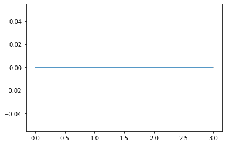
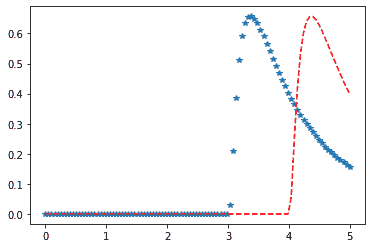

# Python–统计中的对数正态分布

> 原文:[https://www . geesforgeks . org/python-log-正态分布-in-statistics/](https://www.geeksforgeeks.org/python-log-normal-distribution-in-statistics/)

**scipy.stats.lognorm()** 是一个 log-Normal 连续随机变量。它继承自泛型方法的，作为 **rv_continuous 类**的实例。它用特定于这个特定分布的细节来完成这些方法。

**参数:**

> **q :** 上下尾概率
> T3】x:分位数
> **loc :** 【可选】位置参数。默认= 0
> **比例:**【可选】比例参数。默认值= 1
> **大小:**【整数元组，可选】形状或随机变量。
> **时刻:**【可选】由字母['mvsk']组成；m’=均值，‘v’=方差，‘s’= Fisher 偏斜度，‘k’= Fisher 峰度。(默认值= 'mv ')。
> 
> **结果:**对数-正态连续随机变量

**代码#1:创建对数-正态连续随机变量**

```py
# importing library

from scipy.stats import lognorm  

numargs = lognorm.numargs 
a, b = 4.32, 3.18
rv = lognorm(a, b) 

print ("RV : \n", rv)  
```

**输出:**

```py
RV : 
 scipy.stats._distn_infrastructure.rv_frozen object at 0x000002A9D5417648

```

 **代码#2:对数-正态连续变量和概率分布**

```py
import numpy as np 
quantile = np.arange (0.01, 1, 0.1) 

# Random Variates 
R = lognorm.rvs(a, b) 
print ("Random Variates : \n", R) 

# PDF 
R = lognorm.pdf(a, b, quantile) 
print ("\nProbability Distribution : \n", R) 
```

**输出:**

```py
Random Variates : 
 3.331870599932328

Probability Distribution : 
 [0.02619234 0.02690484 0.02765301 0.0284395  0.02926727 0.03013955
 0.03105993 0.03203241 0.03306142 0.03415191]

```

**代码#3:图形表示。**

```py
import numpy as np 
import matplotlib.pyplot as plt 

distribution = np.linspace(0, np.minimum(rv.dist.b, 3)) 
print("Distribution : \n", distribution) 

plot = plt.plot(distribution, rv.pdf(distribution)) 
```

**输出:**

```py
Distribution : 
 [0\.         0.06122449 0.12244898 0.18367347 0.24489796 0.30612245
 0.36734694 0.42857143 0.48979592 0.55102041 0.6122449  0.67346939
 0.73469388 0.79591837 0.85714286 0.91836735 0.97959184 1.04081633
 1.10204082 1.16326531 1.2244898  1.28571429 1.34693878 1.40816327
 1.46938776 1.53061224 1.59183673 1.65306122 1.71428571 1.7755102
 1.83673469 1.89795918 1.95918367 2.02040816 2.08163265 2.14285714
 2.20408163 2.26530612 2.32653061 2.3877551  2.44897959 2.51020408
 2.57142857 2.63265306 2.69387755 2.75510204 2.81632653 2.87755102
 2.93877551 3\.        ]

```



**代码#4:变化的位置参数**

```py
import matplotlib.pyplot as plt 
import numpy as np 

x = np.linspace(0, 5, 100) 

# Varying positional arguments 
y1 = lognorm .pdf(x, 1, 3) 
y2 = lognorm .pdf(x, 1, 4) 
plt.plot(x, y1, "*", x, y2, "r--") 
```

**输出:**

