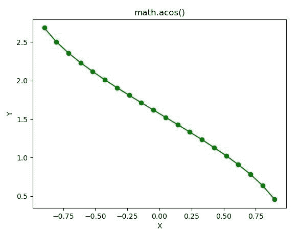

# Python–math . acos()函数

> 原文:[https://www.geeksforgeeks.org/python-math-acos-function/](https://www.geeksforgeeks.org/python-math-acos-function/)

**数学模块**包含许多用于数学运算的函数。函数的作用是:返回一个数字的余弦值。在此函数中传递的值应该在 **-1 到 1** 之间。

> **语法:** math.acos(x)
> 
> **参数:**此方法只接受单个参数。
> 
> *   **x :** 此参数是要传递给 acos()的值
> 
> **返回:**该函数返回一个数的弧余弦值。

下面的例子说明了上述功能的使用:

**例 1:**

```
# Python code to implement
# the acos()function

# importing "math"
# for mathematical operations  
import math  

a = math.pi / 6

# returning the value of arc cosine of pi / 6  
print ("The value of arc cosine of pi / 6 is : ", end ="")  
print (math.acos(a))
```

**输出:**

```
The value of arc cosine of pi / 6 is : 1.0197267436954502

```

**例 2:**

```
# Python code implementation of 
# the acos() function
import math 
import numpy as np 
import matplotlib.pyplot as plt  

in_array = np.linspace(-(1 / 3.5 * np.pi), 1 / 3.5 * np.pi, 20) 

out_array = [] 

for i in range(len(in_array)): 
    out_array.append(math.acos(in_array[i])) 
    i += 1

print("Input_Array : \n", in_array)  
print("\nOutput_Array : \n", out_array)  

plt.plot(in_array, out_array, "go-")  
plt.title("math.acos()")  
plt.xlabel("X")  
plt.ylabel("Y")  
plt.show() 
```

**输出:**

```
Input_Array :  
[-0.8975979  -0.80311391 -0.70862992 -0.61414593 -0.51966194 -0.42517795
 -0.33069396 -0.23620997 -0.14172598 -0.04724199  0.04724199  0.14172598
  0.23620997  0.33069396  0.42517795  0.51966194  0.61414593  0.70862992
  0.80311391  0.8975979 ]

Output_Array :  
[2.6850860217724004, 2.50329950258761, 2.358350863035667, 2.2320996324218134, 
2.1172515505585388, 2.009954812757658, 1.9078351422171613, 1.809259917693194,
1.7130011090538158, 1.6180559117526183, 1.5235367418371748, 1.4285915445359774,
1.3323327358965993, 1.233757511372632, 1.131637840832135, 1.0243411030312544,
0.9094930211679799, 0.783241790554126, 0.6382931510021833, 0.45650663181739287]

```

