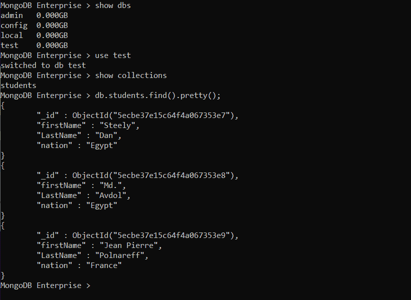

# Python MongoDB–drop _ index 查询

> 原文:[https://www . geesforgeks . org/python-MongoDB-drop _ index-query/](https://www.geeksforgeeks.org/python-mongodb-drop_index-query/)

PyMongo 中的 drop_index()库函数用于从数据库中的集合中删除索引，顾名思义。在本文中，我们将讨论如何使用 python 应用程序和 PyMongo 从集合中移除索引。

> ***语法:***drop _ index(index _ or _ name，session=None，**kwargs)
> **参数:**
> 
> *   **index_or_name** :通过对集合调用 create_index()或 confirm _ index()方法生成的索引的名称。如果自定义索引名称是通过*名称*参数创建的，那么自定义名称应该在这里传递。
> *   **会话:**这是一个可选参数，它指定了 ClientSession(来自类 pymongo.client_session)。
> *   **kwargs:** 这些是附加的关键字参数(可选)。

## 什么是索引？

索引是 MongoDB 中用于提高查询执行效率的一种特殊数据结构。它们是在集合级别定义的，它们允许 MongoDB 限制它搜索的文档数量。b 树数据结构用于蒙古数据库的索引。有各种类型的索引，如单字段索引、复合索引、多键索引。为了便于理解，在本文中，我们将使用单字段索引。

在本地托管的 Mongo 服务器上，让我们创建一个数据库**测试**并收集**学生**。该数据库将保存以下关于学生的信息–



默认情况下，每个集合都有 **_id** 索引。所有集合都必须至少有一个索引。如果删除所有索引，将自动生成一个新索引。我们可以通过运行以下命令来查看索引


现在，假设 mongo 服务器正在运行，我们可以运行以下代码向学生集合添加一个名为 new Index 的新索引:

**示例 1:** **向集合添加索引**

```
import pprint
import pymongo

# connection
try:
    client = pymongo.MongoClient()
    db = client['test']
    print('connection to the server established')

except Exception:
    print('Failed to Connect to server')

collection = db.students

# creating an index
resp = collection.create_index("newIndex")

# printing the auto generated name 
# returned by MongoDB
print(resp)

# index_information() is analogous 
# to getIndexes
pprint.pprint(collection.index_information())
```

**输出:**


如我们所见，自动生成的名称是 newIndex_1。

**示例 2:** **从集合中删除索引**

```
import pprint
import pymongo

try:
    client = pymongo.MongoClient()
    db = client['test']
    print('connection to the server established')

except Exception:
    print('Failed to Connect to server')

collection = db.students

# dropping the index using autogenerated
# name from MongoDB
collection.drop_index("newIndex_1")

# printing the indexes present on the collection
pprint.pprint(collection.index_information())
```

**输出:**


输出显示，新插入的名为 newIndex 的索引被删除，仅保留了原始的 _id 索引。这是 drop_index()的应用。