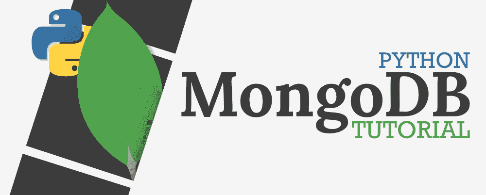

# python mongob 教程

> 原文:[https://www.geeksforgeeks.org/python-mongodb-tutorial/](https://www.geeksforgeeks.org/python-mongodb-tutorial/)

**MongoDB** 是最受欢迎的 NoSQL 数据库之一。它是一个跨平台、面向对象的数据库。基本上，NoSQL 意味着 MongoDB 不以表或关系格式存储数据，而是提供不同的数据存储和检索机制。这叫做 BSON，类似于 JSON。这就是为什么 MongoDB 提供高速、高可用性和高可扩展性。

本 MongoDB 教程将使用大量 Python MongoDB 程序和项目，帮助您从基础到高级学习 MongoDB 数据库与 Python 的交互。

> **目录:**
> 
> *   [简介](#introduction)
> *   [入门](#getting)
> *   [蒙古数据库查询](#queries)
> *   [在 MongoDB 中处理集合和文档](#working)
> *   [蒙古数据库中的索引](#indexing)
> *   【MongoDB 数据与结构化数据的转换
> *   [MongoDB 上的问题](#questions)

**[最近关于 Python MongoDB 的文章！！](https://www.geeksforgeeks.org/tag/python-mongodb/)**

## 介绍

*   [MongoDB:简介](http://geeksforgeeks.org/mongodb-an-introduction/)
*   [MongoDB 和 Python](https://www.geeksforgeeks.org/mongodb-and-python/)
*   [Python 安装 MongoDB 指南| Windows](https://www.geeksforgeeks.org/guide-install-mongodb-python-windows/)

## 入门指南

*   [文档数据库是如何工作的？](https://www.geeksforgeeks.org/how-do-document-databases-work/)
*   [什么是 PyMongo 光标？](https://www.geeksforgeeks.org/what-is-a-pymongo-cursor/)
*   [使用 Python 在 MongoDB 中创建数据库](https://www.geeksforgeeks.org/create-a-database-in-mongodb-using-python/)

## 蒙古数据库查询

*   [什么是 MongoDB 查询？](https://www.geeksforgeeks.org/python-mongodb-query/)
*   [插入和更新数据查询](http://geeksforgeeks.org/mongodb-python-insert-update-data/)
*   [插入 _ 一个查询](https://www.geeksforgeeks.org/python-mongodb-insert_one-query/)
*   [插入 _ 多次查询](https://www.geeksforgeeks.org/python-mongodb-insert_many-query/)
*   [Pymongo 中 insert、insert_one 和 insert _ multi 查询的区别](https://www.geeksforgeeks.org/difference-between-insert-insertone-and-insertmany-in-pymongo/)
*   [更新 _ 一次查询](https://www.geeksforgeeks.org/python-mongodb-update_one/)
*   [更新 _ 多次查询](https://www.geeksforgeeks.org/python-mongodb-update_many-query/)
*   [插入、替换一个、替换多个查询](http://geeksforgeeks.org/mongodb-python-insert-replace_one-replace_many/)
*   [删除数据并删除采集](http://geeksforgeeks.org/mongodb-python-delete-data-drop-collection/)
*   [删除 _ 一个查询](https://www.geeksforgeeks.org/python-mongodb-delete_one/)
*   [删除 _ 多次查询](https://www.geeksforgeeks.org/python-mongodb-delete_many/)
*   [查找查询](http://geeksforgeeks.org/python-mongodb-find/)
*   [查找 _ 一个查询](https://www.geeksforgeeks.org/python-mongodb-find_one-query/)
*   [查找一并更新查询](https://www.geeksforgeeks.org/python-mongodb-find_one_and_update-query/)
*   [find_one_and_delete 查询](https://www.geeksforgeeks.org/python-mongoddb-find_one_and_delete-query/)
*   [查找 _ 一 _ 替换查询](https://www.geeksforgeeks.org/python-mongodb-find_one_and_replace-query/)
*   [排序查询](http://geeksforgeeks.org/python-mongodb-sort/)
*   [不同查询](https://www.geeksforgeeks.org/python-mongodb-distinct/)
*   [重命名查询](https://www.geeksforgeeks.org/python-mongodb-rename/)
*   [批量 _ 写查询](https://www.geeksforgeeks.org/python-mongodb-bulk_write/)
*   [$组(聚合)操作](https://www.geeksforgeeks.org/python-mongodb-group-aggregation/)
*   [限额查询](https://www.geeksforgeeks.org/python-mongodb-limit-query/)
*   [PyMongo 中的嵌套查询](https://www.geeksforgeeks.org/nested-queries-in-pymongo/)

## 在 MongoDB 中使用集合和文档

*   [如何使用 Python 访问 MongoDB 中的一个集合？](https://www.geeksforgeeks.org/how-to-access-a-collection-in-mongodb-using-python/)
*   [使用 PyMongo](https://www.geeksforgeeks.org/get-the-names-of-all-collections-using-pymongo/) 获取所有收藏的名称
*   [使用 Python 删除 MongoDB 中已经存在的集合](https://www.geeksforgeeks.org/drop-collection-if-already-exists-in-mongodb-using-python/)
*   [如何使用 Python 更新集合中的数据？](https://www.geeksforgeeks.org/how-to-update-data-in-a-collection-using-python/)
*   [使用 PyMongo](https://www.geeksforgeeks.org/get-all-the-documents-of-the-collection-using-pymongo/) 获取收藏的所有文档
*   [使用 Python 统计 MongoDB 中的文档数量](https://www.geeksforgeeks.org/count-the-number-of-documents-in-mongodb-using-python/)
*   [使用 PyMongo 更新集合中的所有文档](https://www.geeksforgeeks.org/update-all-documents-in-a-collection-using-pymongo/)
*   [使用 Python 在 MongoDB 中聚合](https://www.geeksforgeeks.org/aggregation-in-mongodb-using-python/)

## 蒙古数据库中的索引

*   [使用 Python 在 MongoDB 中进行索引](https://www.geeksforgeeks.org/indexing-in-mongodb-using-python/)
*   [Python MongoDB–创建 _ 索引查询](https://www.geeksforgeeks.org/python-mongodb-create_index-query/)
*   [如何用 Python 为 MongoDB Collection 创建索引？](https://www.geeksforgeeks.org/how-to-create-index-for-mongodb-collection-using-python/)
*   [使用 PyMongo](https://www.geeksforgeeks.org/get-all-the-information-of-a-collections-indexes-using-pymongo/) 获取集合索引的所有信息
*   [drop_index 查询](https://www.geeksforgeeks.org/python-mongodb-drop_index-query/)
*   [如何使用 PyMongo 删除集合中的所有索引？](https://www.geeksforgeeks.org/how-to-drop-all-the-indexes-in-a-collection-using-pymongo/)
*   [如何用 PyMongo 重建一个集合的所有索引？](https://www.geeksforgeeks.org/how-to-rebuild-all-the-indexes-of-a-collection-using-pymongo/)

## 蒙古数据库数据和结构化数据之间的转换

*   [如何用 Python 在 MongoDB 中导入 JSON 文件？](https://www.geeksforgeeks.org/how-to-import-json-file-in-mongodb-using-python/)
*   [将 PyMongo 光标转换为 JSON](https://www.geeksforgeeks.org/convert-pymongo-cursor-to-json/)
*   [将 PyMongo 光标转换为数据框](https://www.geeksforgeeks.org/convert-pymongo-cursor-to-dataframe/)

## 关于 MongoDB 的问题

*   [如何检查 PyMongo 光标是否为空？](https://www.geeksforgeeks.org/how-to-check-if-the-pymongo-cursor-is-empty/)
*   [如何使用 Python 从 MongoDB 中获取数据？](https://www.geeksforgeeks.org/how-to-fetch-data-from-mongodb-using-python/)
*   [使用 Python MongoDB 进行地理空间查询](https://www.geeksforgeeks.org/geospatial-queries-with-python-mongodb/)
*   [使用 Python 从 MongoDB 图谱中三维绘制样本数据](https://www.geeksforgeeks.org/3d-plotting-sample-data-from-mongodb-atlas-using-python/)