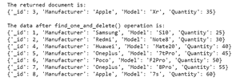

# Python MongoDB–find _ one _ and _ delete 查询

> 原文:[https://www . geesforgeks . org/python-mongoddb-find _ one _ and _ delete-query/](https://www.geeksforgeeks.org/python-mongoddb-find_one_and_delete-query/)

[**【MongoDB】**](https://www.geeksforgeeks.org/mongodb-and-python/)是一个跨平台的面向文档和非关系(即 NoSQL)的数据库程序。它是一个开源文档数据库，以键值对的形式存储数据。

## **find_one_and_delete()**

此函数用于根据我们传递的过滤器从集合中删除单个文档，并从集合中返回删除的文档。它找到与过滤器匹配的第一个匹配字段，并将其从集合中删除，即找到单个文档并将其删除，返回该文档。

> **语法:**collection . find _ one _ and _ delete(筛选，投影=无，排序=无，会话=无，**kwargs)
> 
> **参数:**
> **【过滤】**:与要删除的单据匹配的查询。
> 
> **“投影”** **(可选):**应在
> 结果文档中返回的字段名称列表或指定要包括或排除的字段的映射。如果
> “投影”是列表，将总是返回“_id”。使用映射从结果中排除
> 字段(例如，投影={'_id': False})。
> **'**
> 
> **排序'** **(可选)**:指定
> 查询排序顺序的(键、方向)对列表。如果多个文档与查询匹配，则会对它们进行排序，并删除第一个文档。
> 
> **【会话】** **(可选):** A 类:“~pymongo.client_session。ClientSession”。
> **'**kwargs '(可选):**附加命令参数可以作为关键字参数
> 传递(例如 maxTimeMS 可以用于最近的服务器版本)。

**样本数据库:**


我们操作的数据库。

**例 1:**

## 蟒蛇 3

```py
# importing Mongoclient from pymongo
from pymongo import MongoClient

# Making Connection
myclient = MongoClient("mongodb://localhost:27017/")

# database
db = myclient["mydatabase"]

# Created or Switched to collection
# names: GeeksForGeeks
Collection = db["GeeksForGeeks"]

# Defining the filter that we want to use.
Filter ={'Manufacturer': 'Apple'}

# Using find_one_and_delete() function.
print("The returned document is:")
print(Collection.find_one_and_delete(Filter))

# Printing the data in the collection
# after find_one_and_delete() operation.
print("\nThe data after find_one_and_delete() operation is:")

for data in Collection.find():
    print(data)
```

**输出:**



**例 2 :**

在本例中，我们使用 find_one_and_delete()从数据库中删除了 Redmi 数据:

## 蟒蛇 3

```py
# importing Mongoclient from pymongo
from pymongo import MongoClient

# Making Connection
myclient = MongoClient("mongodb://localhost:27017/")

# database
db = myclient["mydatabase"]

# Created or Switched to collection
# names: GeeksForGeeks
Collection = db["GeeksForGeeks"]

# Defining the filter that we want to use.
Filter ={'Manufacturer': 'Redmi'}

# Using find_one_and_delete() function.
print("The returned document is:")
print(Collection.find_one_and_delete(Filter)

# Printing the data in the collection
# after find_one_and_delete() operation.
print("\nThe data after find_one_and_delete() operation is:")

for data in Collection.find():
    print(data)
```

**输出:**

