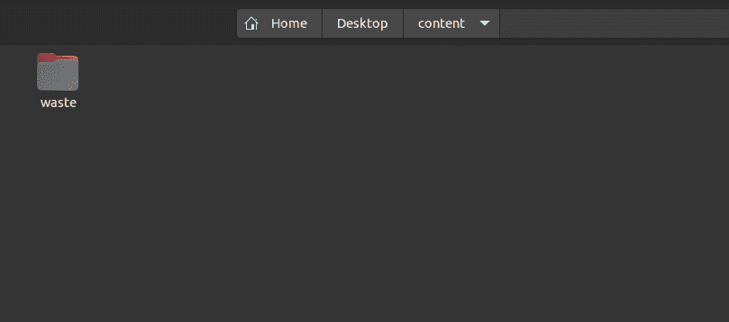

# Python–将所有文件从子文件夹移动到主文件夹

> 原文:[https://www . geesforgeks . org/python-将所有文件从子文件夹移动到主文件夹/](https://www.geeksforgeeks.org/python-move-all-files-from-subfolders-to-main-folder/)

本文将讨论如何使用 Python 将所有文件从子文件夹移动到主文件夹。方法很简单，它类似于使用 Python 将文件从一个文件夹移动到另一个文件夹，除了在这里主文件夹或子文件夹的父文件夹被作为目的地传递。

### 使用的模块

*   **OS 模块:**Python 中的 OS 模块提供与操作系统交互的功能。它提供了一种使用操作系统相关功能的可移植方式。os.path 是操作系统模块的子模块。
*   **Shutil 模块:**Python 中的 Shutil 模块提供了很多关于文件和文件集合的功能。该模块属于 Python 标准实用程序模块。该模块有助于自动化文件和目录的复制和删除过程。

### 使用的功能

*   ***【OS . path . join()】***方法在 Python 中智能地连接一个或多个路径组件。此方法将各种路径组件串联起来，除了最后一个路径组件之外，每个非空部分后面都有一个目录分隔符(“/”)。如果要连接的最后一个路径组件为空，则在末尾放置一个目录分隔符(“/”)。如果路径组件表示绝对路径，则所有以前连接的组件都将被丢弃，并且从绝对路径组件继续连接。

> ***语法:** os.path.join(path，* path)*
> ***参数:***
> ***path** :表示文件系统路径的类路径对象。*
> ****路径**:表示文件系统路径的类路径对象。它表示要连接的路径组件。*
> *类路径对象是表示路径的字符串或字节对象。*
> ***注:**python 中函数定义中的特殊语法*[*<u>* args</u>*](https://www.geeksforgeeks.org/args-kwargs-python/)*(此处为* paths)用于向函数传递可变数量的参数。*
> ***返回类型:**该方法返回一个代表串联路径组件的字符串。*

*   **使用 python 中的 os.listdir()** 方法获取指定目录下所有文件和目录的列表。如果我们没有指定任何目录，那么将返回当前工作目录中的文件和目录列表。

> **语法:** os.listdir(路径)
> **参数:**
> 路径(可选) :目录的路径
> **返回类型:**此方法返回指定路径下所有文件和目录的列表。此方法的返回类型是 list。

*   **shutil.move()** 方法递归地将文件或目录(源)移动到另一个位置(目标)并返回目标。如果目标目录已经存在，那么 src 将被移动到该目录中。如果目标已经存在，但不是目录，则根据 os.rename()语义，它可能会被覆盖。

> ***语法:** shutil.move(源，目标，copy_function = copy2)*
> 
> ***参数:***
> ***来源:**代表源文件路径的字符串。*
> ***目的地:**代表目的地目录路径的字符串。*
> ***copy _ function**(可选):该参数默认值为 copy2。对于这个参数，我们可以使用其他复制函数，如 copy、copytree 等。*
> 
> ***返回值:**这个方法返回一个代表新创建文件路径的字符串。*

为了将文件从子文件夹移动到主文件夹，我们首先必须导入所需的包，然后指定源目录和目标目录的路径。作为目标目录，记得传递主文件夹的目标。现在添加条款，递归地将文件从源移动到目标。

**源文件夹(子文件夹):**


src _ 文件夹

**目标文件夹(主文件夹):**



编译前的目标文件夹

**程序:**

## 蟒蛇 3

```py
import shutil
import os

# Define the source and destination path
source = "Desktop/content/waste/"
destination = "Desktop/content/"

# code to move the files from sub-folder to main folder.
files = os.listdir(source)
for file in files:
    file_name = os.path.join(source, file)
    shutil.move(file_name, destination)
print("Files Moved")
```

**输出:**

> 文件已移动


编译后的目标文件夹


输出. gif