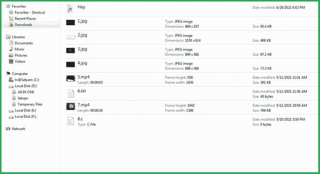
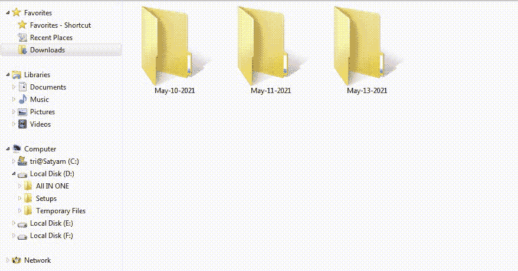

# Python–将文件移动到创建和修改日期命名目录

> 原文:[https://www . geesforgeks . org/python-将文件移动到创建和修改日期命名目录/](https://www.geeksforgeeks.org/python-move-files-to-creation-and-modification-date-named-directories/)

我们都知道根据文件的创建和修改日期来管理文件是多么重要。因此，在本文中，我们将尝试构建一个 Python 脚本，根据文件的创建和修改日期，将所有文件移动到新的目录中。基本上，它会寻找目录，如果找到了，它会从该文件夹中提取所有文件，删除该文件夹，然后按创建日期排列它们。

**使用中的文件夹:**



图为所有文件和文件夹没有正确处理。该脚本将首先从目录中提取所有文件，例如标题为“嘿”的文件。然后它会按时间顺序对所有文件进行排序。

在这里，我们将使用 Python 最重要的一些模块，比如 **shutil** 、 **glob** 等等。以下是关于模块的更多信息:

*   **glob:**glob 模块用于查找符合模式的文件/路径名。基于基准，它也有望比以前的技术更快地匹配路径名。
*   [**Shutil**](https://www.geeksforgeeks.org/shutil-module-in-python/)**:**Python Shutil 模块提供了对文件和文件组执行高级操作的各种方法。它是 Python 的标准实用程序模块之一。该模块有助于自动复制和删除文件和文件夹。

**接近**

*   要根据修改日期更改目录并移动到您希望放置所有文件的目录，请使用 **os.chdir** 功能。
*   要列出所有文件夹和文件，使用 **os.listdir** 功能。
*   要获取当前工作目录，使用 **os.getcwd** 方法。
*   运行**循环**来检查目录内外的所有文件。
*   要存储所有文件实例，请使用 **glob.glob** 功能。它将采用文件名或文件路径，并搜索其中存在的所有文件。

**语法:**

> glob.glob(any_file_name 或 file_path+"\\"*) #

*   我们可以简单地使用 **shutil.move** 方法将文件从一个位置移动到另一个位置。传递要移动的文件名和路径。

**语法:**

> shutil.move(要移动的文件，要移动文件的路径)

*   从文件夹中移除文件后，使用 **shutil.rmtree** 方法移除文件夹。在 **shutil.rmtree** 函数中传递要删除的文件名。

**语法:**

> shutil.rmtree(要删除的文件)

*   再次设置**循环**来浏览所有文件。
*   使用 **time.gmtime** 以结构形式检索文件创建和修改的所有数据。
*   然后，逐个提取年、月、日。
*   运行“如果”条件，查看该文件夹是否已创建；如果没有，使用文件的创建日期作为名称来创建它。
*   最后，使用 **shutil.move** 功能，将所有文件逐一移动到新形成的文件夹中。

**程序:**

## 蟒蛇 3

```
# Import the following modules
import os
import time
import shutil
import datetime
import glob

# Change the directory and jump to the location
# where you want to arrange the files
os.chdir(r"C:\Users\Dell\Downloads\FireShot")

# List the directories and make a list
all_files = list(os.listdir())

# Get the current working directory
outputs = os.getcwd()

# Run a loop for traversing through all the 
# files in the current directory
for files in all_files:
    try:

        # Jump to the directories files
        inputs = glob.glob(files+"\\*")

        # Now again run a loop for travering through
        # all the files inside the folder
        for ele in inputs:

            # Now, move the files one-by-one
            shutil.move(ele, outputs)

        # After extracting files from the folders, 
        # delete that folder
        shutil.rmtree(files)
    except:
        pass

# Again run a loop for traversing through all the
# files in the current directory
for files in os.listdir('.'):

    # Get all the details of the file creation 
    # and modification
    time_format = time.gmtime(os.path.getmtime(files))

    # Now, extract only the Year, Month, and Day
    datetime_object = datetime.datetime.strptime(str(time_format.tm_mon), "%m")

    # Provide the number and find the month
    full_month_name = datetime_object.strftime(
        "%b")

    # Give the name of the folder
    dir_name = full_month_name + '-' + \
        str(time_format.tm_mday) + "-" + \
        str(time_format.tm_year)

    # Check if the folder exists or not
    if not os.path.isdir(dir_name):

        # If not then make the new folder
        os.mkdir(dir_name)
    dest = dir_name

    # Move all the files to their respective folders
    shutil.move(files, dest)

print("successfully moved...")
```

**输出:**

