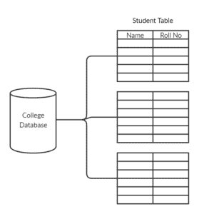

# Python: MySQL 创建表

> 原文:[https://www.geeksforgeeks.org/python-mysql-create-table/](https://www.geeksforgeeks.org/python-mysql-create-table/)

MySQL 是一个关系数据库管理系统(RDBMS)，而结构化查询语言(SQL)是使用命令处理 RDBMS 的语言，即创建、插入、更新和删除数据库中的数据。 **SQL 命令不区分大小写**，即 create 和 CREATE 表示相同的命令。
 **按照下面提到的过程安装 python MySQL 的依赖项**

1.  **使用命令提示符导航到 python 脚本目录。**
2.  **执行命令** 

```py
pip install mysql-connector
```

#### **Python Mysql 连接器模块方法** 

****1。connect():** 此功能用于与 MySQL 服务器建立连接。以下是用于启动连接的参数:**

1.  ****用户:**与用于验证连接的 MySQL 服务器关联的用户名**
2.  ****密码:**与用户名关联的密码，用于身份验证**
3.  ****数据库:**MySQL 中用于创建表的数据库**

****2。cursor()** : Cursor 是执行 SQL 命令时在系统内存中创建的工作空间。该内存是临时的，光标连接在整个会话/生命周期内是有界的，并且命令被执行** 

****3。execute()**:execute 函数以一个 SQL 查询为参数，执行。查询是用于创建、插入、检索、更新、删除等的 SQL 命令。** 

#### **数据库**

**数据库是由多个表构成的信息组织。数据库的组织方式使得数据操作变得容易，即创建、插入、更新和删除等。
**创建数据库的 SQL 命令:**** 

```py
CREATE DATABASE ;
```

****示例:**考虑以下在 MySQL(Ex: college)
中创建数据库的示例**

## **大蟒**

```py
# Python code for creating Database
# Host: It is the server name. It will be
# "localhost" if you are using localhost database

import mysql.connector as SQLC
# Establishing connection with the SQL

DataBase = SQLC.connect(
  host ="server name",
  user ="user name",
  password ="password"
)
# Cursor to the database
Cursor = DataBase.cursor()

Cursor.execute("CREATE DATABASE College")
print("College Data base is created")
```

****输出:**** 

```py
College Data base is created
```

****

## **桌子**

1.  **该表是以行和列的形式组织的数据集合。表存在于数据库中。**
2.  **行也称为元组**
3.  **列被称为表的属性**

****创建表的 SQL 命令:**** 

```py
CREATE TABLE
(
     column_name_1 column_Data_type, 
     column_name_2 column_Data_type, 
     :
     :
     column_name_n column_Data_type
);
```

#### **SQL 数据类型**

**数据类型用于定义将存储在表格单元格中的数据类型。
不同类型的数据类型** 

1.  **数字的**
2.  **字符/字符串**
3.  **日期/时间。**
4.  **Unicode 字符/字符串**
5.  **二进制的**

**除了上面提到的数据类型，MySQL 中还有其他各种各样的数据类型，包括 CLOB、BLOB、JSON、XML 等数据类型。
考虑下面提到的用于创建“学生”表的 python 代码，该表在先前创建的数据库“学院”中包含两个列名称、辊号。** 

## **大蟒**

```py
# Python code for creating Table in the Database
# Host: It is the server name. It will be "localhost"
# if you are using localhost database

import mysql.connectors as SQLC
def CreateTable():

     # Connecting To the Database in Localhost
     DataBase = SQLC.connect(
                 host ="server name",
                 user ="user name",
                 password ="password",
                 database ="College"
               )

     # Cursor to the database
     Cursor = DataBase.cursor()

     # Query for Creating the table
     # The student table contains two columns Name and
     # Name of data type varchar i.e to store string
     # and Roll number of the integer data type.
     TableName ="CREATE TABLE Student
                (
                    Name VARCHAR(255),
                    Roll_no int
                );"

     Cursor.execute(TableName)
     print("Student Table is Created in the Database")
     return

# Calling CreateTable function
CreateTable()
```

****输出:**** 

```py
Student Table is Created in the Database
```