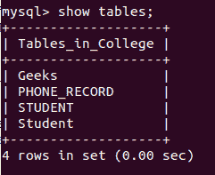
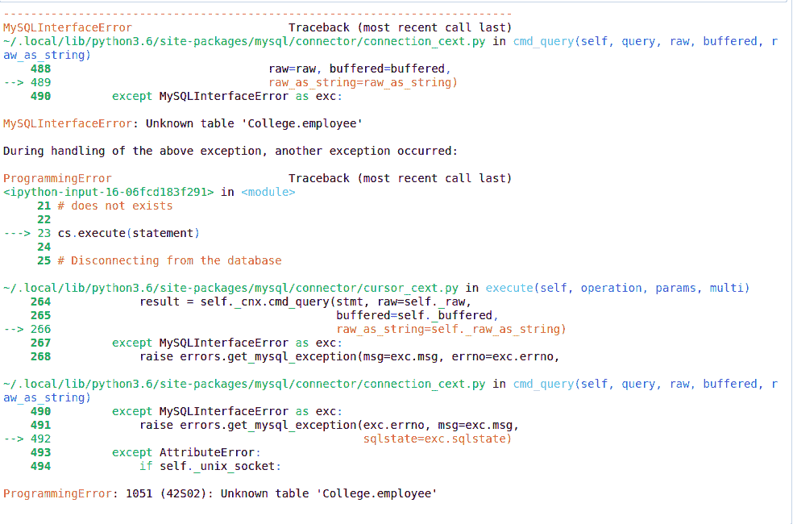
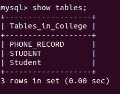

# Python MySQL–拖放表

> 原文:[https://www.geeksforgeeks.org/python-mysql-drop-table/](https://www.geeksforgeeks.org/python-mysql-drop-table/)

当我们不得不使用 MySQL 和其他编程语言时，就要用到连接器。MySQL 连接器的工作是提供对所需语言的 MySQL 驱动程序的访问。因此，它在编程语言和 MySQL 服务器之间生成了一个连接。

## 删除表格命令

Drop 命令影响的是表的结构，而不是数据。它用于删除已经存在的表。对于您不确定要删除的表是否存在的情况**如果存在则删除表**命令被使用。这两种情况将在下面的例子中讨论。

**语法:**

```py
DROP TABLE tablename;

DROP TABLE IF EXISTS tablename;

```

以下程序将帮助您更好地理解这一点。

**下降前的表格:**



**示例 1:** 演示跌落(如果存在)的程序。我们将尝试删除上述数据库中不存在的表。

```py
# Python program to demonstrate
# drop clause

import mysql.connector

# Connecting to the Database
mydb = mysql.connector.connect(
  host ='localhost',
  database ='College',
  user ='root',
)

cs = mydb.cursor()

# drop clause
statement = "Drop Table if exists Employee"

# Uncommenting statement ="DROP TABLE employee"
# Will raise an error as the table employee
# does not exists

cs.execute(statement)

# Disconnecting from the database
mydb.close()
```

**输出:**



**示例 2:** 删除桌面极客的程序

```py
# Python program to demonstrate
# drop clause

import mysql.connector

# Connecting to the Database
mydb = mysql.connector.connect(
  host ='localhost',
  database ='College',
  user ='root',
)

cs = mydb.cursor()

# drop clause
statement ="DROP TABLE Geeks"

cs.execute(statement)

# Disconnecting from the database
mydb.close()
```

**输出:**

