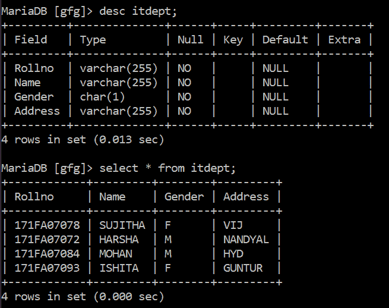

# Python MySQL–LIKE()运算符

> 原文:[https://www.geeksforgeeks.org/python-mysql-like-operator/](https://www.geeksforgeeks.org/python-mysql-like-operator/)

在本文中，我们将使用 Python 语言讨论 LIKE 运算符在 MySQL 中的使用。

有时我们可能需要数据库中匹配特定模式的元组。例如，我们可能希望检索元组以字母“y”开头的所有列，或者以“b”开头、以“l”结尾的所有列，或者更复杂、更严格的字符串模式。这就是 LIKE 子句的作用，通常与 SQL 中的 where 子句结合使用。

有两种通配符用于过滤结果:

*   **百分比符号(%):** 用于匹配零个或多个字符。(可变长度)
*   **下划线(_):** 用于精确匹配一个字符。(固定长度)

**语法:**

> 选择列 1、列 2、…、列 n
> 
> 从表名
> 
> 其中列类似模式；

以下是与 LIKE 子句进行模式匹配的规则:

<figure class="table">

| 模式 | 意义 |
| --- | --- |
| % a ' | 匹配以“a”开头的字符串 |
| %a | 匹配以“a”结尾的字符串 |
| %t | 匹配以“a”开头、以“t”结尾的字符串。 |
| “%wow%” | 在任何位置匹配包含子字符串“wow”的字符串。 |
| _wow% ' | 在第二个位置匹配包含子字符串“wow”的字符串。 |
| _a% ' | 匹配第二个位置包含“a”的字符串。 |
| ' a_ _% ' | 匹配以“a”开头且至少包含 2 个以上字符的字符串。 |

</figure>

为了使用类似操作，我们将使用下表:



下面是描述如何在 Python MySQL 中使用 LIKE 运算符的各种示例。

**例 1:**

程序显示 itdept 表中地址以字母 G 开头的行。

## 蟒蛇 3

```
# import mysql.connector module
import mysql.connector

# establish connection
database = mysql.connector.connect(
    host="localhost",
    user="root",
    password="",
    database="gfg"
)

# creating cursor object
cur_object = database.cursor()
print("like operator address starts with G")

#  query
find = "SELECT * from itdept where Address like 'G%' "

# execute the query
cur_object.execute(find)

# fetching all results
data = cur_object.fetchall()
for i in data:
    print(i[0], i[1], i[2], i[3], sep="--")

# Close database connection
database.close()
```

**输出:**


**例 2:**

在这里，我们显示了表中名称以字母 H 开头，以字母 A 结尾的所有行。

## 蟒蛇 3

```
# import mysql.connector module
import mysql.connector

# establish connection
database = mysql.connector.connect(
    host="localhost",
    user="root",
    password="",
    database="gfg"
)

# creating cursor object
cur_object = database.cursor()
print("like operator name starts with H and ends with A")

#  query
find = "SELECT * from itdept where Name like 'H%A' "

# execute the query
cur_object.execute(find)

# fetching all results
data = cur_object.fetchall()
for i in data:
    print(i[0], i[1], i[2], i[3], sep="--")

# close database connection
database.close()
```

**输出:**


**例 3:**

在这个程序中，我们在表格中显示所有有三个字母地址的行。

## 蟒蛇 3

```
# import mysql.connector module
import mysql.connector

# establish connection
database = mysql.connector.connect(
    host="localhost",
    user="root",
    password="",
    database="gfg"
)

# creating cursor object
cur_object = database.cursor()
print("like operator address has three letters only")

#  query
find = "SELECT * from itdept where Address like '___' "

# execute the query
cur_object.execute(find)

# fetching all results
data = cur_object.fetchall()
for i in data:
    print(i[0], i[1], i[2], i[3], sep="--")

# close database connection
database.close()
```

**输出:**

