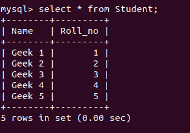

# Python MySQL–Where 子句

> 原文:[https://www.geeksforgeeks.org/python-mysql-where-clause/](https://www.geeksforgeeks.org/python-mysql-where-clause/)

**在 MySQL 数据库中使用 Where 子句**根据需要的条件过滤数据。通过使用 where 子句，可以获取、删除或更新 MySQL 数据库中的特定数据集。

**语法**

> 选择列 1、列 2、…。从[表名]开始的列，其中[条件]；

上面的语法用于显示符合条件的特定数据集。

**示例:**考虑以下名为 college，表名为 student 的数据库。

**数据库模式:**


**数据库:**



### Python 中的 Where 子句

在 Python 中使用 where 子句的步骤是:

1.  首先在 MySQL 和 Python 程序之间形成连接。这是通过导入 mysql.connector 包并使用`mysql.connector.connect()`方法来完成的，用于将用户名、密码、主机(可选默认值:localhost)和数据库(可选)作为参数传递给它。
2.  现在，使用`cursor()` 方法在上面创建的连接对象上创建一个光标对象。数据库游标是一种控制结构，可以遍历数据库中的记录。
3.  然后，通过`execute()`方法执行 where 子句语句。

```
import mysql.connector

#Establishing connection
conn = mysql.connector.connect(user='your_username',
                               host='localhost',
                               password ='your_password',
                               database='College')

# Creating a cursor object using 
# the cursor() method
mycursor = conn.cursor();

# SQL Query
sql = "select * from Student where Roll_no >= 3;"

# Executing query
mycursor.execute(sql)

myresult = mycursor.fetchall()

for x in myresult:
    print(x)

# Closing the connection
conn.close()
```

**输出:**

