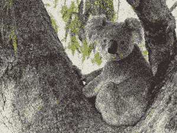

# Python–魔杖中的噪声()功能

> 原文:[https://www . geesforgeks . org/python-noise-in-function-in-wand/](https://www.geeksforgeeks.org/python-noise-function-in-wand/)

**图像噪声**是图像中亮度或颜色信息的随机变化，通常是电子噪声的一个方面。我们可以使用**噪点()**功能给图像添加噪点。当在模糊操作之前应用噪声函数来消除图像时，噪声函数会很有用。

以下是我们可以使用 noise()函数添加的噪声:

*   高斯的
*   脉冲
*   拉普拉斯算子的（调和算子）
*   乘法高斯
*   泊松
*   随意
*   制服

> **语法:**
> 
> ```py
> wand.image.noise(noise_type, attenuate, channel)
> 
> ```
> 
> **参数:**
> 
> | 参数 | 输入类型 | 描述 |
> | --- | --- | --- |
> | 噪声类型 | 数字。真实的 | 要应用的噪声类型。 |
> | 减少的 | 数字。真实的 | 分配率。仅在 ImageMagick-7 中提供。默认值为 1.0。 |
> | 频道 | 基绳 | 选择性地针对要应用噪波的颜色通道。 |

**来源影像:**


**例 1:**

```py
# Import Image from wand.image module
from wand.image import Image

# Read image using Image() function
with Image(filename ="koala.jpeg") as img:

    # Generate noise image using spread() function
    img.noise("poisson", attenuate = 0.9)
    img.save(filename ="noisekoala.jpeg")
```

**输出:**


**例 2:**

```py
# Import Image from wand.image module
from wand.image import Image

# Read image using Image() function
with Image(filename ="koala.jpeg") as img:

    # Generate noise image using spread() function
    img.noise("laplacian", attenuate = 1.0)
    img.save(filename ="noisekoala2.jpeg")
```

**输出:**
