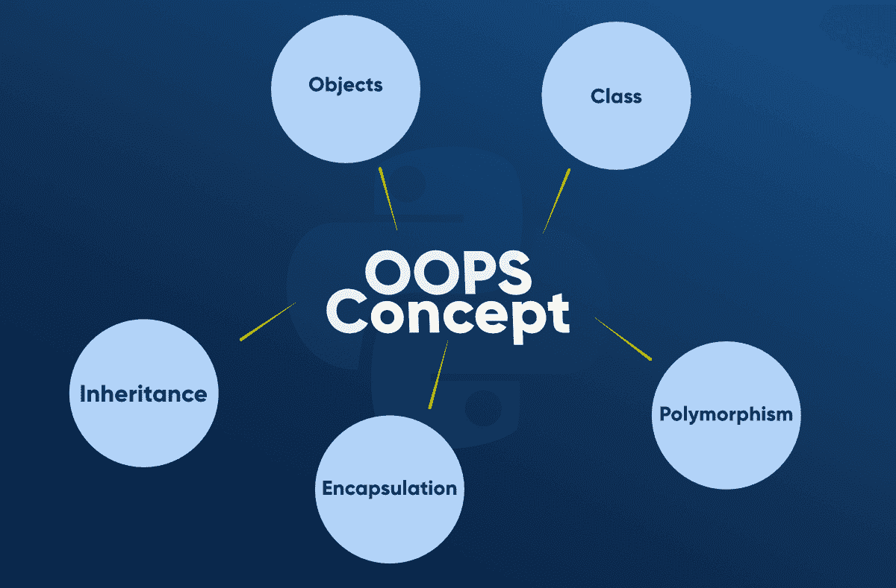
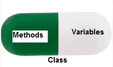

# Python OOPs 概念

> 原文:[https://www.geeksforgeeks.org/python-oops-concepts/](https://www.geeksforgeeks.org/python-oops-concepts/)

在 Python 中，面向对象编程(OOPs)是一种在编程中使用对象和类的编程范式。它旨在实现真实世界的实体，如继承、多态性、封装等。在编程中。OOPs 的主要概念是将数据和处理这些数据的函数绑定为一个单元，这样代码的其他部分就不能访问这些数据。

## 面向对象编程的主要概念

*   班级
*   目标
*   多态性
*   包装
*   遗产



## 班级

类是对象的集合。类包含创建对象的蓝图或原型。它是一个包含一些属性和方法的逻辑实体。

为了理解创建一个类的必要性，让我们考虑一个例子，假设您想要跟踪可能具有不同属性(如品种、年龄)的狗的数量。如果使用列表，第一个元素可能是狗的品种，而第二个元素可能代表它的年龄。假设有 100 只不同的狗，那么你怎么知道哪个元素应该是哪个呢？如果你想给这些狗增加其他属性呢？这缺乏组织性，也正是对课程的需求。

**Python 类上的几点:**

*   类是由关键字类创建的。
*   属性是属于一个类的变量。
*   属性始终是公共的，可以使用点(。)运算符。我的班级。我的属性

**类定义语法:**

```py
class ClassName:
   # Statement-1
   .
   .
   .
   # Statement-N
```

### 示例:在 Python 中创建一个空类

## 计算机编程语言

```py
# Python3 program to
# demonstrate defining
# a class

class Dog:
    pass
```

在上面的例子中，我们使用 class 关键字创建了一个名为 dog 的类。

## 目标

对象是一个具有与之相关的状态和行为的实体。它可以是任何真实世界的物体，如鼠标、键盘、椅子、桌子、笔等。整数、字符串、浮点数、偶数和字典都是对象。更具体地说，任何单个整数或任何单个字符串都是一个对象。数字 12 是一个对象，字符串“Hello，world”是一个对象，列表是一个可以容纳其他对象的对象，以此类推。你一直在使用对象，甚至可能没有意识到。

**一个物体包括:**

*   **状态:**由物体的属性表示。它还反映了对象的属性。
*   **行为:**用一个对象的方法来表示。它还反映了一个对象对其他对象的响应。
*   **身份:**它为一个对象赋予唯一的名称，并使一个对象能够与其他对象交互。

为了理解状态、行为和身份，让我们以类狗为例(如上所述)。

*   这个身份可以认为是狗的名字。
*   状态或属性可以被认为是狗的品种、年龄或颜色。
*   这种行为可以被认为是狗是在吃东西还是在睡觉。

### 示例:创建对象

## 蟒蛇 3

```py
obj = Dog()
```

这将创建一个名为 obj 的对象。在深入研究对象和类之前，让我们了解一些在处理对象和类时会用到的基本关键词。

### **自我**

1.  类方法在方法定义中必须有一个额外的第一个参数。当我们调用方法时，我们没有给出这个参数的值，Python 提供了它
2.  如果我们有一个不需要参数的方法，那么我们仍然需要一个参数。
3.  这类似于 C++中的这个指针和 Java 中的这个引用。

当我们将这个对象的一个方法称为 myobject.method(arg1，arg2)时，这将被 Python 自动转换为 MyClass.method(myobject，arg1，arg 2)——这就是特殊自我的全部意义。

**注意:**更多信息请参考 Python 类中的 [self](https://www.geeksforgeeks.org/self-in-python-class/)

### **初始化方法**

[__init__ 方法](https://www.geeksforgeeks.org/__init__-in-python/)类似于 C++和 Java 中的构造函数。一旦类的对象被实例化，它就会运行。该方法对于您想要对对象进行的任何初始化都很有用。

现在让我们定义一个类，并使用 self 和 __init__ 方法创建一些对象。

### 示例 1:创建具有类和实例属性的类和对象

## 蟒蛇 3

```py
class Dog:

    # class attribute
    attr1 = "mammal"

    # Instance attribute
    def __init__(self, name):
        self.name = name

# Driver code
# Object instantiation
Rodger = Dog("Rodger")
Tommy = Dog("Tommy")

# Accessing class attributes
print("Rodger is a {}".format(Rodger.__class__.attr1))
print("Tommy is also a {}".format(Tommy.__class__.attr1))

# Accessing instance attributes
print("My name is {}".format(Rodger.name))
print("My name is {}".format(Tommy.name))
```

**Output**

```py
Rodger is a mammal
Tommy is also a mammal
My name is Rodger
My name is Tommy

```

### 示例 2:用方法创建类和对象

## 蟒蛇 3

```py
class Dog:

    # class attribute
    attr1 = "mammal"

    # Instance attribute
    def __init__(self, name):
        self.name = name

    def speak(self):
        print("My name is {}".format(self.name))

# Driver code
# Object instantiation
Rodger = Dog("Rodger")
Tommy = Dog("Tommy")

# Accessing class methods
Rodger.speak()
Tommy.speak()
```

**Output**

```py
My name is Rodger
My name is Tommy

```

注:更多信息请参考 [Python 类和对象](https://www.geeksforgeeks.org/python-classes-and-objects/)

## 遗产

继承是一个类从另一个类派生或继承属性的能力。派生属性的类称为派生类或基类，派生属性的类称为基类或父类。继承的好处是:

*   它很好地代表了现实世界的关系。
*   它提供了代码的可重用性。我们不必一次又一次地编写相同的代码。此外，它允许我们在不修改类的情况下向类添加更多的特性。
*   它本质上是可传递的，这意味着如果 B 类从另一个 A 类继承，那么 B 的所有子类都将自动从 A 类继承。

### 示例:Python 中的继承

## 蟒蛇 3

```py
# Python code to demonstrate how parent constructors
# are called.

# parent class
class Person(object):

    # __init__ is known as the constructor
    def __init__(self, name, idnumber):
        self.name = name
        self.idnumber = idnumber

    def display(self):
        print(self.name)
        print(self.idnumber)

    def details(self):
        print("My name is {}".format(self.name))
        print("IdNumber: {}".format(self.idnumber))

# child class
class Employee(Person):
    def __init__(self, name, idnumber, salary, post):
        self.salary = salary
        self.post = post

        # invoking the __init__ of the parent class
        Person.__init__(self, name, idnumber)

    def details(self):
        print("My name is {}".format(self.name))
        print("IdNumber: {}".format(self.idnumber))
        print("Post: {}".format(self.post))

# creation of an object variable or an instance
a = Employee('Rahul', 886012, 200000, "Intern")

# calling a function of the class Person using
# its instance
a.display()
a.details()
```

**Output**

```py
Rahul
886012
My name is Rahul
IdNumber: 886012
Post: Intern
```

在上面的文章中，我们已经创建了两个类，即 Person(父类)和 Employee(子类)。雇员类继承自人员类。我们可以通过 employee 类使用 person 类的方法，如上面代码中的 display 函数所示。子类也可以通过 details()方法修改父类的行为。

**注意:**更多信息请参考我们的【Python 中的 T2】继承教程。

## 多态性

多态性仅仅意味着有许多形式。例如，我们需要确定给定的鸟类物种是否会飞，使用多态性，我们可以使用单个函数来做到这一点。

### 示例:Python 中的多态性

## 蟒蛇 3

```py
class Bird:

    def intro(self):
        print("There are many types of birds.")

    def flight(self):
        print("Most of the birds can fly but some cannot.")

class sparrow(Bird):

    def flight(self):
        print("Sparrows can fly.")

class ostrich(Bird):

    def flight(self):
        print("Ostriches cannot fly.")

obj_bird = Bird()
obj_spr = sparrow()
obj_ost = ostrich()

obj_bird.intro()
obj_bird.flight()

obj_spr.intro()
obj_spr.flight()

obj_ost.intro()
obj_ost.flight()
```

**Output**

```py
There are many types of birds.
Most of the birds can fly but some cannot.
There are many types of birds.
Sparrows can fly.
There are many types of birds.
Ostriches cannot fly.

```

**注意:**更多信息请参考我们的【Python 中的 T2】多态性教程。

## 包装

封装是面向对象编程的基本概念之一。它描述了包装数据的思想以及在一个单元中处理数据的方法。这就对直接访问变量和方法设置了限制，可以防止数据的意外修改。为了防止意外更改，只能通过对象的方法来更改对象的变量。这些类型的变量被称为私有变量。

类是封装的一个例子，因为它封装了成员函数、变量等所有数据。



### 示例:Python 中的封装

## 蟒蛇 3

```py
# Python program to
# demonstrate private members

# Creating a Base class
class Base:
    def __init__(self):
        self.a = "GeeksforGeeks"
        self.__c = "GeeksforGeeks"

# Creating a derived class
class Derived(Base):
    def __init__(self):

        # Calling constructor of
        # Base class
        Base.__init__(self)
        print("Calling private member of base class: ")
        print(self.__c)

# Driver code
obj1 = Base()
print(obj1.a)

# Uncommenting print(obj1.c) will
# raise an AttributeError

# Uncommenting obj2 = Derived() will
# also raise an AtrributeError as
# private member of base class
# is called inside derived class
```

**Output**

```py
GeeksforGeeks
```

在上面的例子中，我们创建了 c 变量作为私有属性。我们甚至不能直接访问这个属性，甚至不能改变它的值。

**注意:**更多信息请参考我们的[Python 封装](https://www.geeksforgeeks.org/encapsulation-in-python/)教程。

[Python 中的面向对象编程|集合 2(数据隐藏和对象打印)](https://www.geeksforgeeks.org/object-oriented-programming-in-python-set-2-data-hiding-and-object-printing/)

https://youtu.be/CiH7lN4

本文由 **Shwetanshu Rohatgi** 供稿。如果您发现任何不正确的地方，或者您想分享更多关于上面讨论的主题的信息，请写评论