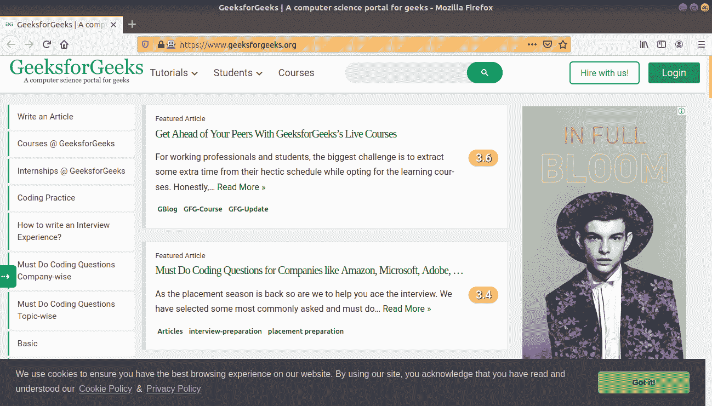

# Python–使用硒打开链接

> 原文:[https://www . geesforgeks . org/python-open-link-use-selenium/](https://www.geeksforgeeks.org/python-opening-links-using-selenium/)

Selenium 是通过程序控制网络浏览器的强大工具。它适用于所有浏览器，适用于所有主要操作系统，其脚本是用各种语言编写的，如 Python、Java、C#等，我们将使用 Python。

硒 Python 绑定提供了一个方便的应用编程接口来访问硒网络驱动程序，如火狐、Ie、Chrome、远程等。目前支持的 Python 版本有 2.7、3.5 及以上版本。

#### 装置

*   **硒:**要安装该模块，请在终端中键入以下命令。

    ```
    pip install selenium
    ```

*   **网络驱动程序:** Selenium 需要一个网络驱动程序来与所选的浏览器进行交互。Web 驱动程序是一个与 web 浏览器交互的包。它通过通用的有线协议与网络浏览器或远程网络服务器进行交互。您可以签出并安装您选择的网络驱动程序。

    > chrome:[https://网站。谷歌。com/a/chrome。org/chrome 驱动/下载](https://sites.google.com/a/chromium.org/chromedriver/downloads)
    > 火狐:[https://github.com/mozilla/geckodriver/releases](https://github.com/mozilla/geckodriver/releases)T5】Safari:[https://web kit。org/blog/6900/web driver-support-in-Safari-10/](https://webkit.org/blog/6900/webdriver-support-in-safari-10/)

## 硒. get()

此方法用于启动新浏览器，并将在浏览器中打开给定的网址。

**语法:**

```
driver.get(url) 

```

**使用的参数:**
该函数只接受一个参数，该参数是需要打开的链接，如上面的语法所示。

**示例:**

```
#importing webdriver from selenium
from selenium import webdriver

#selecting Firefox as the browser
#in order to select Chrome 
# webdriver.Chrome() will be used
driver = webdriver.Firefox(executable_path = '/path/to/geckodriver')

#URL of the website 
url = "https://www.geeksforgeeks.org/"

#opening link in the browser
driver.get(url)
```

**输出:**

