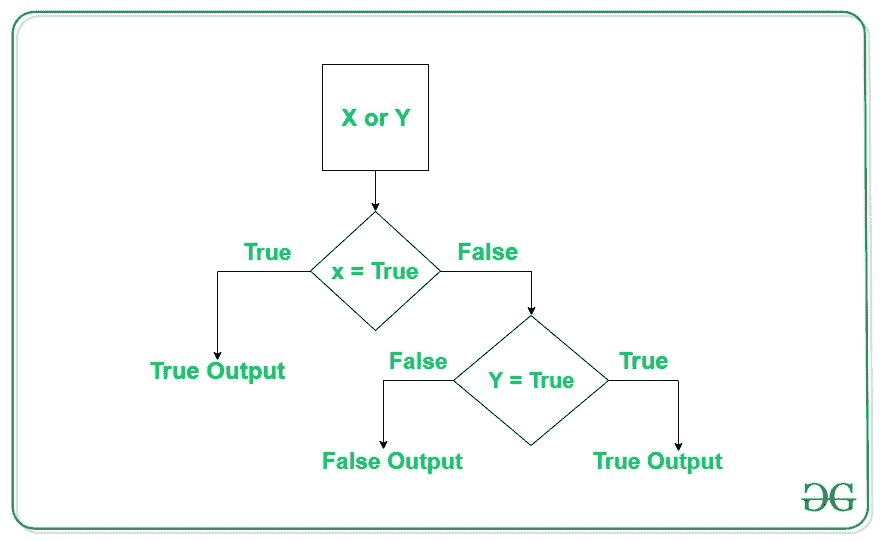

# Python 或运算符

> 原文:[https://www.geeksforgeeks.org/python-or-operator/](https://www.geeksforgeeks.org/python-or-operator/)

Python OR 运算符至少采用两个布尔表达式，如果其中任何一个表达式为真，则返回真。如果所有表达式都为假，则返回假。

## Python 或运算符的流程图



## Python 或运算符的真值表

<figure class="table">

| 表达式 1 | 表达式 2 | 结果 |
| --- | --- | --- |
| 真实的 | 真实的 | 真实的 |
| 真实的 | 错误的 | 真实的 |
| 错误的 | 真实的 | 真实的 |
| 错误的 | 错误的 | 错误的 |

</figure>

## 将 Python 或运算符与布尔表达式结合使用

Python OR 运算符在任何一个传递的布尔表达式为真时返回真。

### **示例:布尔表达式的 Or 运算符**

## 蟒蛇 3

```py
bool1 = 2>3
bool2 = 2<3

print('bool1:', bool1)
print('bool2:', bool2)

# or operator
OR = bool1 or bool2
print("OR operator:", OR)
```

**Output**

```py
bool1: False
bool2: True
OR operator: True
```

## 在 if 中使用 Python 或运算符

我们可以在 if 语句中使用 OR 运算符。如果任何一个条件变为 if True，我们可以在想要执行 if 块的情况下使用它。

### 示例:带 if 语句的 Or 运算符

## 蟒蛇 3

```py
# or operator with if
def fun(a):
    if a >= 5 or a <= 15:
        print('a lies between 5 and 15')
    else:
        print('a is either less than 5 or greater than 15')

# driver code
fun(10)
fun(20)
fun(5)
```

**Output**

```py
a lies between 5 and 15
a lies between 5 and 15
a lies between 5 and 15
```

在上面的输出中，我们可以看到 if 语句的代码总是被执行。这是因为对于的每个值，其中一个布尔表达式将始终为真，否则块将永远不会被执行。

## Python 或运算符–短路

Python Or 运算符总是对表达式求值，直到它找到一个真，一旦它找到一个真，那么表达式的其余部分就不会被检查。为了更好地理解，考虑下面的例子。

### **示例:Python 或运算符中的短路**

## 蟒蛇 3

```py
# short circuit in Python or operator
def true():
    print("Inside True")
    return True

def false():
    print("Inside False")
    return False

case1 = true() or false()
print("Case 1")
print(case1)
print()

case2 = true() or true()
print("Case 2")
print(case2)
print()

case3 = false() or false()
print("Case 3")
print(case3)
print()

case4 = false() or true()
print("Case 4")
print(case4)
```

**Output**

```py
Inside True
Case 1
True

Inside True
Case 2
True

Inside False
Inside False
Case 3
False

Inside False
Inside True
Case 4
True
```

从上面的例子中，我们可以看出，短路或懒惰评估是遵循的。在案例 1 和案例 2 中，因为第一个表达式返回真，所以不计算第二个表达式，而在案例 3 和案例 4 中，因为第一个表达式不返回真，所以计算第二个表达式。