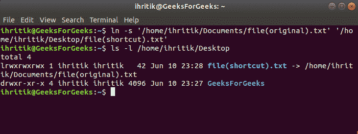

# Python | os.path.realpath()方法

> 原文:[https://www . geesforgeks . org/python-OS-path-real path-method/](https://www.geeksforgeeks.org/python-os-path-realpath-method/)

**Python 中的 OS 模块**提供了与操作系统交互的功能。操作系统属于 Python 的标准实用程序模块。该模块提供了一种使用操作系统相关功能的可移植方式。 **os.path** 模块是 Python 中 **OS 模块**的子模块，用于公共路径名操作。

Python 中的`***os.path.realpath()***`方法用于通过消除路径中遇到的任何符号链接来获取指定文件名的规范路径。

> ***语法:*** os.path.realpath(路径)
> 
> ***参数:***
> **路径**:表示文件系统路径的类路径对象。
> 类似路径的对象是表示路径的*字符串*或*字节*对象。
> 
> ***返回类型:*** 这个方法返回一个代表规范路径的字符串值。

**创建软链接或符号链接**
在 Unix 或 Linux 中，可以使用 ln 命令创建软链接或符号链接。以下是在 shell 提示符下创建符号链接的语法:

```py
$ ln -s {source-filename} {symbolic-filename}

```

**示例:**

示例:


在上面的输出中， *"/home/ihritik/Desktop/file(快捷方式)。txt"* 是一个符号链接。

**代码:**使用 os.path.realpath()方法获取规范路径并解析符号链接

```py
# Python program to explain os.path.realpath() method 

# importing os module 
import os

# Path
path = "/home / ihritik / Desktop / file(shortcut).txt"

# Get the canonical path
# of the specified path
# by eliminating any symbolic links
# encountered in the path
real_path = os.path.realpath(path)

# Print the canonical path
print(real_path)

# Path
path = "/../../GeeksForGeeks / sample.py"

# Get the canonical path
# of the specified path
# eliminating any symbolic links
# encountered in the path
real_path = os.path.realpath(path)

# Print the canonical path
print(real_path)

# Path
path = "file.txt"

# Get the canonical path
# of the specified path
# eliminating any symbolic links
# encountered in the path
real_path = os.path.realpath(path)

# Print the canonical path
print(real_path)

os.chdir("/home / ihritik / Downloads/")

# Path
path = "file.txt"

# Get the canonical path
# of the specified path
# eliminating any symbolic links
# encountered in the path
real_path = os.path.realpath(path)

# Print the canonical path
print(real_path)
```

**Output:**

```py
/home/ihritik/Documents/file(original).txt
/GeeksForGeeks/sample.py
/home/ihritik/file.txt
/home/ihritik/Downloads/file.txt

```

**参考:**T2】https://docs.python.org/3/library/os.path.html