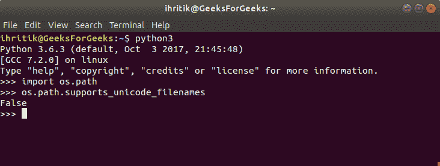

# Python | OS . path . supports _ unicode _ filename 对象

> 原文:[https://www . geeksforgeeks . org/python-OS-path-supports _ unicode _ filename-object/](https://www.geeksforgeeks.org/python-os-path-supports_unicode_filenames-object/)

**Python 中的 OS 模块**提供了与操作系统交互的功能。操作系统属于 Python 的标准实用程序模块。该模块提供了一种使用操作系统相关功能的可移植方式。**操作系统路径**模块是 Python 中操作系统模块的子模块，用于公共路径名操作。

`***os.path.supports_unicode_filenames***`Python 中的对象用于检查任意 Unicode 字符串是否可以用作文件名。

`***os.path.supports_unicode_filenames***`在 posix 系统上总是 *False* ，除了 **Darwin** ，因为 posix 系统不关心文件名的编码。他们将文件名简单地视为一个字节序列。

> ***语法:***OS . path . support _ unicode _ 文件名
> 
> ***参数:*** 这是一个不可调用的对象。因此，不需要任何参数
> 
> ***返回类型:*** 该方法返回 bool 类的布尔值。如果系统支持 Unicode 字符串作为文件名，此方法返回真，否则返回假。

**Code:** use of os.path.supports_unicode_filenames object

```py
# Python program to explain os.path.supports_unicode_filenames object 

# importing os module 
import os

# Check whether an arbitrary Unicode
# string can be used as
# a filename or not 
support = os.path.supports_unicode_filenames

# Print the result
print(support) 
```

**Output:**

```py
False

```

