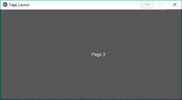
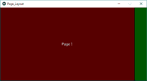
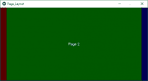
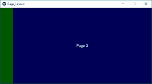

# Python |基维的页面布局

> 哎哎哎:# t0]https://www . geeksforgeeks . org/python-page layout-in-kivy/

Kivy 是 Python 中独立于平台的 GUI 工具。因为它可以在安卓、IOS、linux 和视窗等平台上运行。它基本上是用来开发安卓应用程序的，但并不意味着它不能在桌面应用程序上使用。

> [Kivy 教程–通过示例学习 Kivy](https://www.geeksforgeeks.org/kivy-tutorial/)。

### 页面布局：

页面布局的工作方式不同于其他布局。这是一种动态布局，因为它允许使用边框翻页。这个想法是，它的组件堆叠在彼此的前面，我们只能看到在上面的那个。
page layout 类用于创建一个简单的多页布局，其方式允许使用边框轻松地从一页翻转到另一页。

要使用页面布局，您必须通过以下命令导入它:

```py
from kivy.uix.pagelayout import PageLayout
```

**注意:**
页面布局目前不支持 size_hint、size_hint_min、size_hint_max 或 pos_hint 属性。这意味着我们不能在页面布局中使用所有这些。

**创建页面布局的基本方法:**

```py
1) import kivy
2) import kivyApp
3) import Pagelayout
4) import button
5) Set minimum version(optional)
6) create App class:
        - define build() function
7) return Layout/widget/Class(according to requirement)
8) Run an instance of the class
```

**实施方法:**

## 蟒蛇 3

```py
# Sample Python application demonstrating 
# How to create PageLayout in Kivy

import kivy

# base Class of your App inherits from the App class.  
# app:always refers to the instance of your application  
from kivy.app import App

# The PageLayout class is used to create
# a simple multi-page layout,
# in a way that allows easy flipping from
# one page to another using borders.
from kivy.uix.pagelayout import PageLayout

# creates the button in kivy 
# if not imported shows the error 
from kivy.uix.button import Button

class PageLayout(PageLayout):
    """
    Define class PageLayout here
    """

    def __init__(self):

        # The super function in Python can be
        # used to gain access to inherited methods
        # which is either from a parent or sibling class.
        super(PageLayout, self).__init__()

        # creating buttons on different pages
        btn1 = Button(text ='Page 1')

        btn2 = Button(text ='Page 2')

        btn3 = Button(text ='Page 3')

        # adding button on the screen
        # by add widget method
        self.add_widget(btn1)

        self.add_widget(btn2)

        self.add_widget(btn3)

# creating the App class
class Page_LayoutApp(App):
    """
    App class here
    """

    def build(self):
        """
        build function here
        """
        return PageLayout()

# Run the App
if __name__ == '__main__':
    Page_LayoutApp().run()
```

**输出:**
**第 1 页图片**


**第 2 页影像**


**第 3 页图片**



在页面布局中，您可以在每一页上添加一些功能。我们可以添加图像、创建画布、添加颜色、添加多个小部件、多个布局
这就是我们如何高效地使用页面布局。最好的例子之一我们的图库包含多个页面。
下面是我在[的帮助下给每一页添加不同颜色的代码](https://kivy.org/doc/stable/api-kivy.utils.html)

**实现具有功能的页面布局**

## 蟒蛇 3

```py
# Sample Python application demonstrating the
# working of PageLayout in Kivy with some features

import kivy

# base Class of your App inherits from the App class.  
# app:always refers to the instance of your application  
from kivy.app import App

# The PageLayout class is used to create
# a simple multi-page layout,
# in a way that allows easy flipping from
# one page to another using borders.
from kivy.uix.pagelayout import PageLayout

# creates the button in kivy 
# if not imported shows the error 
from kivy.uix.button import Button

# The Utils module provides a selection of general utility
# functions and classes that may be useful for various applications.
# These include maths, color, algebraic and platform functions.
# Here we are using color from the module
# By get_color_from_hex
# Transform a hex string color to a kivy Color.
from kivy.utils import get_color_from_hex

class PageLayout(PageLayout):
    """
    Define class PageLayout here
    """

    def __init__(self):

        # The super function in Python can be
        # used to gain access to inherited methods
        # which is either from a parent or sibling class.
        super(PageLayout, self).__init__()

        # creating buttons on different pages

        # Button 1 or Page 1
        btn1 = Button(text ='Page 1')
        # Adding Colour to page
        # Here we are using colour from

        btn1.background_color = get_color_from_hex('# FF0000')

        btn2 = Button(text ='Page 2')
        btn2.background_color = get_color_from_hex('# 00FF00')

        btn3 = Button(text ='Page 3')
        btn3.background_color = get_color_from_hex('# 0000FF')

        # adding button on the screen
        # by add widget method
        self.add_widget(btn1)

        self.add_widget(btn2)

        self.add_widget(btn3)

# creating the App class
class Page_LayoutApp(App):
    """
    App class here
    """

    def build(self):
        """
        build function here
        """
        return PageLayout()

# Run the App
if __name__ == '__main__':
    Page_LayoutApp().run()
```

**输出:**
**第 1 页**



**第 2 页**



**第 3 页**



**视频输出:**

<video class="wp-video-shortcode" id="video-307309-1" width="640" height="360" preload="metadata" controls=""><source type="video/webm" src="https://media.geeksforgeeks.org/wp-content/uploads/20190523204914/Page-layout.webm?_=1">[https://media.geeksforgeeks.org/wp-content/uploads/20190523204914/Page-layout.webm](https://media.geeksforgeeks.org/wp-content/uploads/20190523204914/Page-layout.webm)</video>

**注意:**在安卓、Ios 或任何其他支持触控的笔记本电脑上工作时更有效。
参考:[https://kivy.org/doc/stable/api-kivy.uix.pagelayout.html](https://kivy.org/doc/stable/api-kivy.uix.pagelayout.html#kivy.uix.pagelayout.PageLayout.on_touch_down)T5】