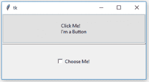
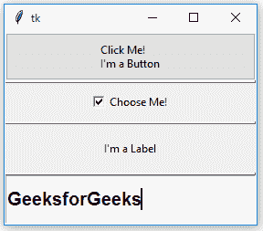

# python | panevendow widget in tkinter

> 哎哎哎:# t0]https://www . geeksforgeeks . org/python-panel dwindw-in-tkinter/小部件

Tkinter 支持多种小部件，让 GUI 越来越有吸引力和功能性。**窗格窗口小部件**是一个几何管理器小部件，它可以包含一个或多个子小部件**窗格**。用户可以通过鼠标移动分隔线**框**来调整子部件的大小。

> **语法:** PanedWindow(主，* *选项)
> 
> **参数:**
> **主**:父小部件或主 Tk()对象
> **选项:**在配置方法中传递或直接在构造函数中传递

PanedWindow 可用于实现常见的 2 窗格或 3 窗格，但也可以使用多个窗格。

**代码#1:** 窗格只有两个窗格的窗口

```
# Importing everything from tkinter module
from tkinter import * from tkinter import ttk

# main tkinter window
root = Tk()

# panedwindow object
pw = PanedWindow(orient ='vertical')

# Button widget
top = ttk.Button(pw, text ="Click Me !\nI'm a Button")
top.pack(side = TOP)

# This will add button widget to the panedwindow
pw.add(top)

# Checkbutton Widget
bot = Checkbutton(pw, text ="Choose Me !")
bot.pack(side = TOP)

# This will add Checkbutton to panedwindow
pw.add(bot)

# expand is used so that widgets can expand
# fill is used to let widgets adjust itself
# according to the size of main window
pw.pack(fill = BOTH, expand = True)

# This method is used to show sash
pw.configure(sashrelief = RAISED)

# Infinite loop can be destroyed by
# keyboard or mouse interrupt
mainloop()
```

**输出:**


**代码#2:** 带有多个窗格的面板

```
# Importing everything from tkinter module
from tkinter import * from tkinter import ttk

# main tkinter window
root = Tk()

# panedwindow object
pw = PanedWindow(orient ='vertical')

# Button widget
top = ttk.Button(pw, text ="Click Me !\nI'm a Button")
top.pack(side = TOP)

# This will add button widget to the panedwindow
pw.add(top)

# Checkbutton Widget
bot = Checkbutton(pw, text ="Choose Me !")
bot.pack(side = TOP)

# This will add Checkbutton to panedwindow
pw.add(bot)

# adding Label widget
label = Label(pw, text ="I'm a Label")
label.pack(side = TOP)

pw.add(label)

# Tkinter string variable
string = StringVar()

# Entry widget with some styling in fonts
entry = Entry(pw, textvariable = string, font =('arial', 15, 'bold'))
entry.pack()

# Focus force is used to focus on particular
# widget that means widget is already selected for operations
entry.focus_force()

pw.add(entry)

# expand is used so that widgets can expand
# fill is used to let widgets adjust itself
# according to the size of main window
pw.pack(fill = BOTH, expand = True)

# This method is used to show sash
pw.configure(sashrelief = RAISED)

# Infinite loop can be destroyed by
# keyboard or mouse interrupt
mainloop()
```

**输出:**
