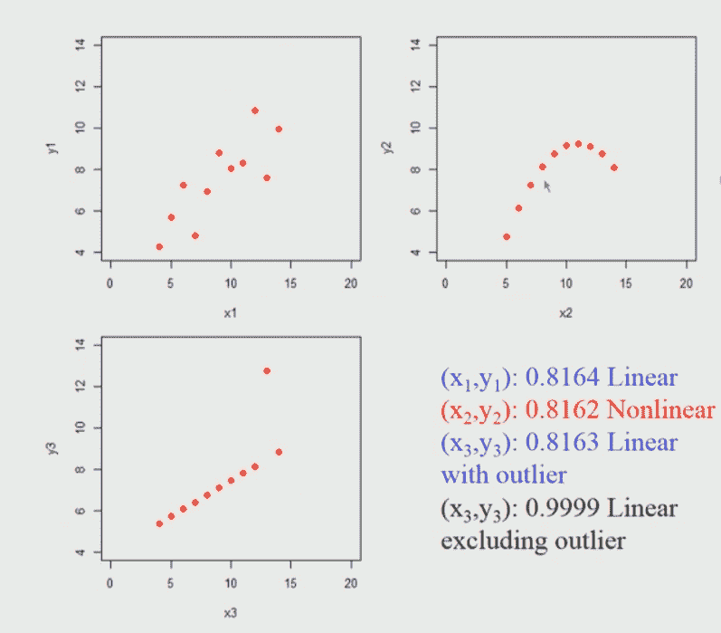

# Python–两个变量之间的皮尔逊相关测试

> 原文:[https://www . geeksforgeeks . org/python-Pearson-相关性-两变量间检验/](https://www.geeksforgeeks.org/python-pearson-correlation-test-between-two-variables/)

**什么是相关性检验？**
两个变量之间关联的强弱被称为相关性检验。
例如，如果我们有兴趣知道父亲和儿子的身高之间是否有关系，可以计算相关系数来回答这个问题。
如需了解更多相关信息，请参考本节[。](https://www.geeksforgeeks.org/mathematics-covariance-and-correlation/)
**相关分析方法:**

*   **参数相关性:**它测量两个变量(x 和 y)之间的线性相关性，称为参数相关性测试，因为它取决于数据的分布。
*   **非参数相关:肯德尔(tau)** 和 [**斯皮尔曼(rho)**](https://www.geeksforgeeks.org/program-spearmans-rank-correlation/) 是基于秩的相关系数，称为非参数相关。

**注:**最常用的方法是参数相关法。
**皮尔逊相关公式:**


> x 和 y 是长度为 n 的两个向量
> m，x 和 m，y 分别对应 x 和 y 的平均值。

**注:**

*   r 取-1(负相关)和 1(正相关)之间的值。
*   r = 0 表示无相关性。
*   不能应用于序数变量。
*   样本量应该适中(20-30)，以便进行良好的估计。
*   异常值会导致误导性的值，意味着对异常值不稳健。

要计算 Python 中的皮尔逊相关性，可以使用–**皮尔逊()**函数。
**Python 函数**

> **语法:**
> 皮尔逊(x，y)
> **参数:**
> x，y:长度相同的数值向量

**数据:**这里下载 csv 文件[。](https://drive.google.com/file/d/1HDojjo4uJRj6YP054xVmmcbb-TGocaWk/view)
**代码:Python 代码找到皮尔森相关性**

## 蟒蛇 3

```py
# Import those libraries
import pandas as pd
from scipy.stats import pearsonr

# Import your data into Python
df = pd.read_csv("Auto.csv")

# Convert dataframe into series
list1 = df['weight']
list2 = df['mpg']

# Apply the pearsonr()
corr, _ = pearsonr(list1, list2)
print('Pearsons correlation: %.3f' % corr)

# This code is contributed by Amiya Rout
```

**输出:**

```py
Pearson correlation is: -0.878
```

**安斯科姆数据的皮尔森相关性:**
安斯科姆的数据也被称为安斯科姆四重奏，由四个数据集组成，这些数据集具有几乎相同的简单统计特性，但在绘制图表时显得非常不同。每个数据集由十一个(x，y)点组成。统计学家弗朗西斯·安斯科姆(Francis Anscombe)于 1973 年构建了这些图表，以证明在分析数据之前绘制数据图表的重要性，以及异常值对统计特性的影响。
这里给出了这 4 组 11 个数据点。请在此下载[CSV 文件。](https://query.data.world/s/6p2ntncvkzj5mnvbpkaswfilryvnrk)
当我们绘制这些点时，它看起来是这样的。我在这里考虑 3 组 11 个数据点。



**上图简要说明:**
所以，如果我们对这些数据集的每一个应用 Pearson 相关系数，我们会发现它几乎是相同的，不管你实际上是应用到第一个数据集(左上)还是第二个数据集(右上)还是第三个数据集(左下)。
因此，它似乎表明，如果我们应用皮尔逊相关，我们发现在第一个数据集(左上角)的情况下，高相关系数接近 1。这里的关键点是，我们不能立即得出结论，如果皮尔逊相关系数将很高，那么它们之间存在线性关系，例如在第二个数据集(右上)中，这是非线性关系，仍然会产生高值。