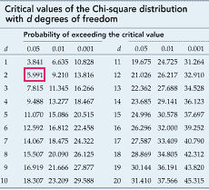

# Python–皮尔森卡方检验

> 原文:[https://www . geesforgeks . org/python-Pearson-chi-square-test/](https://www.geeksforgeeks.org/python-pearsons-chi-square-test/)

皮尔逊卡方统计假设是对分类变量之间独立性的检验。在本文中，我们将使用数学方法执行测试，然后使用 Python 的 **SciPy** 模块。
首先，让我们看看数学方法:

**列联表:**
列联表(也称为交叉表)在统计学中用于总结几个分类变量之间的关系。在这里，我们拿一张表格，显示购买不同类型宠物的男女人数。

<figure class="table">

|   | 狗 | 猫 | 鸟 | 总数 |
| 男人 | Two hundred and seven | Two hundred and eighty-two | Two hundred and forty-one | Seven hundred and thirty |
| 女人 | Two hundred and thirty-four | Two hundred and forty-two | Two hundred and thirty-two | Seven hundred and eight |
| 总数 | Four hundred and forty-one | Five hundred and twenty-four | Four hundred and seventy-three | One thousand four hundred and thirty-eight |

</figure>

测试的**目的**是为了得出两个变量(性别和宠物的选择)是否相互关联。

**无效假设:**
我们首先定义**无效**假设( **H0** )，该假设指出变量之间不存在*关系*。一个**替代**假设会指出两者之间存在*显著关系*。

我们可以通过以下方法来验证这个假设:

*   使用 **p 值**:

我们定义一个**显著性因子**来确定变量之间的关系是否具有显著性。一般选择显著性因子或 **0.05** 的**α值**。该*α值*表示当其为真时错误拒绝 **H0** 的概率。在我们期望更高精度的情况下，选择更低的*α值*。如果测试的 p 值严格大于α值，那么 H0 成立。

*   使用**卡方**值:

如果我们的卡方计算值小于或等于卡方的表格(也称为**临界**)值，那么 **H0** 成立。

**期望值表:**

接下来，我们准备一个类似的计算值(或期望值)表。为此，我们需要计算新表中的每个项目，如下所示:

<center></center>

The expected values table :

<figure class="table">

|   | 狗 | 猫 | 鸟 | 总数 |
| 男人 | 223.87343533 | 266.00834492 | 240.11821975 | Seven hundred and thirty |
| 女人 | 217.12656467 | 257.99165508 | 232.88178025 | Seven hundred and eight |
| 总数 | Four hundred and forty-one | Five hundred and twenty-four | Four hundred and seventy-three | One thousand four hundred and thirty-eight |

</figure>

**卡方表:**

我们通过对每个项目计算以下内容来准备此表:

<center></center>

The chi-square table:

<figure class="table">

|   | 观察到(o) | 计算值(c) | (o-c)^2 / |
|   | Two hundred and seven | 223.87343533 | 1.2717579435607573 |
|   | Two hundred and eighty-two | 266.00834492 | 0.9613722161954465 |
|   | Two hundred and forty-one | 240.11821975 | 0.003238139990850831 |
|   | Two hundred and thirty-four | 217.12656467 | 1.3112758457617977 |
|   | Two hundred and forty-two | 257.99165508 | 0.991245364156322 |
|   | Two hundred and thirty-two | 232.88178025 | 0.0033387601600580606 |
| 总数 |   |   | **4.54228269825232** |

</figure>

从这个表中，我们得到了最后一列的总数，它给出了卡方的计算值。因此卡方的计算值为**4.54228269825232**

现在，我们需要找到卡方的**临界**值。我们可以从表格中得到这个。要使用该表，我们需要知道数据集的**自由度**。自由度定义为:**(行数–1)*(列数–1)。**
因此，自由度为 **(2-1) * (3-1) = 2**

现在，让我们看看表格，找到对应于 **2** 自由度和 **0.05** 显著性因子的值:

<center></center>

The tabular or critical value of chi-square here is  **5.991**

因此，

<center></center>

Therefore, **H0** is **accepted**, that is, the variables ***do not*** have a significant relation.

接下来，让我们看看如何用 Python 执行测试。

**使用 Python 执行测试:**

**SciPy** 是一个开源 Python 库，用于数学、工程、科技计算。

**安装:**

```py
pip install scipy

```

**scipy.stats** 模块的**chi2 _ contribution()**功能将二维数组格式的列联表作为输入。它返回一个元组，该元组按顺序包含*测试统计信息*、 ***p 值*** 、*自由度*和*期望表*(我们根据计算值创建的表)。

因此，我们需要将获得的 **p 值**与 0.05 的**α**值进行比较。

```py
from scipy.stats import chi2_contingency

# defining the table
data = [[207, 282, 241], [234, 242, 232]]
stat, p, dof, expected = chi2_contingency(data)

# interpret p-value
alpha = 0.05
print("p value is " + str(p))
if p <= alpha:
    print('Dependent (reject H0)')
else:
    print('Independent (H0 holds true)')
```

**输出:**

```py
p value is 0.1031971404730939
Independent (H0 holds true)

```

因为，

> p 值>α

因此，我们**接受****【H0】**也就是变量 ***不*** 有显著关系。