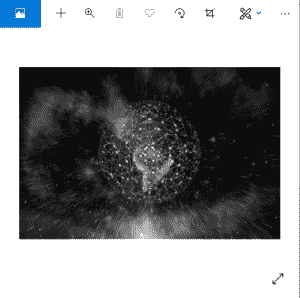
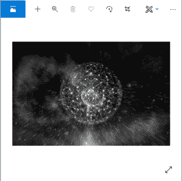
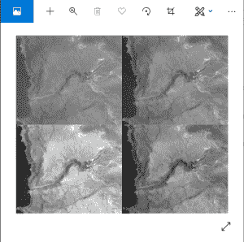

# Python PIL | Image.split()方法

> 原文:[https://www . geesforgeks . org/python-pil-image-split-method/](https://www.geeksforgeeks.org/python-pil-image-split-method/)

PIL 是 python 图像库，它为 Python 解释器提供图像编辑功能。

Image.split()方法用于将图像分割成单独的波段。此方法从图像中返回单个图像波段的元组。
分割一个“RGB”图像会创建三个新图像，每个图像包含一个原始波段(红、绿、蓝)的副本。

> **语法:**
> var = Image。图像分割(图像对象)
> 或
> 变量=图像。Image.split(path_of_image)
> 
> **返回值:**返回包含波段的元组。

**代码#1:**

```
# importing Image class from PIL package
from PIL import Image

# opening a multiband image (RGB specifically)
im = Image.open(r"C:\Users\Admin\Pictures\network.png")

# split() method
# this will split the image in individual bands
# and return a tuple
im1 = Image.Image.split(im)

# showing each band
im1[0].show()
im1[1].show()
im1[2].show()
```

**输出:**





**代码#2:**

```
# importing Image class from PIL package
from PIL import Image

# opening a singleband image
im = Image.open(r"C:\Users\Admin\Pictures\singleband.png")

# split() method
# this will split the image in individual bands
# and return a tuple (of 1 element for singleband)
im1 = Image.Image.split(im)

# showing image
im1[0].show()
```

**输出:**


**使用的图像:**


