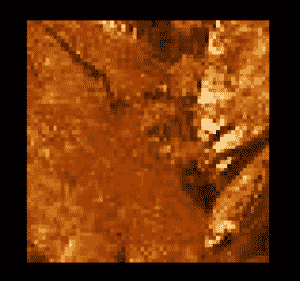

# Python PIL | Image.transform()方法

> 原文:[https://www . geesforgeks . org/python-pil-image-transform-method/](https://www.geeksforgeeks.org/python-pil-image-transform-method/)

PIL 是 python 图像库，它为 Python 解释器提供图像编辑功能。`Image`模块提供了一个同名的类，用于表示 PIL 图像。该模块还提供了许多工厂功能，包括从文件加载图像和创建新图像的功能。

`**Image.transform()**`变换此图像。此方法创建具有给定大小和与原始图像相同模式的新图像，并使用给定的变换将数据复制到新图像。

> **语法:** Image.transform(大小，方法，数据=无，重采样=0，填充=1)
> 
> **参数:**
> **大小**–输出大小。
> **法**–转化法。
> **数据**–转换方法的额外数据。
> **重采样**–可选重采样过滤器。
> 
> **返回:**一个图像对象。

**所用图像:**


```py

# importing Image module from PIL package 
from PIL import Image

# creating image object
img = Image.open(r"C:\Users\System-Pc\Desktop\tree.jpg")

# using image transform method
img1 = img.transform((300, 300), Image.EXTENT, 
       data =[10, 0, 10 + img.width // 4, img.height // 3 ])

img1.show()
```

**输出:**
