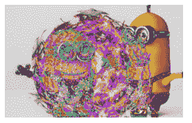

# Python PIL | imagechops . add _ module()和 ImageChops.difference()方法

> 原文:[https://www . geesforgeks . org/python-pil-image chops-add _ modal-and-image chops-different-method/](https://www.geeksforgeeks.org/python-pil-imagechops-add_modulo-and-imagechops-difference-method/)

PIL 是 python 图像库，它为 Python 解释器提供图像编辑功能。

## ImageChops.add _ modulo()方法–

这种方法用于添加两幅图像，而不像 ImageChops.add()那样剪切图像。

> **语法:**imagechops . add _ module(image1，image2)
> 
> **参数:**
> **影像 1** 为第一影像
> **影像 2** 为第二影像
> 
> **返回值:**返回一个图像。
> 
> **注意:**两个图像应该是同一模式。

```py
# This will import Image and ImageChops modules
from PIL import Image, ImageChops

# Opening Images
im = Image.open(r"C:\Users\Admin\Pictures\download.png")
im2 = Image.open(r"C:\Users\Admin\Pictures\images.PNG")

# here adding image1 and image2
im3 = ImageChops.add_modulo(im, im2)

# showing resultant image
im3.show()
```

**输出:**


## ImageChops.difference()方法–

该方法用于获得两幅图像之间逐像素差的绝对值。

> **语法:**imagechops . difference(image1，image2)
> 
> **参数:**
> **影像 1** 第一影像
> **影像 2** 第二影像
> 
> **返回值:**返回一个图像。

```py
# This will import Image and ImageChops modules
from PIL import Image, ImageChops

# Opening Images
im = Image.open(r"C:\Users\Admin\Pictures\download.png")
im2 = Image.open(r"C:\Users\Admin\Pictures\images.PNG")

# here getting absolute difference
# of image1 and image2
im3 = ImageChops.difference(im, im2)

# showing resultant image
im3.show()
```

**输出:**


**使用的图像:**


