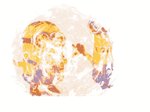

# Python PIL | ImageChops.screen()和 ImageChops.offset()方法

> 原文:[https://www . geesforgeks . org/python-pil-image chops-screen-and-image chops-offset-method/](https://www.geeksforgeeks.org/python-pil-imagechops-screen-and-imagechops-offset-method/)

PIL 是 python 图像库，它为 Python 解释器提供图像编辑功能。

## ImageChops.screen()方法–

这种方法用于将两个倒置的图像叠加在一起。

```
Syntax: ImageChops.screen(image1, image2)

Parameters:
image1 first image
image2 second image

Return Value: An Image
```

## 蟒蛇 3

```
# This will import Image and ImageChops modules
from PIL import Image, ImageChops

# Opening Images
im = Image.open(r"C:\Users\Admin\Pictures\images.png")
im2 = Image.open(r"C:\Users\Admin\Pictures\download.PNG")

# superimposing images im and im2
im3 = ImageChops.screen(im, im2)

# showing resultant image
im3.show()
```

**输出:**



## ImageChops.offset()方法–

此方法返回数据偏移给定距离的图像副本。数据环绕在边缘。如果省略 yoffset，则假定它等于 xoffset。

> **语法:** ImageChops.offset(image1，xoffset，yoffset = None)
> **参数:**
> **图像:**是提供了 offset 的图像
> **xoffset:** 水平距离
> **yoffset:** 是垂直距离，如果省略两个距离都设置为相同。
> **返回值:**原始图像的副本

## 蟒蛇 3

```
# This will import Image and ImageChops modules
from PIL import Image, ImageChops

# Opening Images
im = Image.open(r"C:\Users\Admin\Pictures\images.png")
im2 = Image.open(r"C:\Users\Admin\Pictures\download.PNG")

# Here, xoffset is given 100
# yoffset wil automatically set to 100
im3 = ImageChops.offset(im, 140)

# showing resultant image
im3.show()
```

**输出:**

