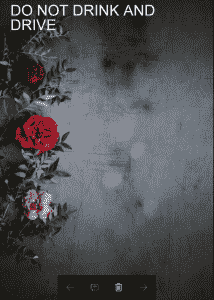

# python pil | imagefont . truetype()

> 哎哎哎:# t0]https://www . geeksforgeeks . org/python-pil-imagefont-truetype/

PIL 是 python 图像库，它为 Python 解释器提供图像编辑功能。 **`ImageFont`** 模块定义了一个同名的类。该类的实例存储位图字体，并与 **`PIL.ImageDraw.Draw.text()`** 方法一起使用。

PIL 使用自己的字体文件格式来存储位图字体。您可以使用:命令` pilfont `实用程序将 BDF 和 PCF 字体描述符(X 窗口字体格式)转换为这种格式。

`**PIL.ImageFont.truetype()**`加载 TrueType 或 OpenType 字体文件，创建字体对象。该函数从给定文件中加载一个字体对象，并为给定大小的字体创建一个字体对象。

该功能需要 `the _imagingft`服务。

> **语法:** PIL。ImageFont.truetype(字体=无，大小=10，索引=0，编码=)
> 
> **参数**:
> 
> **字体**–一个 truetype 字体文件。在 Windows 下，如果在这个文件名中找不到文件，加载程序也会在 Windows 字体/目录中查找。
> **尺寸**–要求的尺寸，以磅为单位。
> **索引**–加载哪个字体面(默认为第一个可用面)。
> **编码**–使用哪种字体编码(默认为 Unicode)。
> 
> **返回**:字体对象。
> **异常**:IOError–如果文件无法读取。

**所用图像:**


```py

# Importing Image and ImageFont, ImageDraw module from PIL package 
from PIL import Image, ImageFont, ImageDraw

# creating a image object
image = Image.open(r'C:\Users\System-Pc\Desktop\rose.jpeg') 

draw = ImageDraw.Draw(image)

font = ImageFont.truetype(r'C:\Users\System-Pc\Desktop\arial.ttf', 70)

text = 'DO NOT DRINK AND \nDRIVE'

draw.text((10, 20), text, font = font)

image.show()
```

**输出:**


**再举一个例子:**再拍一张图片。
**图像使用**


```py
Importing Image and ImageFont, ImageDraw module from PIL package 
from PIL import Image, ImageFont, ImageDraw

# creating a image object
image = Image.open(r'C:\Users\System-Pc\Desktop\flower.jpg') 

draw = ImageDraw.Draw(image)

font = ImageFont.truetype(r'C:\Users\System-Pc\Desktop\arial.ttf', 70)

text = 'stay healthy'

draw.text((50, 100), text, font = font)

image.show()
```

**输出:**
