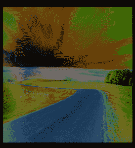

# Python PIL | ImageOps.solarize()方法

> 原文:[https://www . geesforgeks . org/python-pil-imageops-solarize-method/](https://www.geeksforgeeks.org/python-pil-imageops-solarize-method/)

PIL 是 python 图像库，它为 Python 解释器提供图像编辑功能。**图像操作模块**包含许多“现成的”图像处理操作。这个模块有些实验性，大多数操作人员只处理 L 和 RGB 图像。
**ImageOps.solarize()** 反转阈值以上的所有像素值，阈值简单来说就是图像分割。

> **语法:** PIL。ImageOps.solarize(image，threshold=130)
> **参数**:
> **image**–要日晒的图像。
> **阈值**–该灰度级以上的所有像素都被反转。
> **返回**:图像。

**使用的图像:**


## 蟒蛇 3

```py
# Importing Image and ImageOps module from PIL package
from PIL import Image, ImageOps

# creating a image1 object
im1 = Image.open(r"C:\Users\System-Pc\Desktop\a.JPG")

# image segmentation
# using threshold value = 130
# applying solarize method
im2 = ImageOps.solarize(im1, threshold = 130)

im2.show()
```

**输出:**

