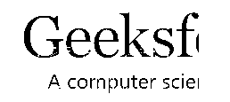

# Python PIL |逻辑 _and()和逻辑 _or()方法

> 原文:[https://www . geesforgeks . org/python-pil-logic _ and-logic _ or-method/](https://www.geeksforgeeks.org/python-pil-logical_and-and-logical_or-method/)

PIL is the Python Imaging Library which provides the python interpreter with image editing capabilities. The **ImageChops module** contains a number of arithmetical image operations, called channel operations (“chops”). These can be used for various purposes, including special effects, image compositions, algorithmic painting, and more.

`**PIL.ImageChops.logical_and()**`方法在两幅图像之间应用逻辑“与”。至少有一个图像必须具有模式“1”。

图 1:


图片 2:


```py
Syntax: PIL.ImageChops.logical_and(image1, image2)

Parameters: 
image1: first image
image2: second image

Return Type: Image

```

```py
# Importing Image and ImageChops module from PIL package  
from PIL import Image, ImageChops 

# creating a image1 object 
im1 = Image.open(r"C:\Users\sadow984\Desktop\a2.PNG") .convert("1")

# creating a image2 object 
im2 = Image.open(r"C:\Users\sadow984\Desktop\x5.PNG") .convert("1")

# applying logical_and method 
im3 = ImageChops.logical_and(im1, im2) 

im3.show() 
```

**输出:**


`**PIL.ImageChops.logical_or()**`方法在两幅图像之间应用逻辑或。至少有一个图像必须具有模式“1”。

```py
Syntax: PIL.ImageChops.logical_or(image1, image2)

Parameters: 
image1: first image
image2: second image

Return Type: Image

```

```py
# Importing Image and ImageChops module from PIL package  
from PIL import Image, ImageChops 

# creating a image1 object 
im1 = Image.open(r"C:\Users\sadow984\Desktop\a2.PNG") .convert("1")

# creating a image2 object 
im2 = Image.open(r"C:\Users\sadow984\Desktop\x5.PNG") .convert("1")

# applying logical_or method 
im3 = ImageChops.logical_or(im1, im2) 

im3.show() 
```

**输出:**
