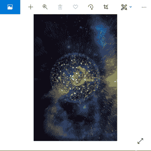

# Python PIL |粘贴()和旋转()方法

> 原文:[https://www . geesforgeks . org/python-pil-粘贴-旋转-方法/](https://www.geeksforgeeks.org/python-pil-paste-and-rotate-method/)

PIL 是 python 图像库，它为 Python 解释器提供图像编辑功能。

**PIL。Image.Image.paste()** 方法用于将一个图像粘贴到另一个图像上。这就是[新()](https://www.geeksforgeeks.org/python-pil-image-new-method/)方法派上用场的地方。

> **语法:** PIL。图像。图像。粘贴(图像 _1，图像 _2，框=无，遮罩=无)
> 或图像 _ 对象。粘贴(图像 _2，框=无，遮罩=无)
> 
> **参数:**
> **image _ 1/image _ object**:是要粘贴其他图像的图像。
> **image_2:** 源图像或像素值(整数或元组)。
> **框:**一个可选的 4 元组，给出要粘贴的区域。如果改为使用二元组，它将被视为左上角。如果省略或无，源将粘贴到左上角。
> 如果给定一个图像作为第二个参数，并且没有第三个参数，则框默认为(0，0)，第二个参数解释为蒙版图像。
> 
> **遮罩:**可选的遮罩图像。

```
# Importing Image module from PIL package
from PIL import Image

# creating a image object (main image)
im1 = Image.open(r"C:\Users\Admin\Pictures\network.PNG")

# creating a image object (image which is to be paste on main mage)
im2 = Image.open(r"C:\Users\Admin\Pictures\geeks.PNG")

# pasting im2 on im1
Image.Image.paste(im1, im2, (50, 125))

# to show specified image
im1.show()
```

**输出:**


#### PIL。Image.Image.rotate()方法-

此方法用于将给定的图像围绕其中心逆时针旋转给定的度数。

> **语法:**
> new_object = PIL。图像。图像。旋转(图像 _ 对象，角度，重采样=0，扩展=0)
> 或
> 新 _ 对象=图像 _ 对象。旋转(角度，重采样=0，扩展=0)
> 
> 这两种语法都可以使用
> 
> **参数:**
> **image_object:** 要旋转的是实像。
> **角度:**以度为单位逆时针旋转。
> **重采样:**可选重采样滤波器。这可能是 PIL 的一个。图片。最近的(使用最近的邻居)，PIL。图像。双线性(2×2 环境中的线性插值)，或 PIL。4×4 环境中的三次样条插值。如果省略，或者如果图像具有模式“1”或“P”，则设置为 pil . image . nexture .
> **展开:**可选展开标志。如果为真，则扩展输出图像，使其足够大以容纳整个旋转图像。如果为假或省略，则使输出图像与输入图像大小相同。
> 
> **返回值:**返回旋转图像的副本。

```
# Importing Image module from PIL package
from PIL import Image
import PIL

# creating a image object (main image)
im1 = Image.open(r"C:\Users\Admin\Pictures\network.PNG")

# rotating a image 90 deg counter clockwise
im1 = im1.rotate(90, PIL.Image.NEAREST, expand = 1)

# to show specified image
im1.show()
```

**输出:**


**使用的图像–**


