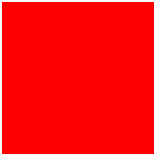
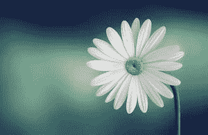
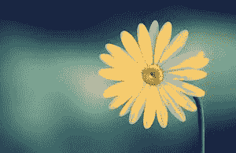

# 蟒蛇皮枕头–图像上的颜色

> 原文:[https://www . geeksforgeeks . org/python-枕头-图像上的颜色/](https://www.geeksforgeeks.org/python-pillow-colors-on-an-image/)

在本文中，我们将使用 Python 中的枕头模块学习图像上的颜色。让我们讨论一些概念:

*   Python 图像库中的一个关键类是图像类。它在图像模块中定义，并提供一个 PIL 图像，在该图像上经常进行操作。这个类的实例通常以几种方式创建:从文件中加载图像，从头开始创建图像，或者作为处理其他图像的结果。我们会看到这些都在使用。
*   任何图像都由像素组成，每个像素代表图像中的一个点。一个像素包含三个值，每个值的范围在 0 到 255 之间，代表红色、绿色和蓝色分量的数量。这些的组合形成了像素的实际颜色。
*   **ImageColor** 模块包含颜色表和从 CSS3 风格的颜色说明符到 RGB 元组的转换器。本模块由 [PIL 使用。Image.Image.new()](https://www.geeksforgeeks.org/python-pil-image-new-method/) 和 ImageDraw 模块等。

ImageColor 模块，包含各种表示颜色的格式。这些格式如下:

*   **字符串:**颜色也可以表示为红、绿、蓝、黄等字符串。它们不区分大小写。
*   **十六进制颜色:**表示为:#rgb 或#rrggbb。例如- #ffff00 代表黄色，其中红色为 255，绿色为 255，蓝色为 0。RGB 将是一个元组-(255，255，0)
*   **圆柱形:**表示为 HSL，其中 H 为色相，S 为饱和度，L 为颜色的明度。例如- #ffff00 表示黄色，其中色调为 0.63，饱和度为 1.00，明度值为 0.50。

### 用颜色创建图像

这里，我们将使用 Image.new()方法创建带有颜色的图像。

**PIL。Image.new()** 方法创建一个具有给定模式和大小的新图像。尺寸是以像素为单位的(宽度，高度)元组。颜色作为单波段图像的单个值给出，作为多波段图像的元组给出(每个波段一个值)。我们也可以使用颜色名称。如果省略了颜色参数，图像将被零填充(这通常对应于黑色)。如果颜色为“无”，则图像不会初始化。如果您要在图像中粘贴或绘制东西，这可能会很有用。

> ***句法:** PIL。Image.new(模式、大小、颜色)*
> 
> ***参数:***
> 
> *   ***模式:**用于新图像的模式。(可能是 RGB，RGBA)*
> *   ***大小:**包含(宽度、高度)像素的二元组。*
> *   ***颜色:**图像使用什么颜色。默认为黑色。如果给定，对于单波段模式，这应该是单个整数或浮点值，对于多波段模式，这应该是一个元组。*
> 
> ***返回值:**一个**图像**对象。*

## 蟒蛇 3

```py
from PIL import Image

# color --> "red" or (255,0,0) or #ff0000
img = Image.new('RGB',(200,200),(255,0,0))
img.show()
```

**输出:**



### 将颜色字符串转换为 RGB 颜色值

使用 ImageColor 模块，我们还可以将颜色转换为 RGB 格式(RGB 元组)，因为 RGB 非常方便执行不同的操作。为此我们将使用**[](https://www.geeksforgeeks.org/python-pil-imagecolor-getrgb-method/)****的方法。 **ImageColor.getrgb()** 将颜色字符串转换为 rgb 元组。如果无法解析字符串，此函数将引发 ValueError 异常。******

> ******语法:**GDP。image color . image GB(颜色)****
> 
> *******参数:*******
> 
> *   *******颜色:**一个颜色串*****
> 
> *******返回:**(红、绿、蓝[，阿尔法])*****

## ****蟒蛇 3****

```py
**# importing module
from PIL import ImageColor

# using getrgb for yellow
img1 = ImageColor.getrgb("yellow")
print(img1)

# using getrgb for red
img2 = ImageColor.getrgb("red")
print(img2)**
```

******输出:******

```py
**(255, 255, 0)
(255, 0, 0)**
```

### ****将颜色字符串转换为灰度值****

****[**imagecolor . getcolor()**](https://www.geeksforgeeks.org/python-pil-imagecolor-getcolor-method/)与 getrgb()相同，但如果模式不是彩色或调色板图像，则将 rgb 值转换为灰度值。如果无法解析字符串，此函数将引发 ValueError 异常。****

> *******语法：** 。ImageColor.getcolor（color， mode）*****
> 
> *******参数:*******
> 
> *   *******颜色**–一个颜色串*****
> 
> *******返回:**(灰度[，阿尔法])或(红、绿、蓝[，阿尔法])*****

## ****蟒蛇 3****

```py
**# importing module
from PIL import ImageColor

# using getrgb for yellow
img1 = ImageColor.getcolor("yellow",'L')
print(img1)

# using getrgb for red
img2 = ImageColor.getcolor("red",'L')
print(img2)**
```

******输出:******

```py
**226
76**
```

### ****通过更改像素值来更改颜色****

****我们还可以将图像的颜色更改为其他颜色。****

******输入图像:******

********

## ****蟒蛇 3****

```py
**from PIL import Image

img = Image.open("flower.jpg")
img = img.convert("RGB")

d = img.getdata()

new_image = []
for item in d:

    # change all white (also shades of whites)
    # pixels to yellow
    if item[0] in list(range(200, 256)):
        new_image.append((255, 224, 100))
    else:
        new_image.append(item)

# update image data
img.putdata(new_image_data)

# save new image
img.save("flower_image_altered.jpg")**
```

******输出:******

********