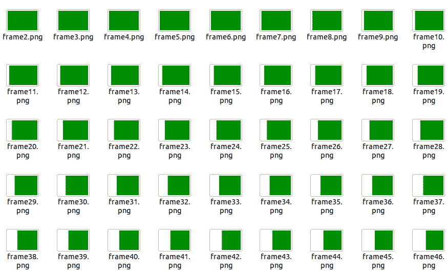

# 蟒蛇枕–图像序列

> 原文:[https://www . geeksforgeeks . org/python-枕头-图像-序列/](https://www.geeksforgeeks.org/python-pillow-image-sequences/)

枕头中的**图像序列**模块包含一个包装类，帮助用户迭代图像序列的帧。它可以迭代动画、gif 等。

## **迭代器类**

此类接受图像对象作为参数。它实现了一个迭代器对象，用户可以使用它来迭代图像序列。 **[ ]** 运算符可用于通过索引访问元素，如果用户试图访问不存在的索引，这将引发**索引错误**。

**语法:**

> **语法:**类 PIL。迭代器(图像对象)

首先，模块**图像**和**图像序列**应该导入，因为我们将使用**图像.打开()**来打开图像或动画文件，在第二个示例中，我们将使用**图像.显示()**来显示图像。然后借助**图像序列。迭代器(image_object)** 方法我们可以对帧进行迭代，也可以提取图像序列中存在的所有帧，并将它们保存在文件中。

**我们将使用这个 Gif 进行演示:**


**下面是实现:**

## 蟒蛇 3

```py
# importing the ImageSequence module:
from PIL import Image, ImageSequence

# Opening the input gif:
im = Image.open("animation.gif")

# create an index variable:
i = 1

# iterate over the frames of the gif:
for fr in ImageSequence.Iterator(im):
    fr.save("frame%d.png"%i)
    i = i + 1
```

**输出:**

动画(gif 文件)总共有 36 帧。输出将在。png 模式。



**索引错误示例:**

对于这个例子，我们将使用本文之前使用的程序的一个小的修改版本。我们已经看到，上面的动画总共有 36 帧，索引从 0 到 35。当我们试图访问第 36 帧时，它会显示**索引错误**。

**访问最后一帧:**

## 蟒蛇 3

```py
# importing the ImageSequence module:
from PIL import Image, ImageSequence

# Opening the input gif:
im = Image.open("animation.gif")

# create an index variable:
i =1

# create an empty list to store the frames:
app = []

# iterate over the frames of the gif:
for fr in ImageSequence.Iterator(im):
    app.append(fr)
    fr.save("frame%d.png"%i)
    i = i + 1

# print the length of the list of frames.
print(len(app))

app[35].show()
```

**输出:**


**访问不存在的帧:**

## 蟒蛇 3

```py
# importing the ImageSequence module:
from PIL import Image, ImageSequence

# Opening the input gif:
im = Image.open("animation.gif")

# create an index variable:
i =1

# create an empty list to store the frames:
app = []

# iterate over the frames of the gif:
for fr in ImageSequence.Iterator(im):
    app.append(fr)
    fr.save("frame%d.png"%i)
    i = i + 1

# print the length of the list of frames.
print(len(app))

# nonexistent frame it will show
# IndexError
app[36].show()
```

**输出:**

```py
IndexError: list index out of range
```