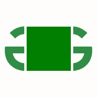
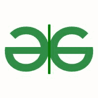

# 蟒蛇枕–ImageDraw 模块

> 哎哎哎:# t0]https://www . geeksforgeeks . org/python-pillow-imagedraw-module/

python 的枕头是停产的 Python 图像库(PIL)的分叉，是一个强大的库，能够为您的 Python 代码添加图像处理功能。枕头提供了许多模块，可以简化处理和修改图像的过程。

在本文中，我们将了解这个库的 ImageDraw 模块。ImageDraw 提供了多种方法，顾名思义，可以在图像上进行绘制。在这个模块的帮助下，我们可以画线、画圆、画矩形，甚至在图像上书写和格式化文本。

## 在图像上绘制常见形状

我们将使用的图像可以使用 PIL 显示如下:

## 计算机编程语言

```py
# Importing Image and ImageDraw from PIL
from PIL import Image, ImageDraw

# Opening the image to
# be used and displaying it
img = Image.open('img_path.png')
img.show()
```

**输出**


输出图像如下

我们可以通过首先创建一个“绘制”对象，使用“绘制”方法在图像上绘制形状和图形。

### 在图像上绘制矩形:

为了绘制矩形，我们使用 ImageDraw 模块的矩形绘制方法:

> **语法:** ImageDraw.rectangle(xy，填充，轮廓，宽度)
> 
> **该方法的参数为:**
> 
> *   **xy :** 对应于包围您的形状的左上角和右下角坐标中的点集的元组。这些点在元组中传递如下:(左上 x 坐标、左上 y 坐标、右下 x 坐标、右下 y 坐标)
> *   **填充:**对应于填充形状的 RGB 颜色值元组。
> *   **轮廓:**对应于为形状边界指定的 RGB 颜色值元组。
> *   **宽度:**对应形状边界厚度的整数值。注:各种形状绘制方法的参数相似。

## 计算机编程语言

```py
# Importing Image and ImageDraw from PIL
from PIL import Image, ImageDraw

# Opening the image to be used
img = Image.open('img_path.png')

# Creating a Draw object
draw = ImageDraw.Draw(img)

# Drawing a green rectangle
# in the middle of the image
draw.rectangle(xy = (50, 50, 150, 150),
               fill = (0, 127, 0),
               outline = (255, 255, 255),
               width = 5)

# Method to display the modified image
img.show()
```

**输出:**



矩形方法的输出图像

### 在图像上绘制椭圆(圆):

为了绘制椭圆形状，我们使用 ImageDraw 方法中的椭圆方法:

> **语法:** ImageDraw.ellipse(xy，填充，轮廓，宽度)

您将在 xy 中提供的坐标将作为一个方框，圆圈将被包含在其中。

## 计算机编程语言

```py
# Importing Image and ImageDraw from PIL
from PIL import Image, ImageDraw

# Opening the image to be used
img = Image.open('img_path.png')

# Creating a Draw object
draw = ImageDraw.Draw(img)

# Drawing a green circle on the image
draw.circle(xy = (50, 50, 150, 150), 
            fill = (0, 127, 0),
            outline = (255, 255, 255),
            width = 5)

# Method to display the modified image
img.show()
```

**输出:**


椭圆方法的输出图像

### 在图像上画线:

为了画线，我们使用 ImageDraw 方法中的线条方法:

> **语法:**limajaw . ine(xy，fill，width)

这里不考虑轮廓参数，宽度将决定线条的长度。

## 计算机编程语言

```py
# Importing Image and ImageDraw from PIL
from PIL import Image, ImageDraw

# Opening the image to be used
img = Image.open('img_path.png')

# Creating a Draw object
draw = ImageDraw.Draw(img)

# Drawing a green vertical
# line in the middle image
draw.line(xy=(50, 150, 150, 50),
          fill=(0, 128, 0), width = 5)

# Method to display the modified image
img.show()
```

**输出:**



线方法的输出图像

### 在图像上绘制多边形:

我们可以使用 ImageDraw 方法中的多边形方法绘制所需形状的多边形:

> **语法:** ImageDraw.polygon(xy，填充，轮廓)

xy 元组参数将包含基于形状所需边数的坐标。这里，宽度参数无效。

## 计算机编程语言

```py
# Importing Image and ImageDraw from PIL
from PIL import Image, ImageDraw

# Opening the image to be used
img = Image.open('img_path.png')

# Creating a Draw object
draw = ImageDraw.Draw(img)

# Drawing a green diamond-shaped
# polygon in the middle of the image
draw.polygon(xy=(50, 150, 150, 50),
             fill=(0, 128, 0), 
             outline=(255, 255, 255))

# Method to display the modified image
img.show()
```

**输出:**


多边形方法的输出图像

**同样，我们可以用这些方法画一些其他的形状:**

1.  **弧:** ImageDraw.arc(xy，开始，结束，填充，宽度)
2.  **和弦(弓形):**图像绘制和弦(xy，开始，结束，填充，轮廓，宽度)
3.  **点:**图像绘制点(xy，填充)
4.  **piece slice:**imagedraw . piece slice(xy，开始，结束，填充，轮廓，宽度)

开始和结束参数对应顺时针方向的角度，用一条线连接。

## 在图像上书写文本:

使用我们的绘图对象，我们还可以在图像上书写文本。可以使用文本方法完成:

> **语法:** ImageDraw.text(xy，文本，填充，字体，锚点，间距，对齐，方向，特征，语言，笔画 _ 宽度，笔画 _ 填充，嵌入 _ 颜色)

我们还将使用来自 PIL 的图像字体为我们的文本使用所需的字体。

## 计算机编程语言

```py
# Importing Image, ImageDraw and ImageFont 
# from PIL
from PIL import Image, ImageDraw, ImageFont

# Opening the image to be used
img = Image.open('img_path.png')

# Creating an instance for
# the font to be used using ImageFont
# Here we pass the font name and
# the font size as arguments
fnt = ImageFont.truetype("Pillow/Tests/fonts/FreeMono.ttf", 20)

# Creating a Draw object
draw = ImageDraw.Draw(img)

# Drawing the text on the image
draw.text(xy=(25, 160),
          text="Hello, Geeks!",
          font=fnt,
          fill=(0, 127, 0))

img.show()
```

**输出:**


文本方法的输出图像