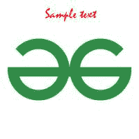

# 蟒蛇枕–在图像上书写文字

> 原文:[https://www . geesforgeks . org/python-抱枕-写作-图像上的文字/](https://www.geeksforgeeks.org/python-pillow-writing-text-on-image/)

在本文中，我们将看到如何使用 Python [枕头](https://www.geeksforgeeks.org/python-pillow-a-fork-of-pil/)模块在图像上书写文本。

### 装置

本模块未预装 Python。要安装它，请在命令行中执行以下命令:

```
pip install pillow
```

**分步实施:**

**第一步:**导入枕库

要完成这项任务，枕头库中需要的功能有:图像、图像绘制、图像字体。所有这些功能都导入为:

> *来自 GDP 导入图像、图像绘制、图像字体*

**步骤 2:** 打开图像

在这一步中，我们要添加文本的图像被导入并使用“Image.open('Image_name ')打开”。在给定的情况下，gfg 徽标用于在其上添加文本。图像名称是 gfg_logo.jpeg。因此，它被写成:

> *img = image . open(' gfg _ logo . JPEG ')*

**第三步:**图像转换

在这一步中，我们使用“ImageDraw”将图像转换为可编辑的格式。Draw('用于存储上述步骤中的图像的变量')"。在给定的情况下，这被写成:

> *d1 =图像绘制。Draw(img)*

**第四步:**字体样式。

这一步是可选的。对于那些希望自己的文本看起来很酷或很时尚的人来说，因为有人不会选择任何字体样式，所以系统会采用默认的字体样式。首先从 https://ttfonts.net/font/1004_Mistral.htm 下载字体样式文件。下载文件后，使用函数 imagefont . truetype(' adddress _ of _ font_style '，font _ style)。在给定的情况下，这被写成:

> *myfont = imagefont . truetype('/home/raghav/pycharprojects/gfg/mistral . TTF '，20 ')t1〕*

**步骤 5:** 渲染文本

这是决定字体整体属性的主要步骤。这写为:

> *d1.text((65，10)，“示例文本”，fill =(255，0，0)，font=myFont)*

*   **起始坐标:**枕头库采用笛卡尔像素坐标系，左上角为(0，0)。
*   **文本:**单引号或双引号之间的字符串
*   **RGB 格式的文字颜色:**对于你想要的颜色，你可以去谷歌查一下它的 RGB 色码并使用。
*   **字体样式:**从谷歌下载字体并使用。

**第 6 步:**显示并保存结果。

最后一步是使用 img.show()函数在屏幕上显示修改后的图像，并使用 img.save("results.jpeg ")存储图像。

**下面是实现:**


输入图像

## 蟒蛇 3

```
# Import Image for basic functionalities like open, save, show
# Import ImageDraw to convert image into editable format
# Import ImageFont to choose the font style
from PIL import Image, ImageDraw, ImageFont

# gfg_logo.jpeg image opened using open
# function and assigned to variable named img
img = Image.open('gfg_logo.jpeg')

# Image is converted into editable form using
# Draw function and assigned to d1
d1 = ImageDraw.Draw(img)

# Font selection from the downloaded file
myFont = ImageFont.truetype('/home/raghav/PycharmProjects/gfg/Mistral.ttf', 20)

# Decide the text location, color and font
d1.text((65, 10), "Sample text", fill =(255, 0, 0),font=myFont)

# show and save the image
img.show()
img.save("results.jpeg")
```

**输出:**



修改后的图像

**示例 1:** 要更改文本的位置，请在步骤 5 中更改坐标。

尺寸从(65，100)更改为(65，170)。因此，文本的位置下降，因为从(x，y)坐标开始，y 坐标的值增加，如输出所示。

## 蟒蛇 3

```
# Import Image for basic functionalities like open, save, show
# Import ImageDraw to convert image into editable format
# Import ImageFont to choose the font style
from PIL import Image, ImageDraw, ImageFont

# gfg_logo.jpeg image opened using
# open function and assigned to variable named img
img = Image.open('gfg_logo.jpeg')

# Image is converted into editable form using
# Draw function and assigned to d1
d1 = ImageDraw.Draw(img)

# Font selection from the downloaded file
myFont = ImageFont.truetype('/home/raghav/PycharmProjects/gfg/Mistral.ttf', 20)

# Decide the text location, color and font
d1.text((65, 170), "Sample text", fill =(255, 0, 0),font=myFont)

# show and save the image
img.show()
img.save("results.jpeg")
```

**输出:**


更改坐标后的图像

**示例 2:** 要更改文本的颜色，请在步骤 5 中再次更改。

枕头上有 RGB 颜色代码(红、绿、蓝)。在上述情况下，R 和 B 值为 0，G 值为 255，即最大值。因此，文本的颜色变为绿色，如输出所示。

## 蟒蛇 3

```
# Import Image for basic functionalities like open, save, show
# Import ImageDraw to convert image into editable format
# Import ImageFont to choose the font style
from PIL import Image, ImageDraw, ImageFont

# gfg_logo.jpeg image opened using
# open function and assigned to variable named img
img = Image.open('gfg_logo.jpeg')

# Image is converted into editable form using Draw function
# and assigned to d1
d1 = ImageDraw.Draw(img)

# Font selection from the downloaded file
myFont = ImageFont.truetype('/home/raghav/PycharmProjects/gfg/Mistral.ttf', 20)

# Decide the text location, color and font
d1.text((65, 170), "Sample text", fill =(0, 255, 0),font=myFont)

# show and save the image
img.show()
img.save("results.jpeg")
```

**输出:**


更改文本颜色后的图像

**示例 3:** 要更改文本，请在步骤 5 中更改文本字段。

## 蟒蛇 3

```
# Import Image for basic functionalities like open, save, show
# Import ImageDraw to convert image into editable format
# Import ImageFont to choose the font style
from PIL import Image, ImageDraw, ImageFont

# gfg_logo.jpeg image opened using open function
# and assigned to variable named img
img = Image.open('gfg_logo.jpeg')

# Image is converted into editable form using Draw
# function and assigned to d1
d1 = ImageDraw.Draw(img)

# Font selection from the downloaded file
myFont = ImageFont.truetype('/home/raghav/PycharmProjects/gfg/Mistral.ttf', 20)

# Decide the text location, color and font
d1.text((65, 170), "Sample text 2", fill=(0, 255, 0), font=myFont)

# show and save the image
img.show()
img.save("results.jpeg")
```

**输出:**


更改文本字段后的图像

**示例 4:** 要更改文本的大小，请转到步骤 4 并更改大小。

## 蟒蛇 3

```
# Import Image for basic functionalities like open, save, show
# Import ImageDraw to convert image into editable format
# Import ImageFont to choose the font style
from PIL import Image, ImageDraw, ImageFont

# gfg_logo.jpeg image opened using
# open function and assigned to variable named img
img = Image.open('gfg_logo.jpeg')

# Image is converted into editable form using
# Draw function and assigned to d1
d1 = ImageDraw.Draw(img)

# Font selection from the downloaded file
myFont = ImageFont.truetype('/home/raghav/PycharmProjects/gfg/Mistral.ttf', 30)

# Decide the text location, color and font
d1.text((65, 170), "Sample text", fill = (0, 255, 0),font=myFont)

# show and save the image
img.show()
img.save("results.jpeg")
```

**输出:**


更改文本大小后的图像

**示例 5:** 要更改文本字体，请转到步骤 4。

## 蟒蛇 3

```
# Import Image for basic functionalities like open, save, show
# Import ImageDraw to convert image into editable format
# Import ImageFont to choose the font style
from PIL import Image, ImageDraw, ImageFont

# gfg_logo.jpeg image opened using open function and
# assigned to variable named img
img = Image.open('gfg_logo.jpeg')

# Image is converted into editable form using Draw
# function and assigned to d1
d1 = ImageDraw.Draw(img)

# Font selection from the downloaded file
myFont = ImageFont.truetype('/home/raghav/PycharmProjects/gfg/00006_44s.ttf', 30)

# Decide the text location, color and font
d1.text((0, 170), "Sample text", fill =(0, 255, 0),font=myFont)

# show and save the image
img.show()
img.save("results.jpeg")
```

**输出:**


更改字体样式后的图像