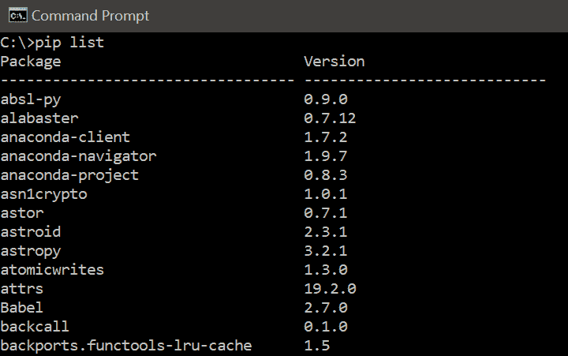
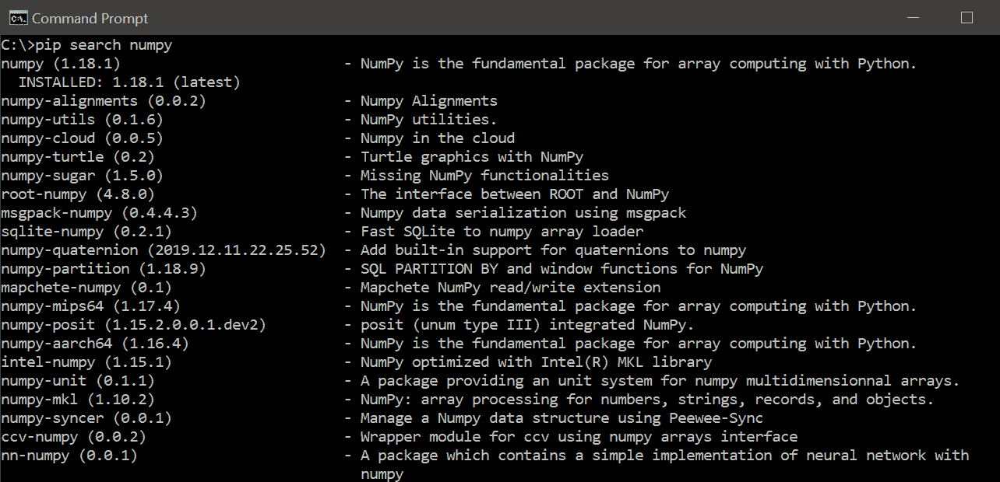
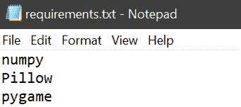
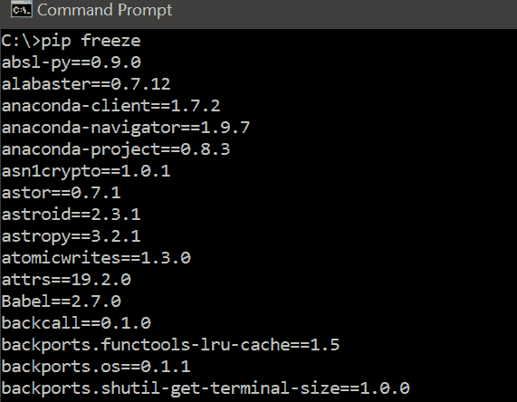
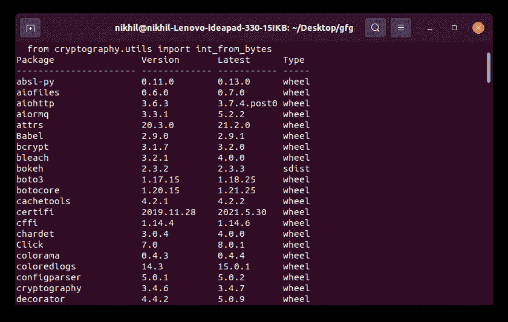
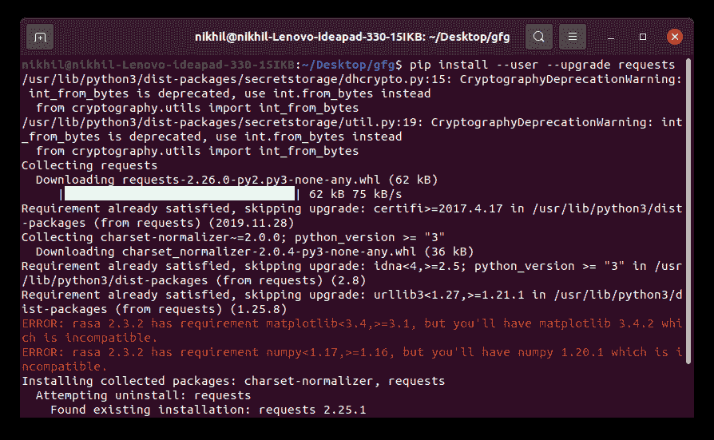
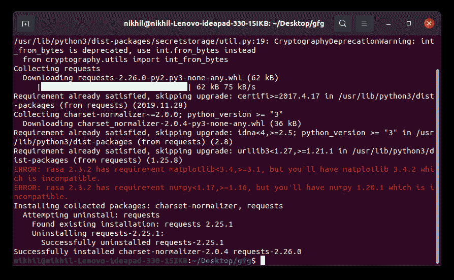
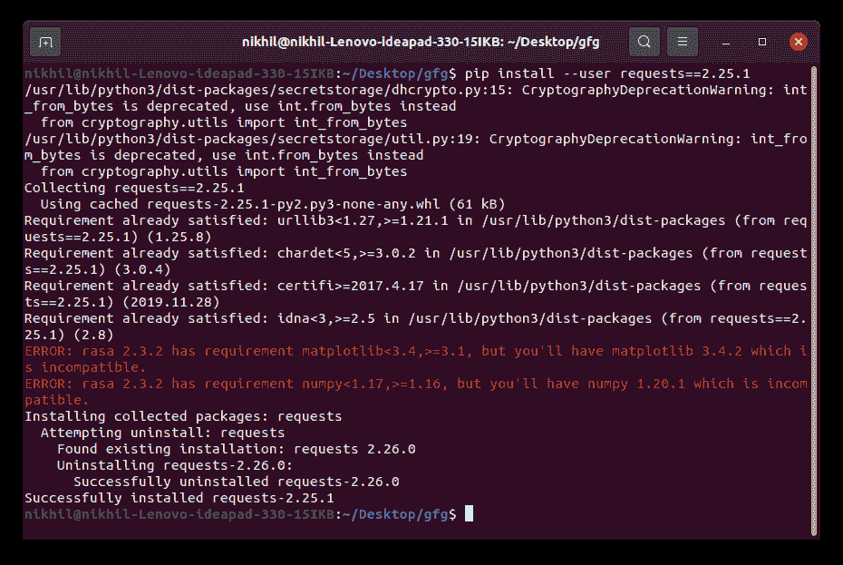

# Python PIP

> 原文:[https://www.geeksforgeeks.org/python-pip/](https://www.geeksforgeeks.org/python-pip/)

在本文中，我们将讨论什么是 pip，如何使用 pip 安装、升级和卸载软件包。所以在开始使用之前让我们先了解一下什么是 pip？

## 皮普是什么？

**Python pip** 是 Python 包的包管理器。我们可以使用 pip 来安装 Python 没有的包。命令提示符中 pip 命令的基本语法是:

```py
pip 'arguments'
```

## 如何安装 pip？

Python pip 预装在 3.4 或更早版本的 Python 上。要检查 pip 是否已安装，请在终端中键入以下命令。

```py
pip --version
```

如果画中画已经安装在系统中，这个命令将告诉画中画的版本。


> **如果您的系统上没有安装 pip，请参考以下文章。**
> 
> *   [如何在 Windows 上安装 PIP？](https://www.geeksforgeeks.org/how-to-install-pip-on-windows/)
> *   [如何在 Linux 中安装 PIP？](https://www.geeksforgeeks.org/how-to-install-pip-in-linux/)
> *   [如何在 macOS 中安装 pip？](https://www.geeksforgeeks.org/how-to-install-pip-in-macos/)

## Python pip 安装包

我们可以使用 Python **pip install** 命令来安装额外的包。假设我们想用 pip 安装 numpy。我们可以使用下面的命令来完成。

**语法:**

```py
<pip install numpy
```

**例 1:** 未安装所需软件包时。


**示例 2:** 当所需的包已经安装时。


## 指定包版本

我们也可以使用下面的命令安装特定版本的软件包。

**语法:**

```py
pip install package_name==version
```

这将安装具有指定版本的软件包

## **使用画中画**显示包裹信息

我们可以使用 Python **pip show** 命令来显示特定包的详细信息。

**语法:**

```py
pip show numpy
```

**示例:**


**注:**

*   “需要”列显示了 NumPy 包所需的依赖关系
*   所需的显示需要 NumPy 的包

## **用 pip 列出已安装的软件包**

Python **pip list** 命令显示系统中安装的软件包列表。

**语法:**

```py
pip list
```

**示例:**



## **用 pip 卸载软件包**

Python **pip 卸载**命令卸载特定的现有包。

**语法:**

```py
pip uninstall numpy
```

**示例:**


**注意:**pip 卸载命令不会卸载包依赖项。如果您也想删除依赖项，那么您可以使用 pip show 命令查看依赖项，并手动删除每个包。

## **用画中画搜索包裹**

我们可以使用 Python **pip 搜索**命令来搜索特定的现有包。

**语法:**

```py
pip search numpy
```

**示例:**



## **使用带画中画的需求文件**

让我们假设您想要一个以上的软件包，那么您可以一次安装所有模块，而不是手动安装每个软件包。这可以通过创建一个 requirements.txt 文件来完成。让我们假设 requirements.txt 文件如下所示–



**语法:**

```py
pip install -r requirements.txt
```

**示例:**


## **用 pip 列出附加包装**

Python **pip 冻结**命令用于列出没有预装 Python 的包。

**语法:**

```py
pip freeze
```

**示例:**



## 用画中画列出过期的包

python**pip list–过时**命令用于列出所有过时的包。该命令将安装的包信息与 pip 存储库进行交叉检查。

**语法:**

```py
pip list --outdated
```

**示例:**



## 使用 pip 升级软件包

Python **pip 安装-用户-升级**用于更新一个包。

**语法:**

```py
pip install --user --upgrade package_name
```

**示例:**

 

我们还可以使用下面的命令将任何包升级到特定的版本。

```py
pip install --user --upgrade package_name==version
```

## 用 pip 降级包

Python**pip install–user**命令用于将包降级到特定版本。

**语法:**

```py
pip install --user package_name==version
```

**示例:**

