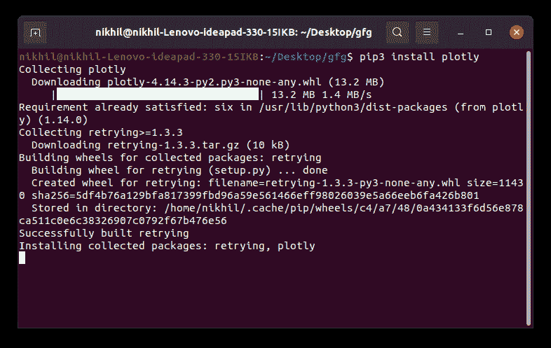
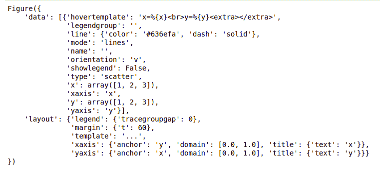

# Python 剧情教程

> 原文:[https://www.geeksforgeeks.org/python-plotly-tutorial/](https://www.geeksforgeeks.org/python-plotly-tutorial/)

**Python Plotly** Library 是一个开源库，可以简单轻松地进行数据可视化和理解数据。Plotly 支持各种类型的图，如折线图、散点图、直方图、cox 图等。所以你们一定想知道为什么 Plotly 比其他可视化工具或库更重要？答案如下

*   Plotly 具有悬停工具功能，允许我们检测大量数据点中的任何异常值或异常情况。
*   它在视觉上很有吸引力，能被广大观众所接受。
*   它允许我们对我们的图表进行无休止的定制，这使得我们的情节对其他人来说更有意义和更容易理解。


本教程旨在借助庞大的数据集向您提供关于 Plotly 的见解，从基础到高级解释 Plotly，并涵盖所有常用的图表。

**目录**

> *   [Installation](#Installation)
> *   [Packaging structure diagram](#Package)
> *   [Introduction diagram](#Getting)
> *   [Create different types of charts](#Different)
>     *   [Line chart](#Line)
>     *   [Bar chart](#Bar)
>     *   [Histogram](#Histograms)
>     *   [Scatter chart and bubble chart](#Scatter)
>     
>     *   contour map
>     *   [heat map](#Heatmaps)
>     *   [error line](#Error)
>     *   [3D line graph](#3D1)
>     *   [Three-dimensional scatter diagram](#3D2)
>     *   [3D surface drawing](#3D3)
> *   [interacts with figure](#Interacting)

[**Plotly 上最近的文章！！！**T3】](https://www.geeksforgeeks.org/tag/python-plotly/)

## 装置

Plotly 没有内置 Python。要安装它，请在终端中键入以下命令。

```
pip install plotly
```



这可能需要一些时间，因为它也会安装依赖项。

## Plotly 的包装结构

Plotly 中有三个主要模块。它们是:

*   阴谋地
*   图表对象
*   plotly .工具

**plotly.plotly** 充当本地机器和 plotly 之间的接口。它包含需要 Plotly 服务器响应的功能。

**plotly.graph_objects** 模块包含负责创建图的对象(图形、布局、数据和图的定义，如散点图、折线图)。图形可以表示为字典或**的实例。图**在传递给 plotly.js 之前，这些被序列化为 JSON。为了更好地理解，考虑下面的例子。

**注意:** plotly.express 模块可以一次创建整个图形。它在内部使用 graph_objects 并返回 graph_objects。图实例。

**示例:**

## 蟒蛇 3

```
import plotly.express as px

# Creating the Figure instance
fig = px.line(x=[1,2, 3], y=[1, 2, 3])

# printing the figure instance
print(fig)
```

**输出:**



图被表示为树，其中根节点具有三个顶层属性–**数据、布局和框架**以及被称为“属性”的命名节点。考虑上面的例子， **layout.legend** 是一个嵌套的字典，其中图例是字典内部的键，其值也是字典。

**plotly.tools** 模块包含各种工具形式的功能，可以增强 plotly 的体验。

## 入门指南

在学习了 plotly 的安装和基本结构之后，让我们使用 Plotly 定义的预定义数据集创建一个简单的图。

**示例:**

## 蟒蛇 3

```
import plotly.express as px

# Creating the Figure instance
fig = px.line(x=[1, 2, 3], y=[1, 2, 3])

# showing the plot
fig.show()
```