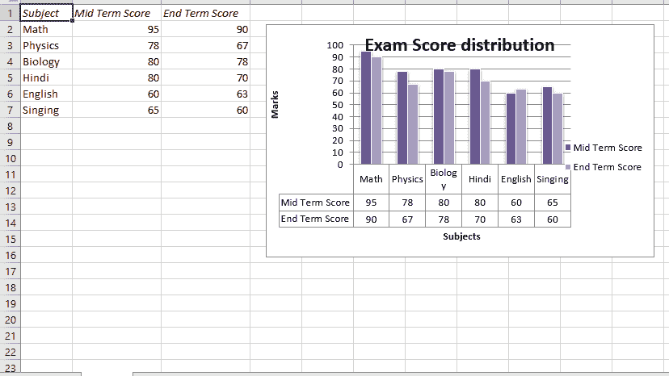
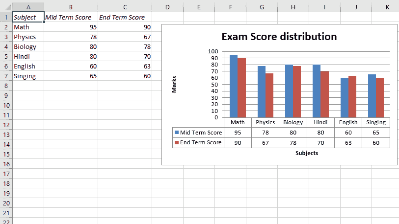

# Python |使用 XlsxWriter 模块在带有数据表的 excel 工作表中绘制柱形图

> 原文:[https://www . geesforgeks . org/python-绘图-柱形图-excel 表格-数据表-使用-xlsxwriter-module/](https://www.geeksforgeeks.org/python-plotting-column-charts-in-excel-sheet-with-data-tables-using-xlsxwriter-module/)

**先决条件:** [在 excel 表格上创建和书写](https://www.geeksforgeeks.org/python-create-and-write-on-excel-file-using-xlsxwriter-module/)
**XlsxWriter** 是一个 Python 库，使用它可以对 excel 文件执行多种操作，如创建、书写、算术运算和绘制图形。让我们看看如何使用实时数据绘制带有数据表的图表。
图表由至少一系列一个或多个数据点组成。系列本身由单元格区域的引用组成。要在 excel 表上绘制图表，首先要创建特定图表类型的图表对象(如柱形图等)。).创建图表对象后，在其中插入数据，最后，将该图表对象添加到工作表对象中。

**代码#1 :** 用默认数据表绘制柱形图。

要在 excel 工作表中绘制这种类型的图表，请使用图表对象的 set_table()方法。

## 蟒蛇 3

```py
# import xlsxwriter module
import xlsxwriter

# Workbook() takes one, non-optional, argument  
# which is the filename that we want to create.
workbook = xlsxwriter.Workbook('Ex_chart2.xlsx')

# The workbook object is then used to add new  
# worksheet via the add_worksheet() method.
worksheet = workbook.add_worksheet()

# Create a new Format object to formats cells
# in worksheets using add_format() method .

# here we create italic format object
bold = workbook.add_format({'italic': 1})

# Add the worksheet data that the charts will refer to.
Data1 = ['Subject', 'Mid Term Score', 'End Term Score']
Data2 = [["Math", "Physics", "Biology", "Hindi", "English", "Singing"],
         [95, 78, 80, 80, 60, 65],
         [90, 67, 78, 70, 63, 60]]

# Write a row of data starting from 'A1'
# with bold format .
worksheet.write_row('A1', Data1, bold)

# Write a column of data starting from 
# 'A2', 'B2', 'C2' respectively .
worksheet.write_column('A2', Data2[0])
worksheet.write_column('B2', Data2[1])
worksheet.write_column('C2', Data2[2])

# set the width of B and C column
worksheet.set_column('B:C', 15)

# Create a chart object that can be added
# to a worksheet using add_chart() method.

# here we create a column chart object .
chart1 = workbook.add_chart({'type': 'column'})

# Add a data series to a chart
# using add_series method.

# Configure the first series.
# = Sheet1 !$A$1 is equivalent to ['Sheet1', 0, 0].

# note : spaces is not inserted in b/w
# = and Sheet1, Sheet1 and !
# if space is inserted it throws warning.
chart1.add_series({
    'name':       '= Sheet1 !$B$1',
    'categories': '= Sheet1 !$A$2:$A$7',
    'values':     '= Sheet1 !$B$2:$B$7', })

# Configure a second series.
# Note use of alternative syntax to define ranges.
# [sheetname, first_row, first_col, last_row, last_col].
chart1.add_series({
    'name':       ['Sheet1', 0, 2],
    'categories': ['Sheet1', 1, 0, 6, 0],
    'values':     ['Sheet1', 1, 2, 6, 2], })

# Add a chart title 
chart1.set_title({'name': 'Exam Score distribution'})

# Add x-axis label
chart1.set_x_axis({'name': 'Subjects'})

# Add y-axis label
chart1.set_y_axis({'name': 'Marks'})

# set the style of the chart.
chart1.set_style(14)

# set the plot area layout of chart
chart1.set_plotarea({
    'layout': {
        'x':      0.15,
        'y':      0.09,
        'width':  0.63,
        'height': 0.40, } })

# Set a data table on the X-Axis
# with the legend keys shown.
chart1.set_table()

# add chart to the worksheet with given
# offset values at the top-left corner of
# a chart is anchored to cell D2 .
worksheet.insert_chart('D2', chart1,
    {'x_offset': 20, 'y_offset': 5})

# Finally, close the Excel file 
# via the close() method. 
workbook.close()
```

**输出:**



**代码#2 :** 用默认数据表和图例绘制柱形图。
要在 excel 工作表中绘制这种类型的图表，请将 set_table()方法与图表对象的“show_keys”关键字参数一起使用。

## 蟒蛇 3

```py
# import xlsxwriter module
import xlsxwriter

# Workbook() takes one, non-optional, argument  
# which is the filename that we want to create.
workbook = xlsxwriter.Workbook('Ex_chart1.xlsx')

# The workbook object is then used to add new  
# worksheet via the add_worksheet() method.
worksheet = workbook.add_worksheet()

# Create a new Format object to formats cells
# in worksheets using add_format() method .

# here we create italic format object
bold = workbook.add_format({'italic': 1})

# Add the worksheet data that the charts will refer to.
Data1 = ['Subject', 'Mid Term Score', 'End Term Score']
Data2 = [ ["Math", "Physics", "Biology", "Hindi", "English", "Singing"],
          [95, 78, 80, 80, 60, 65],
          [90, 67, 78, 70, 63, 60] ]

# Write a row of data starting from 'A1'
# with bold format .
worksheet.write_row('A1', Data1, bold)

# Write a column of data starting from 
# 'A2', 'B2', 'C2' respectively .
worksheet.write_column('A2', Data2[0])
worksheet.write_column('B2', Data2[1])
worksheet.write_column('C2', Data2[2])

# set the width of B and C column
worksheet.set_column('B:C', 15)

# Create a chart object that can be added
# to a worksheet using add_chart() method.

# here we create a column chart object .
chart2 = workbook.add_chart({'type': 'column'})

# Add a data series to a chart
# using add_series method.

# Configure the first series.
# = Sheet1 !$A$1 is equivalent
# to ['Sheet1', 0, 0].

# note : spaces is not inserted in b / w
# = and Sheet1, Sheet1 and !
# if space is inserted it throws warning.
chart2.add_series({
    'name':       '= Sheet1 !$B$1',
    'categories': '= Sheet1 !$A$2:$A$7',
    'values':     '= Sheet1 !$B$2:$B$7', })

# Configure a second series.
# Note use of alternative syntax to define ranges.
# [sheetname, first_row, first_col, last_row, last_col].
chart2.add_series({
    'name':       ['Sheet1', 0, 2],
    'categories': ['Sheet1', 1, 0, 6, 0],
    'values':     ['Sheet1', 1, 2, 6, 2], })

# Add a chart title 
chart2.set_title({'name': 'Exam Score distribution'})

# Add x-axis label
chart2.set_x_axis({'name': 'Subjects'})

# Add y-axis label
chart2.set_y_axis({'name': 'Marks'})

# Set a data table on the X-Axis with the legend keys shown.
chart2.set_table({'show_keys': True})

# hide the chart legends.
chart2.set_legend({'position': 'none'})

# add chart to the worksheet with given
# offset values at the top-left corner of
# a chart is anchored to cell D2 .
worksheet.insert_chart('D2', chart2,
     {'x_offset': 20, 'y_offset': 5})

# Finally, close the Excel file 
# via the close() method. 
workbook.close()
```

**输出:**

