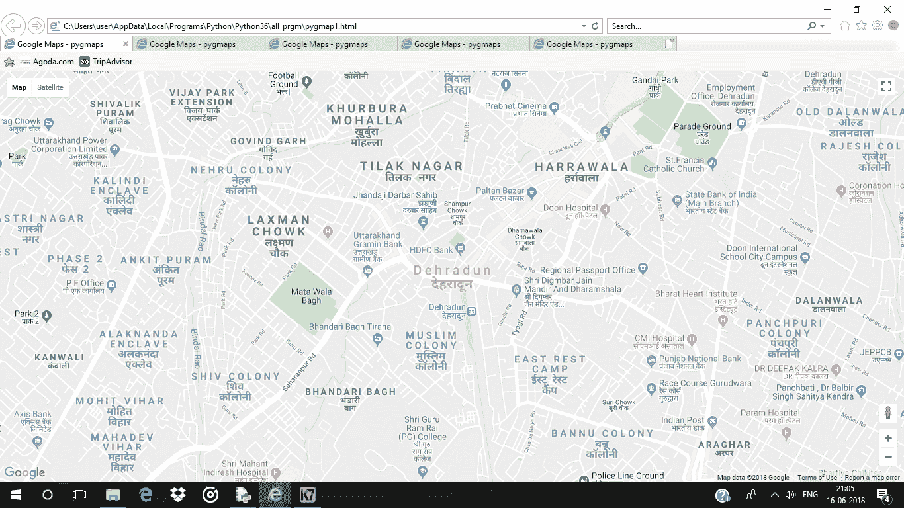
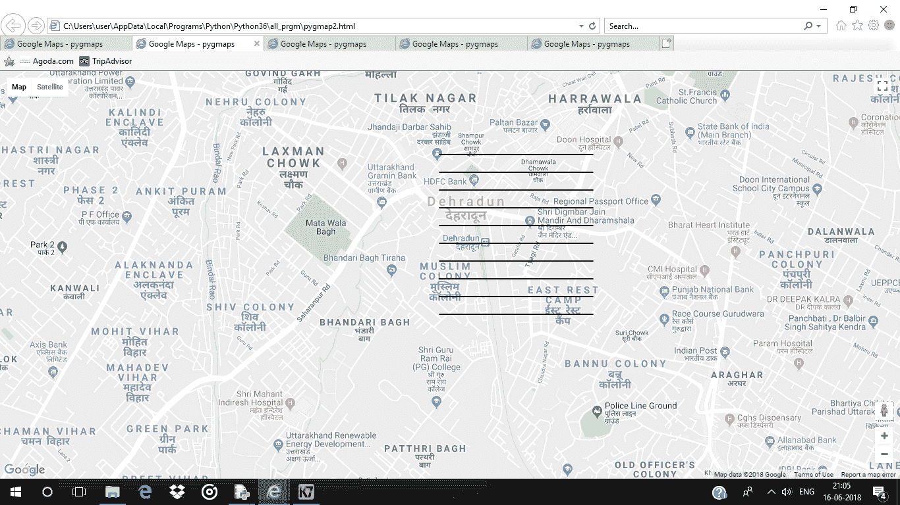
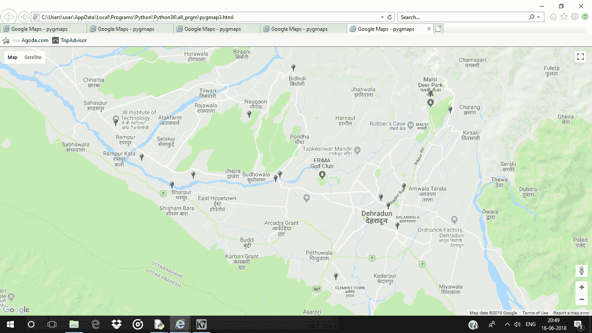
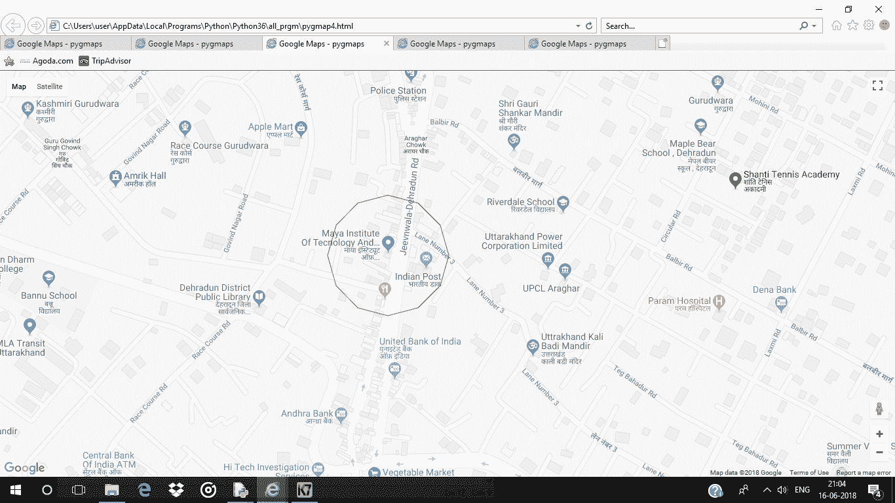
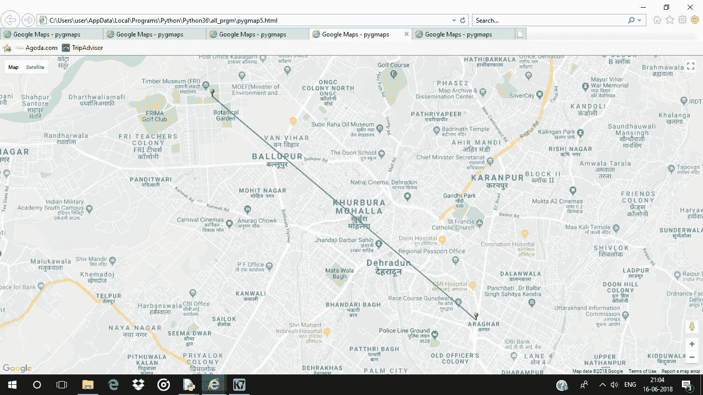

# 使用 Python 的 pygmaps 包在谷歌地图上绘制数据

> 原文:[https://www . geesforgeks . org/python-绘图-数据-在谷歌上-地图-使用-pygmaps-package/](https://www.geeksforgeeks.org/python-plotting-data-on-google-map-using-pygmaps-package/)

**pygmaps** 是一个类似 matplotlib 的界面，用于生成 HTML 和 javascript，以在谷歌地图上呈现用户想要的所有数据。

命令安装 **pygmaps** :

```py
pip install pygmaps (on windows)
sudo pip3 install pygmaps (on linix / unix)

```

**代码#1 :** 创建基础地图。

```py
# import required package
import pygmaps

# maps method return map object
# 1st argument is center latitude
# 2nd argument is center longitude
# 3ed argument zoom level
mymap1 = pygmaps.maps(30.3164945, 78.03219179999999, 15)

# create the HTML file which includes
# google map. Pass the absolute path
# as an argument.
mymap1.draw('pygmap1.html')
```

**输出:**


**代码#2 :** 在地图上绘制网格

```py
# importing pygmaps
import pygmaps

mymap2 = pygmaps.maps(30.3164945, 78.03219179999999, 15)

# draw grids on the map
# 1st argument is the starting point of latitude
# 2nd argument is the ending point of latitude
# 3rd argument is grid size in latitude
# 4th argument is the starting point of longitude
# 5th argument is the ending point of longitude
# 6th argument is grid size in longitude
mymap2.setgrids(30.31, 30.32, 0.001,
                78.04, 78.03, 0.001)

mymap2.draw('pygmap2.html')
```

**输出:**


**代码#3 :** 向地图中添加一个点

```py
# importing pygmaps
import pygmaps

# list of latitudes
latitude_list = [30.3358376, 30.307977, 30.3216419,
                 30.3427904, 30.378598, 30.3548185,
                 30.3345816, 30.387299, 30.3272198,
                 30.3840597, 30.4158, 30.340426,
                 30.3984348, 30.3431313, 30.273471]

# list of longitudes
longitude_list = [77.8701919, 78.048457, 78.0413095,
                  77.886958, 77.825396, 77.8460573,
                  78.0537813, 78.090614, 78.0355272,
                  77.9311923, 77.9663, 77.952092,
                  78.0747887, 77.9555512, 77.9997158]

mymap3 = pygmaps.maps(30.3164945, 78.03219179999999, 15)

for i in range(len(latitude_list)):

    # add a point into a map
    # 1st argument is latitude
    # 2nd argument is longitude
    # 3rd argument is colour of the point showed in thed map
    # using HTML colour code e.g.
    # red "# FF0000", Blue "# 0000FF", Green "# 00FF00"
    mymap3.addpoint(latitude_list[i], longitude_list[i], "# FF0000")

mymap3.draw('pygmap3.html')
```

**输出:**


**代码#4 :** 画一个给定半径的圆

```py
import pygmaps

mymap4 = pygmaps.maps(30.3164945, 78.03219179999999, 15)

# Draw a circle of given radius
# 1st argument is latitude
# 2nd argument is longitude
# 3rd argument is radius (in meter)
# 4th argument is colour of the circle
mymap4.addradpoint(30.307977, 78.048457, 95, "# FF0000")
mymap4.draw('pygmap4.html')
```

**输出:**


**代码#5 :** 在给定坐标的 b/w 上画线

```py
# Importing pygmaps
import pygmaps

mymap5 = pygmaps.maps(30.3164945, 78.03219179999999, 15)

latitude_list =[30.343769, 30.307977]
longitude_list =[77.999559, 78.048457]

for i in range(len(latitude_list)) :
    mymap5.addpoint(latitude_list[i], longitude_list[i], "# FF0000")

# list of coordinates         
path = [(30.343769, 77.999559),
        (30.307977, 78.048457)]

# draw a line in b / w the given coordinates
# 1st argument is list of coordinates
# 2nd argument is colour of the line
mymap5.addpath(path, "# 00FF00")

mymap5.draw('pygmap5.html')
```

**输出:**
