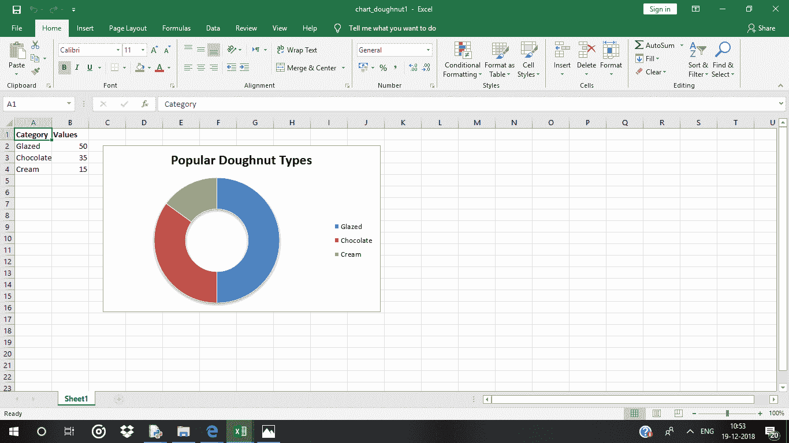
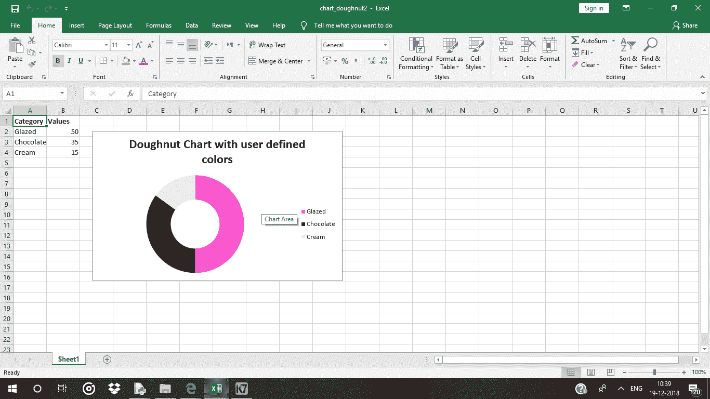
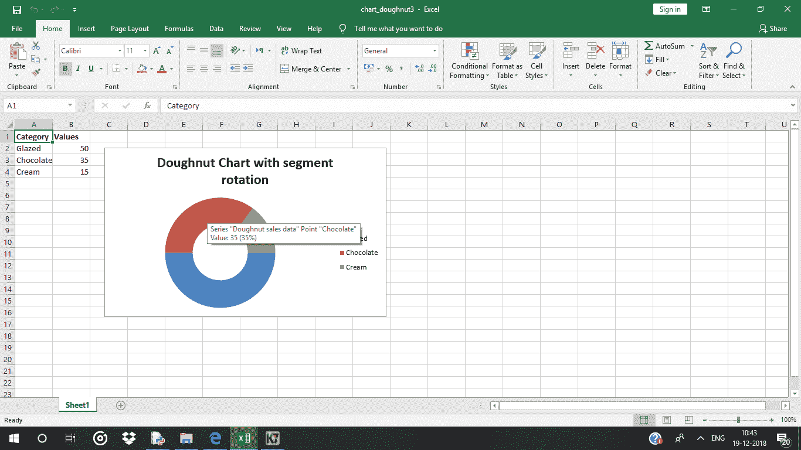
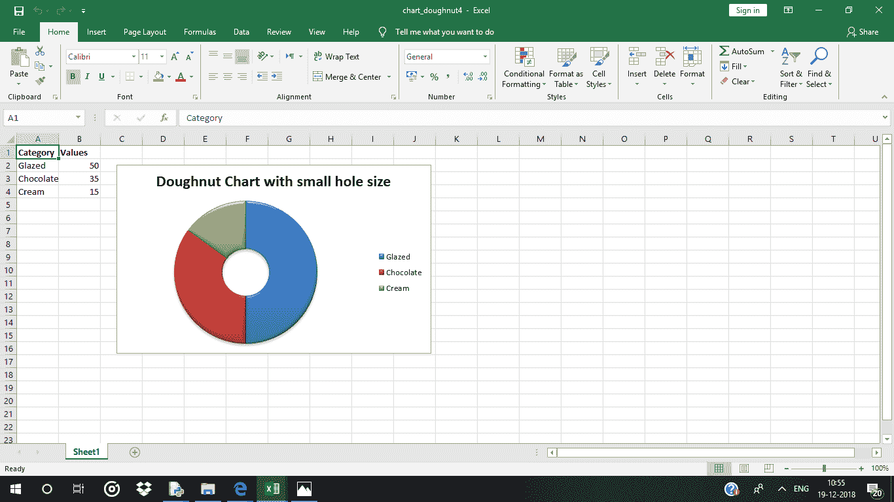

# Python |使用 XlsxWriter 模块在 excel 工作表中绘制圆环图

> 原文:[https://www . geesforgeks . org/python-绘图-甜甜圈-excel 中的图表-工作表-使用-xlsxwriter-module/](https://www.geeksforgeeks.org/python-plotting-doughnut-charts-in-excel-sheet-using-xlsxwriter-module/)

**先决条件:** [在 excel 表格上创建并书写](https://www.geeksforgeeks.org/python-create-and-write-on-excel-file-using-xlsxwriter-module/)

**`XlsxWriter`** 是一个 Python 库，使用它可以对 excel 文件执行多种操作，如创建、编写、算术运算和绘制图形。让我们看看如何使用实时数据绘制不同种类的圆环图。

图表至少由一系列一个或多个数据点组成。系列本身由单元格区域的引用组成。要在 excel 表上绘制图表，首先要创建特定图表类型的图表对象(如圆环图等)。).创建图表对象后，在其中插入数据，最后，将该图表对象添加到工作表对象中。

**代码#1 :** 绘制简单的甜甜圈图。

要在 excel 工作表中绘制简单的饼图，请使用`add_chart()` 方法，并键入工作簿对象的*“圆环图”*关键字参数。

```py
# import xlsxwriter module 
import xlsxwriter

# Workbook() takes one, non-optional, argument   
# which is the filename that we want to create. 
workbook = xlsxwriter.Workbook('chart_doughnut1.xlsx')

# The workbook object is then used to add new   
# worksheet via the add_worksheet() method.  
worksheet = workbook.add_worksheet()

# Create a new Format object to formats cells 
# in worksheets using add_format() method . 

# here we create bold format object . 
bold = workbook.add_format({'bold': 1})

# Add the worksheet data that the charts will refer to.
headings = ['Category', 'Values']
data = [
    ['Glazed', 'Chocolate', 'Cream'],
    [50, 35, 15],
]

# Write a row of data starting from 'A1' 
# with bold format .
worksheet.write_row('A1', headings, bold)

# Write a column of data starting from  
# 'A2', 'B2' respectively . 
worksheet.write_column('A2', data[0])
worksheet.write_column('B2', data[1])

# Create a chart object that can be added 
# to a worksheet using add_chart() method. 

# here we create a doughnut chart object . 
chart1 = workbook.add_chart({'type': 'doughnut'})

# Add a data series to a chart 
# using add_series method.

# Configure the first series.
# syntax to define ranges 
# [sheetname, first_row, first_col, last_row, last_col].
chart1.add_series({
    'name':       'Doughnut sales data',
    'categories': ['Sheet1', 1, 0, 3, 0],
    'values':     ['Sheet1', 1, 1, 3, 1],
})

# Add a chart title 
chart1.set_title({'name': 'Popular Doughnut Types'})

# Set an Excel chart style. Colors
# with white outline and shadow.
chart1.set_style(10)

# add chart to the worksheet with an offset, 
# at the top-left corner of a chart  
# is anchored to cell C2 .
worksheet.insert_chart('C2', chart1, {'x_offset': 25, 'y_offset': 10})

# Finally, close the Excel file  
# via the close() method.  
workbook.close()
```

**输出:**


**代码#2 :** 用用户定义的线段颜色绘制一个圆环图。

要在 excel 表上绘制带有用户定义的线段颜色的饼图，请使用图表对象的 points 关键字参数的`add_series()`方法。

```py
# import xlsxwriter module 
import xlsxwriter

# Workbook() takes one, non-optional, argument   
# which is the filename that we want to create. 
workbook = xlsxwriter.Workbook('chart_doughnut2.xlsx')

# The workbook object is then used to add new   
# worksheet via the add_worksheet() method.  
worksheet = workbook.add_worksheet()

# Create a new Format object to formats cells 
# in worksheets using add_format() method . 

# here we create bold format object . 
bold = workbook.add_format({'bold': 1})

# Add the worksheet data that the charts will refer to.
headings = ['Category', 'Values']
data = [
    ['Glazed', 'Chocolate', 'Cream'],
    [50, 35, 15],
]

# Write a row of data starting from 'A1' 
# with bold format .
worksheet.write_row('A1', headings, bold)

# Write a column of data starting from  
# 'A2', 'B2' respectively . 
worksheet.write_column('A2', data[0])
worksheet.write_column('B2', data[1])

# Create a chart object that can be added 
# to a worksheet using add_chart() method. 

# here we create a doughnut chart object .
chart2 = workbook.add_chart({'type': 'doughnut'})

# Note use of alternative syntax to define ranges.
# = Sheet1 !$A$1 is equivalent to ['Sheet1', 0, 0]. 
# Configure the series and add user defined segment colors.
chart2.add_series({
    'name': 'Doughnut sales data',
    'categories': '= Sheet1 !$A$2:$A$4',
    'values':     '= Sheet1 !$B$2:$B$4',
    'points': [
        {'fill': {'color': '# FA58D0'}},
        {'fill': {'color': '# 61210B'}},
        {'fill': {'color': '# F5F6CE'}},
    ],
})

# Add a chart title
chart2.set_title({'name': 'Doughnut Chart with user defined colors'})

# add chart to the worksheet with an offset, 
# at the top-left corner of a chart  
# is anchored to cell C2 .
worksheet.insert_chart('C2', chart2, {'x_offset': 25, 'y_offset': 10})

# Finally, close the Excel file  
# via the close() method.  
workbook.close()
```

**输出:**


**代码#3 :** 绘制带旋转线段的圆环图。

要在 excel 表上绘制扇形旋转的饼图，请使用图表对象的确定角度参数的`set_rotation()`方法。

```py
# import xlsxwriter module 
import xlsxwriter

# Workbook() takes one, non-optional, argument   
# which is the filename that we want to create. 
workbook = xlsxwriter.Workbook('chart_doughnut3.xlsx')

# The workbook object is then used to add new   
# worksheet via the add_worksheet() method.  
worksheet = workbook.add_worksheet()

# Create a new Format object to formats cells 
# in worksheets using add_format() method . 

# here we create bold format object . 
bold = workbook.add_format({'bold': 1})

# Add the worksheet data that the charts will refer to.
headings = ['Category', 'Values']
data = [
    ['Glazed', 'Chocolate', 'Cream'],
    [50, 35, 15],
]

# Write a row of data starting from 'A1' 
# with bold format .
worksheet.write_row('A1', headings, bold)

# Write a column of data starting from  
# 'A2', 'B2' respectively . 
worksheet.write_column('A2', data[0])
worksheet.write_column('B2', data[1])

# Create a chart object that can be added 
# to a worksheet using add_chart() method. 

# here we create a doughnut chart object .
chart3 = workbook.add_chart({'type': 'doughnut'})

# Configure the series.
chart3.add_series({
    'name': 'Doughnut sales data',
    'categories': '= Sheet1 !$A$2:$A$4',
    'values':     '= Sheet1 !$B$2:$B$4',
})

# Add a chart title.
chart3.set_title({'name': 'Doughnut Chart with segment rotation'})

# Change the angle / rotation of the first segment.
chart3.set_rotation(90)

# add chart to the worksheet with an offset, 
# at the top-left corner of a chart  
# is anchored to cell C2 .
worksheet.insert_chart('C2', chart3, {'x_offset': 25, 'y_offset': 10})

# Finally, close the Excel file  
# via the close() method.  
workbook.close()
```

**输出:**


**代码#4 :** 用用户定义的孔尺寸绘制一个圆环图。

要在 excel 表上绘制具有用户定义的孔尺寸的饼图，请使用图表对象的定值(半径)参数的`set_hole_size()`方法。

```py
# import xlsxwriter module 
import xlsxwriter

# Workbook() takes one, non-optional, argument   
# which is the filename that we want to create. 
workbook = xlsxwriter.Workbook('chart_doughnut4.xlsx')

# The workbook object is then used to add new   
# worksheet via the add_worksheet() method.  
worksheet = workbook.add_worksheet()

# Create a new Format object to formats cells 
# in worksheets using add_format() method . 

# here we create bold format object . 
bold = workbook.add_format({'bold': 1})

# Add the worksheet data that the charts will refer to.
headings = ['Category', 'Values']
data = [
    ['Glazed', 'Chocolate', 'Cream'],
    [50, 35, 15],
]

# Write a row of data starting from 'A1' 
# with bold format .
worksheet.write_row('A1', headings, bold)

# Write a column of data starting from  
# 'A2', 'B2' respectively . 
worksheet.write_column('A2', data[0])
worksheet.write_column('B2', data[1])

# Create a chart object that can be added 
# to a worksheet using add_chart() method. 

# here we create a doughnut chart object .
chart4 = workbook.add_chart({'type': 'doughnut'})

# Configure the series.
chart4.add_series({
    'name': 'Doughnut sales data',
    'categories': '= Sheet1 !$A$2:$A$4',
    'values':     '= Sheet1 !$B$2:$B$4',
})

# Set a 3D style.
chart4.set_style(26)

# Add a title.
chart4.set_title({'name': 'Doughnut Chart with small hole size'})

# Change the hole size.
chart4.set_hole_size(33)

# Insert the chart into the worksheet (with an offset).
worksheet.insert_chart('C2', chart4, {'x_offset': 25, 'y_offset': 10})

# Finally, close the Excel file  
# via the close() method.  
workbook.close()
```

**输出:**
