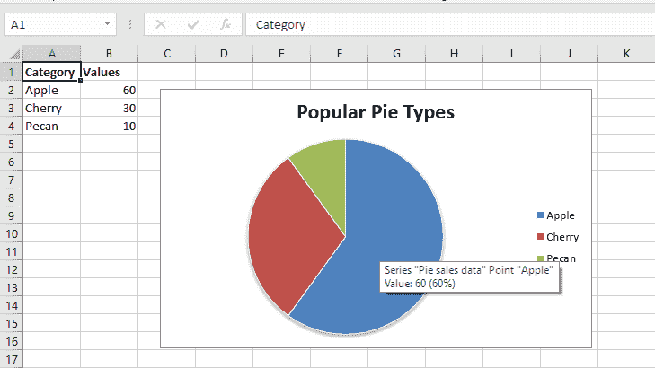
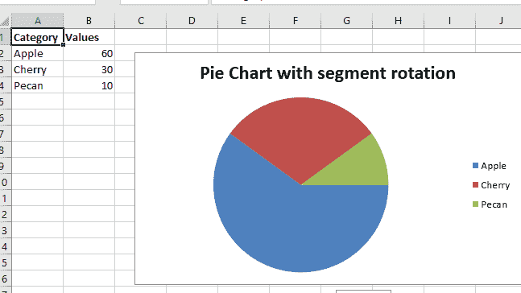

# Python |使用 XlsxWriter 模块在 excel 表格中绘制饼图

> 原文:[https://www . geesforgeks . org/python-绘图-饼图-excel 中的图表-工作表-使用-xlsxwriter-module/](https://www.geeksforgeeks.org/python-plotting-pie-charts-in-excel-sheet-using-xlsxwriter-module/)

**先决条件:** [在 excel 表格上创建并书写](https://www.geeksforgeeks.org/python-create-and-write-on-excel-file-using-xlsxwriter-module/)

**`XlsxWriter`** 是一个 Python 库，使用它可以对 excel 文件执行多种操作，如创建、编写、算术运算和绘制图形。让我们看看如何使用实时数据绘制不同类型的饼图。

图表至少由一系列一个或多个数据点组成。系列本身由单元格区域的引用组成。

要在 excel 表上绘制图表，首先要创建特定图表类型的图表对象(如饼图等)。).创建图表对象后，在其中插入数据，最后，将该图表对象添加到工作表对象中。

**代码#1 :** 绘制简单的饼图。

要在 excel 工作表中绘制简单的饼图，请使用带有工作簿对象的“饼图”关键字参数的`add_chart()`方法。

```
# import xlsxwriter module
import xlsxwriter

# Workbook() takes one, non-optional, argument  
# which is the filename that we want to create.
workbook = xlsxwriter.Workbook('chart_pie.xlsx')

# The workbook object is then used to add new  
# worksheet via the add_worksheet() method. 
worksheet = workbook.add_worksheet()

# Create a new Format object to formats cells
# in worksheets using add_format() method .

# here we create bold format object .
bold = workbook.add_format({'bold': 1})

# create a data list .
headings = ['Category', 'Values']

data = [
    ['Apple', 'Cherry', 'Pecan'],
    [60, 30, 10],
]

# Write a row of data starting from 'A1'
# with bold format.
worksheet.write_row('A1', headings, bold)

# Write a column of data starting from
# A2, B2, C2 respectively.
worksheet.write_column('A2', data[0])
worksheet.write_column('B2', data[1])

# Create a chart object that can be added
# to a worksheet using add_chart() method.

# here we create a pie chart object .
chart1 = workbook.add_chart({'type': 'pie'})

# Add a data series to a chart
# using add_series method.
# Configure the first series.
#[sheetname, first_row, first_col, last_row, last_col].
chart1.add_series({
    'name':       'Pie sales data',
    'categories': ['Sheet1', 1, 0, 3, 0],
    'values':     ['Sheet1', 1, 1, 3, 1],
})

# Add a chart title 
chart1.set_title({'name': 'Popular Pie Types'})

# Set an Excel chart style. Colors with white outline and shadow.
chart1.set_style(10)

# Insert the chart into the worksheet(with an offset).
# the top-left corner of a chart is anchored to cell C2. 
worksheet.insert_chart('C2', chart1, {'x_offset': 25, 'y_offset': 10})

# Finally, close the Excel file  
# via the close() method.  
workbook.close() 
```

**输出:**


**代码#2:** 用用户定义的线段颜色绘制饼图。

要在 excel 表上绘制带有用户定义的线段颜色的饼图，请使用图表对象的 points 关键字参数的`add_series()`方法。

```
# import xlsxwriter module
import xlsxwriter

# Workbook() takes one, non-optional, argument  
# which is the filename that we want to create.
workbook = xlsxwriter.Workbook('chart_pie_colour.xlsx')

# The workbook object is then used to add new  
# worksheet via the add_worksheet() method. 
worksheet = workbook.add_worksheet()

# Create a new Format object to formats cells
# in worksheets using add_format() method .

# here we create bold format object .
bold = workbook.add_format({'bold': 1})

# create a data list .
headings = ['Category', 'Values']

data = [
    ['Apple', 'Cherry', 'Pecan'],
    [60, 30, 10],
]

# Write a row of data starting from 'A1'
# with bold format .
worksheet.write_row('A1', headings, bold)

# Write a column of data starting from
# A2, B2, C2 respectively.
worksheet.write_column('A2', data[0])
worksheet.write_column('B2', data[1])

# Create a chart object that can be added
# to a worksheet using add_chart() method.

# here we create a pie chart object 
chart2 = workbook.add_chart({'type': 'pie'})

# Add a data series to a chart 
# using add_series method. 

# Configure the first series. 
# = Sheet1 !$A$1 is equivalent to ['Sheet1', 0, 0].
chart2.add_series({
    'name': 'Pie sales data',
    'categories': '= Sheet1 !$A$2:$A$4',
    'values':     '= Sheet1 !$B$2:$B$4',
    'points': [
        {'fill': {'color': '# 5ABA10'}},
        {'fill': {'color': '# FE110E'}},
        {'fill': {'color': '# CA5C05'}},
    ],
})

# Add a chart title.
chart2.set_title({'name': 'Pie Chart with user defined colors'})

# Insert the chart into the worksheet (with an offset)
# the top-left corner of a chart is anchored to cell C2.  
worksheet.insert_chart('C2', chart2, {'x_offset': 25, 'y_offset': 10})

# Finally, close the Excel file  
# via the close() method.  
workbook.close()
```

**输出:**


**代码#3:** 绘制扇形旋转的饼图。

若要在 excel 工作表中绘制带旋转线段的饼图，请使用图表对象的 set_rotation()方法和确定角度参数。

```
# import xlsxwriter module
import xlsxwriter

# Workbook() takes one, non-optional, argument  
# which is the filename that we want to create.
workbook = xlsxwriter.Workbook('chart_pie_rotation.xlsx')

# The workbook object is then used to add new  
# worksheet via the add_worksheet() method. 
worksheet = workbook.add_worksheet()

# Create a new Format object to formats cells
# in worksheets using add_format() method .

# here we create bold format object .
bold = workbook.add_format({'bold': 1})

# create a data list .
headings = ['Category', 'Values']

data = [
    ['Apple', 'Cherry', 'Pecan'],
    [60, 30, 10],
]

# Write a row of data starting from 'A1'
# with bold format .
worksheet.write_row('A1', headings, bold)

# Write a column of data starting from
# A2, B2, C2 respectively.
worksheet.write_column('A2', data[0])
worksheet.write_column('B2', data[1])

# Create a chart object that can be added
# to a worksheet using add_chart() method.

# here we create a pie chart object .
chart3 = workbook.add_chart({'type': 'pie'})

# Add a data series to a chart 
# using add_series method. 

# Configure the first series. 
# = Sheet1 !$A$1 is equivalent to ['Sheet1', 0, 0].
chart3.add_series({
    'name': 'Pie sales data',
    'categories': '= Sheet1 !$A$2:$A$4',
    'values':     '= Sheet1 !$B$2:$B$4',
})

# Add a chart title.
chart3.set_title({'name': 'Pie Chart with segment rotation'})

# Change the angle / rotation of the first segment.
chart3.set_rotation(90)

# Insert the chart into the worksheet (with an offset).
# the top-left corner of a chart is anchored to cell C2. 
worksheet.insert_chart('C2', chart3, {'x_offset': 25, 'y_offset': 10})

# Finally, close the Excel file  
# via the close() method.  
workbook.close()
```

**输出:**
