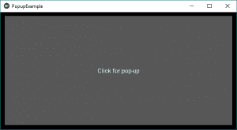
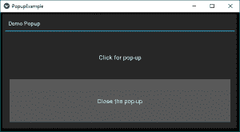
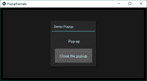

# Python |Kivy 中的弹出窗口小部件

> 原文:[https://www.geeksforgeeks.org/python-popup-widget-in-kivy/](https://www.geeksforgeeks.org/python-popup-widget-in-kivy/)

Kivy 是 Python 中独立于平台的 GUI 工具。因为它可以在安卓、IOS、linux 和 Windows 等平台上运行。它基本上是用来开发安卓应用程序的，但并不意味着它不能在桌面应用程序上使用。

> 👉🏽 [Kivy 教程–通过示例学习 Kivy](https://www.geeksforgeeks.org/kivy-tutorial/)。

### 弹出窗口小部件 ：

*   弹出窗口小部件用于创建弹出窗口。默认情况下，弹出窗口将覆盖整个“父”窗口。创建弹出窗口时，您必须至少设置一个弹出窗口标题和弹出窗口内容
*   当我们必须向用户传达某些明显的信息时，使用弹出对话框。通过状态栏给用户的消息以及需要重点告知的特定消息仍然可以通过弹出对话框来完成。
*   请记住，小部件的默认大小是 size_hint=(1，1)。
*   如果您不想让弹出窗口显示在全屏幕上，您必须给出小于 1 的大小提示(例如 size_hint=(.8，. 8))，或者停用 size_hint 并使用固定大小属性。

要使用弹出窗口，您必须导入:

```
from kivy.uix.popup import Popup
```

**注意:** Popup 是一个特殊的小部件。不要试图将其作为孩子添加到任何其他小部件中。如果你这样做了，弹出窗口将像一个普通的小部件一样被处理，不会被隐藏在后台创建。

```
Basic Approach :

1) import kivy
2) import kivyApp
3) import Label
4) import button
5) import Gridlayout
6) import popup
7) Set minimum version(optional)
8) create App class
9) return Layout/widget/Class(according to requirement)
10) In the App class create the popup
11) Run an instance of the class
```

**Code #1:** In the first code the popup will cover the whole “parent” window.

```
# Kivy example for the Popup widget

# Program to Show how to create a switch
# import kivy module   
import kivy 

# base Class of your App inherits from the App class.   
# app:always refers to the instance of your application  
from kivy.app import App

# this restrict the kivy version i.e 
# below this kivy version you cannot 
# use the app or software 
kivy.require('1.9.0')

# The Button is a Label with associated actions
# that is triggered when the button
# is pressed (or released after a click/touch).
from kivy.uix.button import Button

# The GridLayout arranges children in a matrix.
# It takes the available space and
# divides it into columns and rows,
# then adds widgets to the resulting “cells”.
from kivy.uix.gridlayout import GridLayout

# Popup widget is used to create popups.
# By default, the popup will cover
# the whole “parent” window.
# When you are creating a popup,
# you must at least set a Popup.title and Popup.content.
from kivy.uix.popup import Popup

# The Label widget is for rendering text. 
from kivy.uix.label import Label

# to change the kivy default settings we use this module config
from kivy.config import Config

# 0 being off 1 being on as in true / false
# you can use 0 or 1 && True or False
Config.set('graphics', 'resizable', True)

# Make an app by deriving from the kivy provided app class
class PopupExample(App):
    # override the build method and return the root widget of this App

    def build(self):
        # Define a grid layout for this App
        self.layout = GridLayout(cols = 1, padding = 10)

        # Add a button
        self.button = Button(text ="Click for pop-up")
        self.layout.add_widget(self.button)

        # Attach a callback for the button press event
        self.button.bind(on_press = self.onButtonPress)

        return self.layout

    # On button press - Create a popup dialog with a label and a close button
    def onButtonPress(self, button):

        layout = GridLayout(cols = 1, padding = 10)

        popupLabel = Label(text = "Click for pop-up")
        closeButton = Button(text = "Close the pop-up")

        layout.add_widget(popupLabel)
        layout.add_widget(closeButton)       

        # Instantiate the modal popup and display
        popup = Popup(title ='Demo Popup',
                      content = layout)  
        popup.open()   

        # Attach close button press with popup.dismiss action
        closeButton.bind(on_press = popup.dismiss)   

# Run the app
if __name__ == '__main__':
    PopupExample().run()
```

**输出:**

当点击屏幕时弹出会这样打开:


当点击关闭时，弹出窗口将关闭。


**代码#2:**
在第二个代码中当我们使用 *size_hint* 和 size 的时候我们可以给出相应的大小。在这种情况下，只需在第 75 行中添加如下代码所示的内容。

```
# Kivy example for the Popup widget

# Program to Show how to create a switch
# import kivy module   
import kivy 

# base Class of your App inherits from the App class.   
# app:always refers to the instance of your application  
from kivy.app import App

# this restrict the kivy version i.e 
# below this kivy version you cannot 
# use the app or software 
kivy.require('1.9.0')

# The Button is a Label with associated actions
# that is triggered when the button
# is pressed (or released after a click/touch).
from kivy.uix.button import Button

# The GridLayout arranges children in a matrix.
# It takes the available space and
# divides it into columns and rows,
# then adds widgets to the resulting “cells”.
from kivy.uix.gridlayout import GridLayout

# Popup widget is used to create popups.
# By default, the popup will cover
# the whole “parent” window.
# When you are creating a popup,
# you must at least set a Popup.title and Popup.content.
from kivy.uix.popup import Popup

# The Label widget is for rendering text. 
from kivy.uix.label import Label

# to change the kivy default settings we use this module config
from kivy.config import Config

# 0 being off 1 being on as in true / false
# you can use 0 or 1 && True or False
Config.set('graphics', 'resizable', True)

# Make an app by deriving from the kivy provided app class
class PopupExample(App):
    # override the build method and return the root widget of this App

    def build(self):
        # Define a grid layout for this App
        self.layout = GridLayout(cols = 1, padding = 10)

        # Add a button
        self.button = Button(text ="Click for pop-up")
        self.layout.add_widget(self.button)

        # Attach a callback for the button press event
        self.button.bind(on_press = self.onButtonPress)

        return self.layout

    # On button press - Create a popup dialog with a label and a close button
    def onButtonPress(self, button):

        layout = GridLayout(cols = 1, padding = 10)

        popupLabel = Label(text = "Click for pop-up")
        closeButton = Button(text = "Close the pop-up")

        layout.add_widget(popupLabel)
        layout.add_widget(closeButton)       

        # Instantiate the modal popup and display
        popup = Popup(title ='Demo Popup',
                      content = layout,
                      size_hint =(None, None), size =(200, 200))  
        popup.open()   

        # Attach close button press with popup.dismiss action
        closeButton.bind(on_press = popup.dismiss)   

# Run the app
if __name__ == '__main__':
    PopupExample().run()
```

**输出:**
弹出窗口大小将小于窗口大小。



参考编号 ： [https://kivy.org/doc/stable/api-kivy.uix.popup.html](https://kivy.org/doc/stable/api-kivy.uix.popup.html)