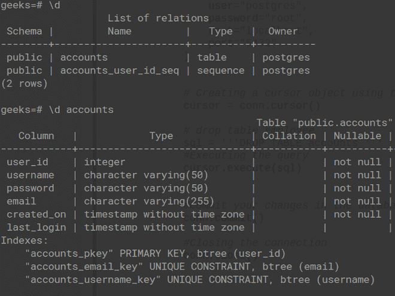

# Python PostgreSQL–拖放表

> 原文:[https://www.geeksforgeeks.org/python-postgresql-drop-table/](https://www.geeksforgeeks.org/python-postgresql-drop-table/)

在本文中，我们将看到如何使用 pyscopg2 模块 Python 在 PostgreSQL 中删除表。在 PostgreSQL 中，DROP TABLE 用于从数据库中删除现有的表。它会删除该表的表定义以及所有关联的数据、索引、规则、触发器和约束。如果特定的表不存在，那么它会显示一个错误。

> **语法:**DROP TABLE TABLE _ name；

### 使用的表格:

这里，我们使用帐户表进行演示。



现在让我们删除这个表，因为我们将使用 will **psycopg2** 模块来连接 PostgreSQL 并在 cursor.execute(query)对象中执行 SQL 查询。

> **语法:**cursor . execute(SQL _ query)；

### **示例 1:使用 psycopg2** 放置表格

这里我们将使用 DELETE 子句删除该表。

> **语法:**DROP TABLE TABLE _ name；

**代码:**

## 蟒蛇 3

```
# importing psycopg2
import psycopg2

conn=psycopg2.connect(
    database="test",
    user="postgres",
    password="password",
    host="localhost",
    port="5432"
)

# Creating a cursor object using the cursor() 
# method
cursor = conn.cursor()

# drop table accounts
sql = '''DROP TABLE accounts '''

# Executing the query
cursor.execute(sql)
print("Table dropped !")

# Commit your changes in the database
conn.commit()

# Closing the connection
conn.close()
```

**输出:**

```
Table dropped !
```

### **例 2:在**检查**是否存在**之前放下表

如果再次尝试删除同一个表，由于已经删除了，会出现“表不存在”的错误，所以我们可以使用的 IF EXIST 子句来解决。

> **语法****:**DROP TABLE _ name IF exists TABLE _ name；

**代码:**

## 蟒蛇 3

```
# importing psycopg2
import psycopg2

conn=psycopg2.connect(
    database="geeks",
    user="postgres",
    password="root",
    host="localhost",
    port="5432"
)

# Creating a cursor object using the cursor()
# method
cursor = conn.cursor()

# drop table accounts
sql = '''DROP table IF EXISTS accounts '''

# Executing the query
cursor.execute(sql)

print("Table dropped !")
# Commit your changes in the database
conn.commit()

# Closing the connection
conn.close()
```

**输出:**

```
Table dropped !
```

**脚本执行后，让我们检查 PostgreSQL 中的表:**

