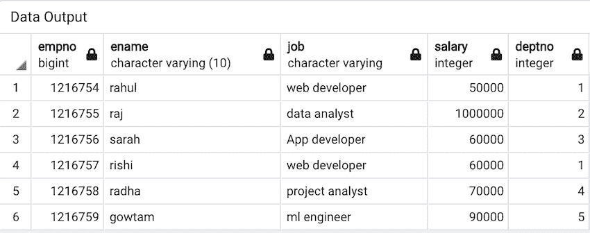
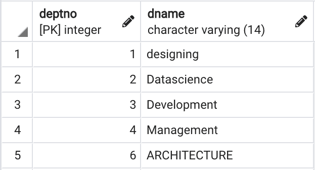
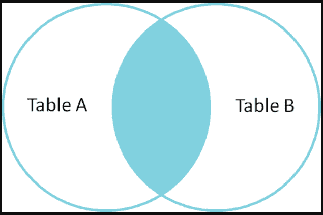
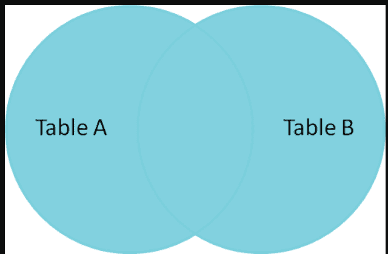
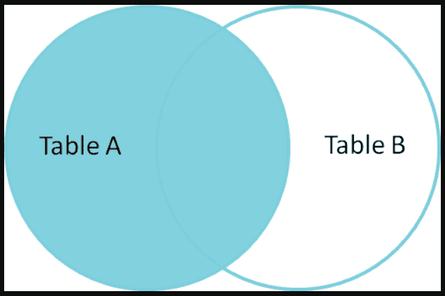
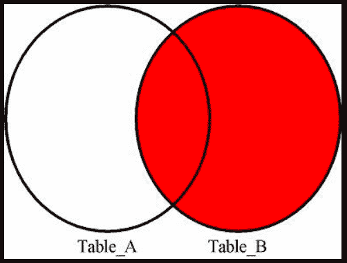
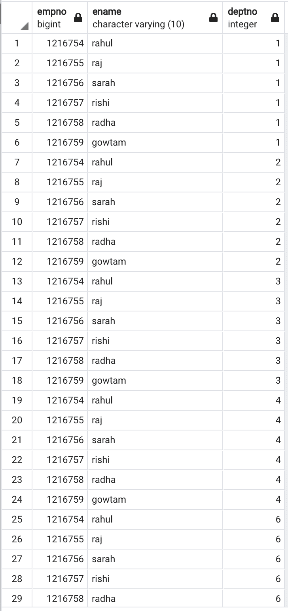

# Python PostgreSQL–连接

> 原文:[https://www.geeksforgeeks.org/python-postgresql-join/](https://www.geeksforgeeks.org/python-postgresql-join/)

在本文中，我们将看到在 Python 中使用 pyscopg2 的 PostgreSQL 中的连接方法。让我们看看 PostgreSQL 支持的联接类型。

## 连接类型:

*   内部连接
*   完全连接(外部连接)
*   左连接
*   右连接
*   交叉连接

**演示用表:**

**表 1:员工表**



**表 2:部门表**



[psycopg2.connect()](https://www.geeksforgeeks.org/postgresql-connecting-to-the-database-using-python/) 方法用于连接数据库，cursor()和 [fetchall()](https://www.geeksforgeeks.org/sql-using-python-set-3-handling-large-data/) 方法用于从数据库中检索数据。我们使用 execute()方法来执行我们的 SQL 命令，然后通过 fetchall()方法进一步检索它。

## 内部连接

内部联接是最常见的联接类型之一。内部连接用于根据行之间的共同特征连接两个表。它返回一个具有公共行特征的表。



**执行一条 SQL 语句:**

> 选择表 1.col1，表 2.col2…
> 
> 来自表 1
> 
> 内部连接表 2
> 
> ON table 1 . common _ field = table 2 . common _ field；

**代码:**

## 蟒蛇 3

```
import psycopg2

conn = psycopg2.connect(
    database="EMPLOYEE_DATABASE", user='postgres',
  password='pass', host='127.0.0.1', port='5432'
)

conn.autocommit = True
cursor = conn.cursor()

sql = '''SELECT * from employee INNER JOIN dept\
ON employee.deptno =dept.deptno '''

cursor.execute(sql)
results = cursor.fetchall()
for i in results:
    print(i)
conn.commit()
conn.close()
```

**输出:**


## 完全加入

它也被称为“完全外部连接”。它返回在左表或右表中匹配的所有数据。如果两个表中的行不匹配，则结果数据框将用缺少匹配行的表中的每一列替换 NaN。



**执行一条 SQL 语句:**

> 选择表 1.col1，表 2.col2…
> 
> 来自表 1
> 
> 完全连接表 2
> 
> ON table 1 . common _ field = table 2 . common _ field；

**代码:**

## 蟒蛇 3

```
import psycopg2

conn = psycopg2.connect(
    database="EMPLOYEE_DATABASE", user='postgres',
  password='pass', host='127.0.0.1', port='5432'
)

conn.autocommit = True
cursor = conn.cursor()

sql = '''SELECT * from employee FULL JOIN dept\
ON employee.deptno =dept.deptno '''

cursor.execute(sql)
results = cursor.fetchall()
for i in results:
    print(i)
conn.commit()
conn.close()
```

**输出:**


## 左连接

它也称为左外连接，返回包含左数据框所有行的表。如果左表中有不匹配的行，那么右表中不匹配的数据将被 NaN 替换。



**执行一条 SQL 语句:**

> 选择表 1.col1，表 2.col2…
> 
> 来自表 1
> 
> 左连接表 2
> 
> ON table 1 . common _ field = table 2 . common _ field；

**代码:**

## 蟒蛇 3

```
import psycopg2

conn = psycopg2.connect(
    database="EMPLOYEE_DATABASE", user='postgres',
  password='pass', host='127.0.0.1', port='5432'
)

conn.autocommit = True
cursor = conn.cursor()

sql = '''SELECT * from employee left JOIN dept\
ON employee.deptno =dept.deptno '''

cursor.execute(sql)
results = cursor.fetchall()
for i in results:
    print(i)
conn.commit()
conn.close()
```

**输出:**


## 右连接

右连接与左连接完全相反。返回包含右表所有行的表。如果右表中有不匹配的行，则左表中不匹配的数据被 NaN 替换。



**执行一条 SQL 语句:**

> 选择表 1.col1，表 2.col2…
> 
> 来自表 1
> 
> 右连接表 2
> 
> ON table 1 . common _ field = table 2 . common _ field；

**代码:**

## 蟒蛇 3

```
import psycopg2

conn = psycopg2.connect(
    database="EMPLOYEE_DATABASE", user='postgres',
  password='pass', host='127.0.0.1', port='5432'
)

conn.autocommit = True
cursor = conn.cursor()

sql = '''SELECT * from employee RIGHT JOIN dept\
ON employee.deptno =dept.deptno '''

cursor.execute(sql)
results = cursor.fetchall()
for i in results:
    print(i)
conn.commit()
conn.close()
```

**输出:**


## 交叉连接

交叉连接将第一个表的每一行与第二个表的每一行匹配。如果输入表分别有 A 列和 B 列，那么我们的最终输出表将有 A+B 列

**执行一条 SQL 语句:**

> 从表 1 中选择列…交叉连接表 2

**代码:**

## 蟒蛇 3

```
import psycopg2

conn = psycopg2.connect(
    database="EMPLOYEE_DATABASE", user='postgres',
  password='pass', host='127.0.0.1', port='5432'
)

conn.autocommit = True
cursor = conn.cursor()

sql = '''SELECT employee.empno,employee.ename,
dept.deptno from employee cross JOIN dept  '''

cursor.execute(sql)
results = cursor.fetchall()
for i in results:
    print(i)
conn.commit()
conn.close()
```

**输出:**

