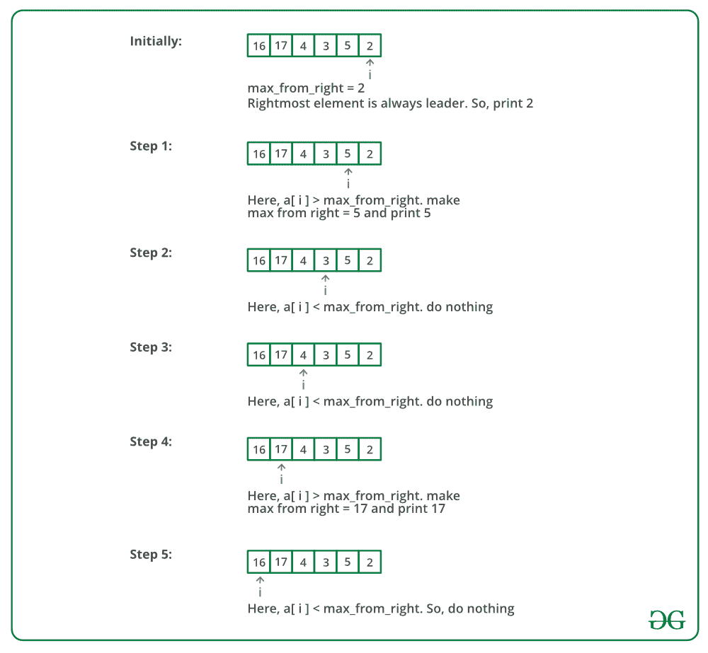

# 阵列中领导者的 Python 程序

> 原文:[https://www . geesforgeks . org/python-面向阵列领导者的程序/](https://www.geeksforgeeks.org/python-program-for-leaders-in-an-array/)

编写一个程序来打印数组中的所有 LEADERS。如果某个元素大于其右侧的所有元素，则该元素为引线。最右边的元素总是一个领导者。例如，在数组{16，17，4，3，5，2}中，前导是 17，5 和 2。
让输入数组为 arr[]，数组的大小为*大小*。

**方法 1(简单)**
使用两个循环。外部循环从 0 到 size–1 运行，并从左到右逐一挑选所有元素。内部循环将拾取的元素与其右侧的所有元素进行比较。如果拾取的元素大于其右侧的所有元素，则拾取的元素是引线。

## 计算机编程语言

```
# Python Function to print leaders in array 

def printLeaders(arr,size): 

    for i in range(0, size): 
        for j in range(i+1, size): 
            if arr[i]<=arr[j]: 
                break
        if j == size-1: # If loop didn't break 
            print arr[i], 

# Driver function 
arr=[16, 17, 4, 3, 5, 2] 
printLeaders(arr, len(arr)) 

# This code is contributed by _Devesh Agrawal__ 
```

**输出:**

```
17 5 2
```

**时间复杂度:** O(n*n)
**方法 2(从右扫描)**
从右到左扫描一个数组中的所有元素，一直跟踪最大值到现在。当最大值改变时，打印它。
下图是上述方法的模拟运行:



以下是上述方法的实现:

## 计算机编程语言

```
# Python function to print leaders in array
def printLeaders(arr, size):

    max_from_right = arr[size-1]   
    print max_from_right,    
    for i in range( size-2, -1, -1):        
        if max_from_right < arr[i]:        
            print arr[i],
            max_from_right = arr[i]

# Driver function
arr = [16, 17, 4, 3, 5, 2]
printLeaders(arr, len(arr))

# This code contributed by _Devesh Agrawal__
```

**输出:**

```
2 5 17
```

**时间复杂度:** O(n)

更多详情请参考[阵中领袖](https://www.geeksforgeeks.org/leaders-in-an-array/)整篇文章！