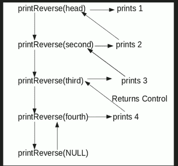

# 打印链表反转而不实际反转的 Python 程序

> 原文:[https://www . geeksforgeeks . org/python-for-program-printing-reverse-of-a-link-list-无需实际反转/](https://www.geeksforgeeks.org/python-program-for-printing-reverse-of-a-linked-list-without-actually-reversing/)

给定一个链表，使用递归函数打印它的逆序。例如，如果给定的链表是 1->2->3->4，那么输出应该是 4->3->2->1。
注意，问题只是关于打印反面。要反转列表本身请参见[本](https://www.geeksforgeeks.org/reverse-a-linked-list/)T3**难度等级:**菜鸟



**算法:**

```py
printReverse(head)
  1\. call print reverse for head->next
  2\. print head->data
```

**实施:**

## 蟒蛇 3

```py
# Python3 program to print reverse
# of a linked list 

# Node class 
class Node: 

    # Constructor to initialize
    # the node object 
    def __init__(self, data):         
        self.data = data 
        self.next = None

class LinkedList: 

    # Function to initialize head 
    def __init__(self): 
        self.head = None

    # Recursive function to print 
    # linked list in reverse order
    def printrev(self, temp):        
        if temp:
            self.printrev(temp.next)
            print(temp.data, end = ' ')
        else:
            return

    # Function to insert a new node 
    # at the beginning 
    def push(self, new_data):         
        new_node = Node(new_data) 
        new_node.next = self.head 
        self.head = new_node 

# Driver code
llist = LinkedList() 

llist.push(4) 
llist.push(3) 
llist.push(2) 
llist.push(1) 

llist.printrev(llist.head)
# This code is contributed by Vinay Kumar(vinaykumar71)
```

**输出:**

```py
4 3 2 1
```

**时间复杂度:** O(n)

更多详情请参考[打印链表的反转而不实际反转](https://www.geeksforgeeks.org/print-reverse-of-a-linked-list-without-actually-reversing/)的完整文章！