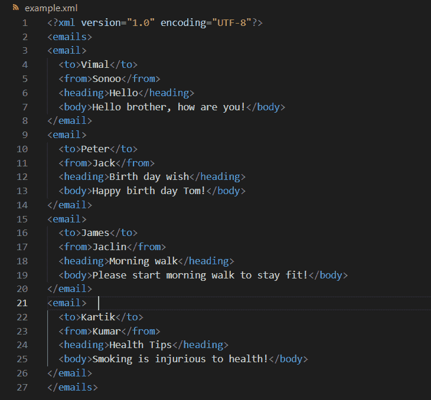
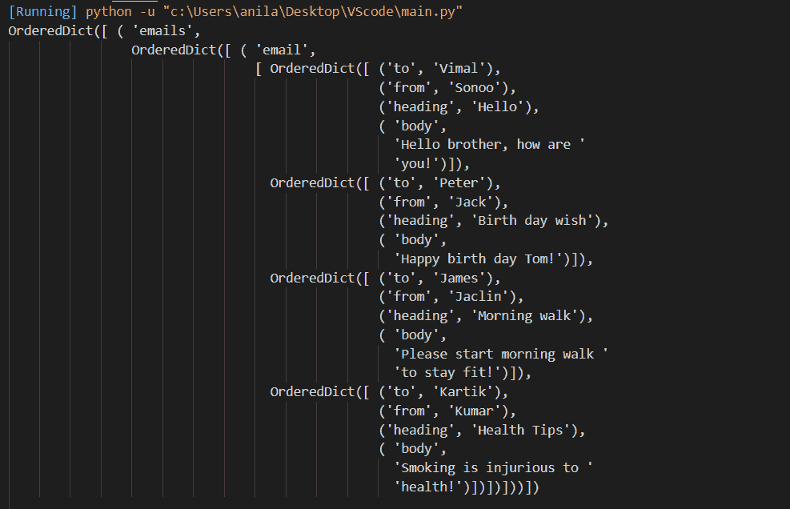
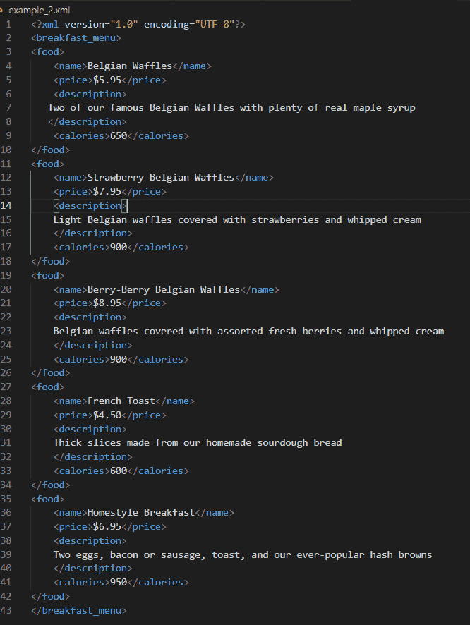
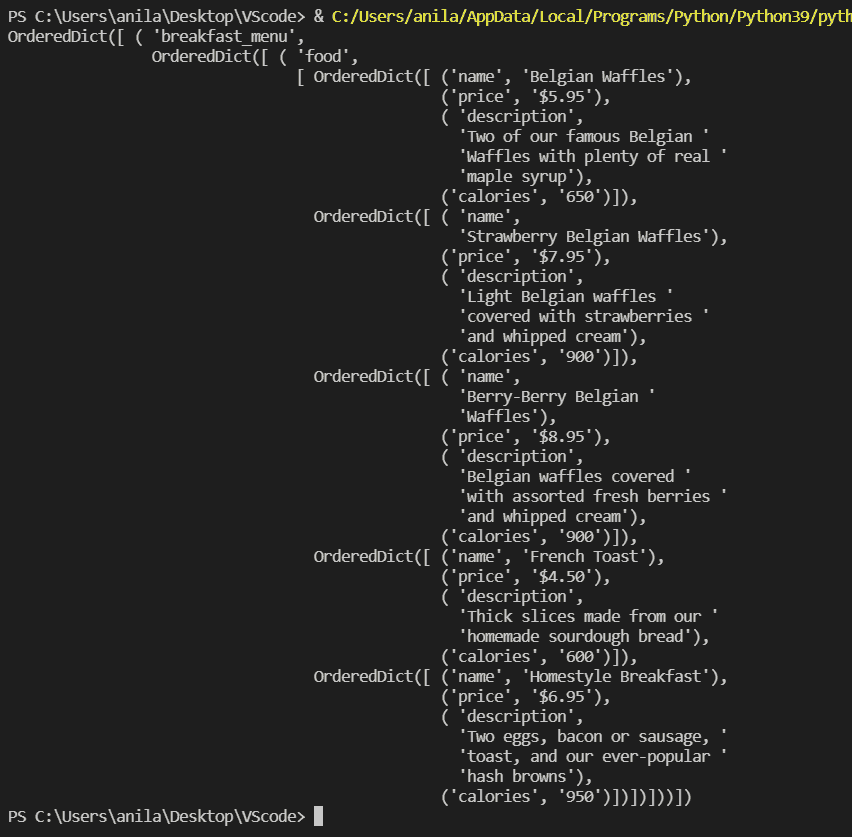

# Python 程序将 XML 转换为字典

> 原文:[https://www . geesforgeks . org/python-program-convert-XML-to-dictionary/](https://www.geeksforgeeks.org/python-program-to-convert-xml-to-dictionary/)

在本文中，我们将讨论如何使用 Python 将 XML 转换为字典。

## 使用的模块

*   **xmltodit**:它是一个 Python 模块，让使用 XML 的时候感觉就像是在使用【JSON】一样。在终端中运行以下命令来安装模块。

**语法:**

> pip 安装 xmltodict

*   [**pprint**](https://www.geeksforgeeks.org/pprint-data-pretty-printer-python/)**:**pprint 模块提供了以格式良好且可读性更强的方式“漂亮打印”任意 Python 数据结构的能力。

## 方法

*   将必要的模块导入工作空间。
*   以只读模式打开 XML 文件，使用 [**文件读取内容，读取()**](https://www.geeksforgeeks.org/how-to-read-from-a-file-in-python/) 并将其存储在变量中。

**语法:**

```py
with open('filename', 'r', encoding='utf-8') as file:
    my_xml = file.read()
```

*   使用 **xmltodict.parse()** 从变量中解析内容并将其转换为 Dictionary。

**语法:**

> XML odict . parse(XML _ input，编码='utf-8 '，expat=expat，process _ namespaces = False，namespace_separator= ':'，**kwargs)

*   使用 [**pprint(漂亮打印)**](https://www.geeksforgeeks.org/pprint-data-pretty-printer-python/) 以格式良好且可读的方式打印字典。

**语法:**

> pprint.pprint(对象，流=无，缩进=1，宽度=80，深度=无，*紧凑=假，排序 _ 字典=真)

**示例:**将 XML 转换为字典

**使用的文件:**



## 蟒蛇 3

```py
# Import the required modules
import xmltodict
import pprint

# Open the file and read the contents
with open('example.xml', 'r', encoding='utf-8') as file:
    my_xml = file.read()

# Use xmltodict to parse and convert 
# the XML document
my_dict = xmltodict.parse(my_xml)

# Print the dictionary
pprint.pprint(my_dict, indent=2)
```

**输出:**



**示例 2:** 将 XML 转换为字典

**使用的文件:**



## 蟒蛇 3

```py
# Import the required modules
import xmltodict
import pprint

# Open the file and read the contents
with open('example_2.xml', 'r', encoding='utf-8') as file:
    my_xml = file.read()

# Use xmltodict to parse and convert the 
# XML document
my_dict = xmltodict.parse(my_xml)

# Print the dictionary
pprint.pprint(my_dict, indent=2)
```

**输出:**

