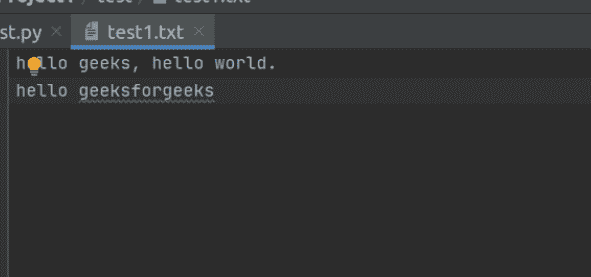

# Python 程序统计一个文本文件中的空格数

> 原文:[https://www . geesforgeks . org/python-程序-计算文本文件中的空格数/](https://www.geeksforgeeks.org/python-program-to-count-the-number-of-blank-spaces-in-a-text-file/)

所有的程序都需要输入来处理，处理后给出输出。Python 支持文件处理，允许用户处理文件。文件处理的概念已经扩展到各种其他语言，但是实现要么冗长要么复杂。Python 将文件分为文本和二进制文件，
向文件写入数据时需要注意的一点是，应该保持文件的一致性和完整性。一旦你把数据存储在一个文件中，现在最重要的是它的检索，因为计算机数据存储为 1 和 0 的位，如果它的检索没有正确完成，那么它就变得完全无用，并且数据被认为是损坏的。因此，写和读也是 Python 中文件处理的一个重要方面。

### 如何计算空格或任何字符的数量？

“”(空格)也属于可打印 ASCII 字符类型，而空值不是可打印 ASCII 字符类型。

#### **进场:**

如何使用 Python 写入文件？

1.  打开要写入的文件。
2.  计算该文本文件中的空格数。
3.  关闭文件。

**这里是我们的文本文件。**



**实施**:

**方法#1:** 使用 isspace()函数。

首先，我们将打开文本文件，并将该文本文件存储在该变量中。循环用于计算文本文件中的空格数。如果条件(char.isspace())测试所有条件，如果它返回 True，那么计数将增加 1。测试后，所有角色的循环将返回 False 并自行终止。最后，程序将显示空间总数。

## 蟒蛇 3

```
# this will open the file and store
# in "file" variable
file = open("test1.txt", "r")

count = 0
while True:

    # this will read each character
    # and store in char
    char = file.read(1)

    if char.isspace():
        count += 1
    if not char:
        break

print(count)
```

**输出:**

```
5

```

注意–ISS space()也计算新的行字符，因此它显示输出为 6。

**方法#2:** 使用循环:

首先，我们将打开文本文件，并将该文本文件存储在该变量中。循环用于计算文本文件中的空格数。如果条件(char == " ")测试所有条件，如果它返回 True，那么计数将增加 1。测试后，所有角色的循环将返回 False 并自行终止。最后，程序将显示空间总数。

## 蟒蛇 3

```
# this will open the file and store in
# "file" variable
file = open("test1.txt", "r")

count = 0
while True:

    # this will read each character
    # and store in char
    char = file.read(1)

    if char == " ":
        count += 1
    if not char:
        break

print(count)
```

**输出:**

```
4

```

**方法#3:** 使用 python 模块“functools”。

部分函数是特定参数值的函数。它们可以通过使用“functools”库中的“partial”用 python 创建。

## 蟒蛇 3

```
import functools

with open("test1.txt") as file:
    file_char = functools.partial(file.read, 1)

    for char in iter(file_char, " "):

        if char == " ":
            count += 1

    print("count: ", count)
```

**输出:**

```
4

```