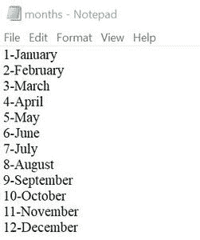
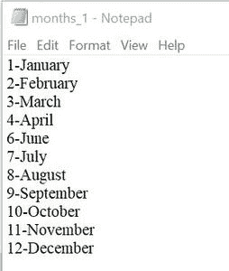

# Python 程序从文件中删除特定行

> 原文:[https://www . geesforgeks . org/python-程序-删除-文件中的特定行/](https://www.geeksforgeeks.org/python-program-to-delete-specific-line-from-file/)

在本文中，我们将看到如何使用 Python 从文件中删除特定的行

在整个程序中，作为示例，我们将使用名为 **months.txt** 的文本文件，在该文件上将执行各种删除操作。



## **方法 1:使用特定位置删除一行**

在该方法中，使用*readline()逐行读取文本文件。*如果一行的位置与要删除的位置相似，则不会写入新创建的文本文件。

**示例:**

## 蟒蛇 3

```py
# deleting a line
# based on the position

# opening the file in
# reading mode

try:
    with open('months.txt', 'r') as fr:
        # reading line by line
        lines = fr.readlines()

        # pointer for position
        ptr = 1

        # opening in writing mode
        with open('months.txt', 'w') as fw:
            for line in lines:

                # we want to remove 5th line
                if ptr != 5:
                    fw.write(line)
                ptr += 1
    print("Deleted")

except:
    print("Oops! something error")
```

**输出:**

```py
Deleted
```

“5 月 5 日”写在第 5 行，现已删除，如下所示:



## 方法 2:使用与行完全匹配的文本删除行

在此方法中，读取文件后，检查每行是否与给定文本完全匹配。如果不匹配，则写入新文件。

## 蟒蛇 3

```py
# deleting a line on the basis
# of a matching text (exactly)

# we want to remove a line
# with text = '8-August'
try:
    with open('months.txt', 'r') as fr:
        lines = fr.readlines()

        with open('months_2.txt', 'w') as fw:
            for line in lines:

                # strip() is used to remove '\n'
                # present at the end of each line
                if line.strip('\n') != '8-August':
                    fw.write(line)
    print("Deleted")
except:
    print("Oops! something error")
```