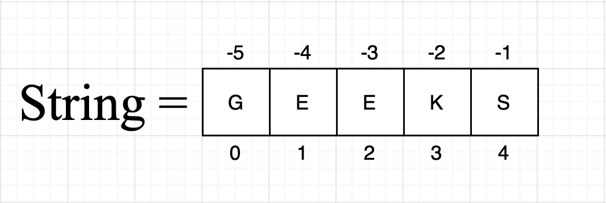

# Python 程序求首末数字之和

> 原文:[https://www . geesforgeks . org/python-program-to-find-sum-first-and-last-digits/](https://www.geeksforgeeks.org/python-program-to-find-sum-of-first-and-last-digit/)

给定一个正整数 N(至少包含两位数)。任务是编写一个 Python 程序来添加给定数字 n 的第一个和最后一个数字

**示例:**

> **输入:** N = 1247
> 
> **输出:** 8
> 
> **说明:**第一位数字为 1，最后一位数字为 7。所以，这两个(1 + 7)相加等于 8。
> 
> **输入:** N = 73
> 
> **输出:** 10

## **方法 1:** 字符串实现

*   接受字符串形式的输入或字符串中给定的类型转换输入。
*   现在选择字符串的第 0 个索引，将其类型转换为整数，并将其存储在变量中。
*   与-1st 索引相同，也存储在另一个变量中。
*   现在将这两个变量相加
*   将它们打印为输出。

**注意:**我们可以使用**字符串【0】**访问 string 的第一个元素，使用**字符串【-1】**访问 String 的最后一个元素。



**字符串表示**

## 蟒蛇 3

```
# We have a number
number = 1247

# We are type casting it in string
number = str(number)

# Storing first and last digit in a variable
# after type casting into Integer.
first_digit = int(number[0])
last_digit = int(number[-1])

# Adding these two variables
addition = first_digit + last_digit

# Display our output
print('Addition of first and last digit of the number is', 
      addition)
```

**输出:**

> 数字的第一位和最后一位加起来是 8

## **方法 2:** 用整数求解

*   我们给出了一个正整数。
*   除以 10 后，将余数存储在**结果**变量中。
*   继续循环，直到数字小于 9。
*   每次在循环中，将数字除以 10(整数除法)。
*   循环结束后。
*   将**结果**变量中的数字相加。
*   将结果变量显示为输出。

**注:**每当我们用 10 除任何一个数时，都会得到最后一位数字作为余数。如果我们用 100 除任何数，我们得到最后两位数作为余数。

## 蟒蛇 3

```
# We have a number.
number = 1247

# Assigning last digit of the number in res
# variable.
res = number % 10

# Now, continue a loop until
# the number becomes less than 9.
while number > 9:

    # integer division of the number and reassigning
    # it.
    number = number // 10

# Here, our number only contain one digit.
# So, add this number in res variable.
res += number

# Now, display our output
print('Addition of first and last digit of number is', res)
```

**输出:**

```
Addition of first and last digit of the number is 8
```

**时间复杂度:** O(n)，其中 n 是给定数字中有多少位数。