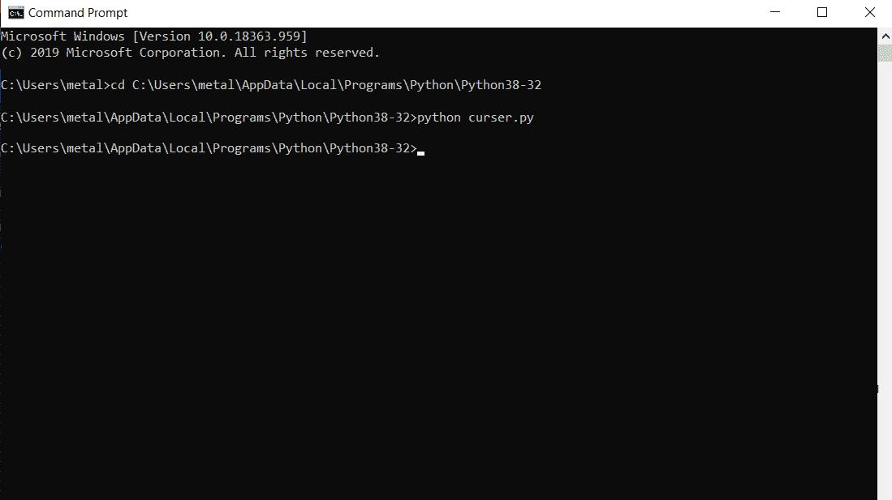

# Python 程序隐藏终端屏幕上的鼠标光标

> 原文:[https://www . geesforgeks . org/python-程序-隐藏终端屏幕上的鼠标光标/](https://www.geeksforgeeks.org/python-program-to-hide-the-mouse-cursor-on-the-terminal-screen/)

编写一个程序来隐藏终端屏幕上的鼠标光标。

**进场:**

*   在 [C 语言](https://www.geeksforgeeks.org/c-language-set-1-introduction/)中导入 curses 包用于此任务，**naps**函数调用用于延时， **curs_set()** 函数调用使光标消失。
*   在 Python 中，导入并使用了一个名为 UniCurses 的包，它类似于 Curses 包。在程序中， **[【睡眠】()](https://www.geeksforgeeks.org/sleep-in-python/)** 功能用于延迟，调用 **curs_set()** 功能使光标消失然后再次出现。

下面是上述方法的实现:

## 蟒蛇 3

```py
# Python program for the above approach
import curses
import time

# Initializing curses 
stdscr = curses.initscr()

# Setting the cursor to visible by 
# inserting 1 as argument
curses.curs_set(1)  

# Delay of 2 seconds
time.sleep(2)

# Setting the cursor to invisible by 
# inserting 0 as argument
curses.curs_set(0) 

# Delay of 2 seconds
time.sleep(2)

# Setting the cursor to visible by 
# inserting 1 as argument
curses.curs_set(1)  

# Delay of 2 seconds
time.sleep(2)

# Restoring terminal to it's
# original state
curses.endwin()
```

**输出:**
运行程序后，出现新窗口:
[](https://media.geeksforgeeks.org/wp-content/uploads/20200813111813/Screenshot3478.png)

2 秒后，鼠标光标消失:
[](https://media.geeksforgeeks.org/wp-content/uploads/20200813111815/Screenshot3479.png)

4 秒后，鼠标光标再次出现:
[](https://media.geeksforgeeks.org/wp-content/uploads/20200813111813/Screenshot3478.png)

6 秒后，程序结束:
[](https://media.geeksforgeeks.org/wp-content/uploads/20200813111917/Screenshot3471.png)