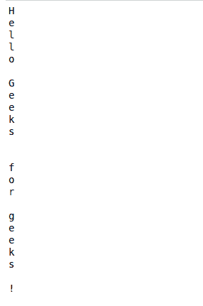
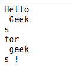

# 从文件中逐字符读取的 Python 程序

> 原文:[https://www . geesforgeks . org/python-从文件逐字符读取程序/](https://www.geeksforgeeks.org/python-program-to-read-character-by-character-from-a-file/)

给定一个文本文件。任务是逐个字符地从文件中读取文本。
**使用的功能:**

> **语法:** file.read(length)
> **参数:**指定要从文件中读取的数据长度的整数值。
> **返回值:**以字符串形式返回读取的字节。

**示例 1:** 假设文本文件是这样的。


## 蟒蛇 3

```
# Demonstrated Python Program
# to read file character by character

file = open('file.txt', 'r')

while 1:

    # read by character
    char = file.read(1)         
    if not char:
        break

    print(char)

file.close()
```

**输出**T2】



**示例 2:** 一次读取多个字符。

## 蟒蛇 3

```
# Python code to demonstrate
# Read character by character

with open('file.txt') as f:

    while True:

        # Read from file
        c = f.read(5)
        if not c:
            break

        # print the character
        print(c)
```

**输出**T2】

